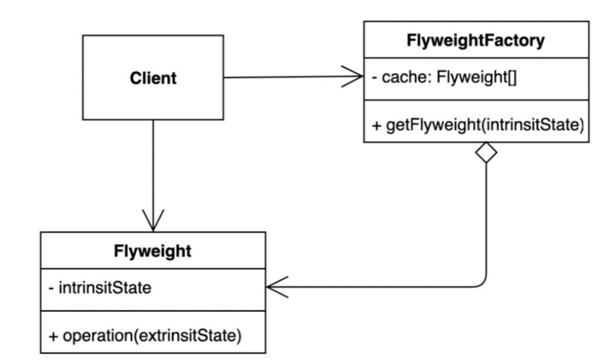

## 1. intro



객체를 가볍게 만들어 메모리 사용을 줄이는 패턴

- 자주 변하는 속성(또는 외적인 속성, extrinsit)과 변하지 는 속성(또는 내적인 속성, intrinsit)을 분리하고 재사용하여 메모리 사용을
  줄일  수 있다.


자주 변하는 것과 변하지 않는것을 구분 하는 것.

extrinsit : 자주 변하는 속성

intrinsit : 변하지 않는 속성


## 2. implement

- 공유하는 인스턴스가 있어서 메모리를 덜 쓴다. 인스턴스를 많이 사용하는 경우에 쓸 수 있는 방식

### 변경 전

- 변경되지 않는속성이 중복하여 생성되어 메모리를 잡아먹는다.
  - Font, Font size

```java
public class Client {

    public static void main(String[] args) {
        Character c1 = new Character('h', "white", "Nanum", 12);
        Character c2 = new Character('e', "white", "Nanum", 12);
        Character c3 = new Character('l', "white", "Nanum", 12);
        Character c4 = new Character('l', "white", "Nanum", 12);
        Character c5 = new Character('o', "white", "Nanum", 12);
    }
}
```

### 변경 후


- 변경되지 않느 속성은 Font class를 생성하여 이동시킨다.
- 플라이웨이트 팩토리 : FontFactory 를 생성해서 같은 속성(캐싱)을 가져 올 때는 인스턴스를 생성하지 않도록 한다.
- 플라이웨이트 : Font

```java
public static void main(String[] args) {
        FontFactory fontFactory = new FontFactory();
        Character c1 = new Character('h', "white", fontFactory.getFont("nanum:12"));
        Character c2 = new Character('e', "white", fontFactory.getFont("nanum:12"));
        Character c3 = new Character('l', "white", fontFactory.getFont("nanum:12"));
    }
```

- 플라이웨이트 (Font) 를 생성 할 때, 사용되는 속성들은 변경이 안되기 때문에 `final`로 생성한다.

```java
public final class Font {

    final String family;

    final int size;

    public Font(String family, int size) {
        this.family = family;
        this.size = size;
    }

    public String getFamily() {
        return family;
    }

    public int getSize() {
        return size;
    }
}
```

- 캐싱
  1. cache를 맴버변수로 생성
  2. getFont 로 cache 한개를 리턴 할때, 포함되어 있으면 그대로 리턴하고 아니라면, 인스턴스를 생성하여 put 한 후 리턴한다.
  3. 같은 키 값은 같은 인스턴스를 계속 사용하여 캐싱 효과가 있다.

```java
public class FontFactory {

    private Map<String, Font> cache = new HashMap<>();

    public Font getFont(String font) {
        if (cache.containsKey(font)) {
            return cache.get(font);
        } else {
            String[] split = font.split(":");
            Font newFont = new Font(split[0], Integer.parseInt(split[1]));
            cache.put(font, newFont);
            return newFont;
        }
    }
}
```


## 3. Strength and Weakness

객체를 가볍게 만들어 메모리 사용을 줄이는 패턴

### 장점

- 애플리케이션에서 사용하는 메모리를 줄일 수 있다.

같은 키를 가지고 있다면 계속 같은걸 캐싱하는 개념이라서 메모리를 아낄 수 있다.

### 단점

- 코드의 복잡도가 증가한다.


## 4. API example

- Integer.valueOf
  - `This method will always cache values in the range -128 to 127`
  - 위 주석에서 보듯이, 특정 범위에서는 캐싱을 하고 있기 때문에 `==` 로 비교 할 시 같은 인스턴스라서 `true`가 리턴된다
  - 하지만, 범위를 벗어난 값을 `==` 로 비교하면 캐싱이 안되어 있기 때문에 `false`가 나온다.
  - 당연하지만, `equals`를 써야한다.

```java
public class FlyweightInJava {

    public static void main(String[] args) {
        Integer i1 = Integer.valueOf(10);
        Integer i2 = Integer.valueOf(10);
        System.out.println(i1 == i2);
    }
}
/**
     * Returns an {@code Integer} instance representing the specified
     * {@code int} value.  If a new {@code Integer} instance is not
     * required, this method should generally be used in preference to
     * the constructor {@link #Integer(int)}, as this method is likely
     * to yield significantly better space and time performance by
     * caching frequently requested values.
     *
     * This method will always cache values in the range -128 to 127,
     * inclusive, and may cache other values outside of this range.
     *
     * @param  i an {@code int} value.
     * @return an {@code Integer} instance representing {@code i}.
     * @since  1.5
     */
    @IntrinsicCandidate
    public static Integer valueOf(int i) {
        if (i >= IntegerCache.low && i <= IntegerCache.high)
            return IntegerCache.cache[i + (-IntegerCache.low)];
        return new Integer(i);
    }
```