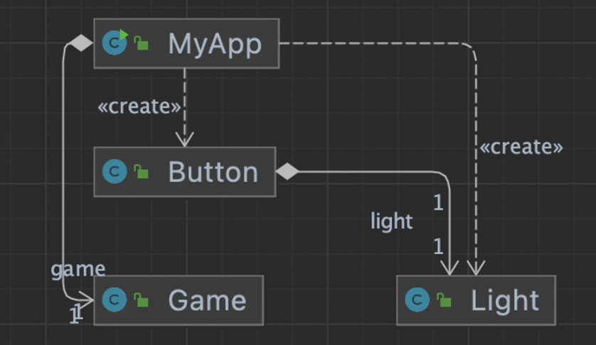
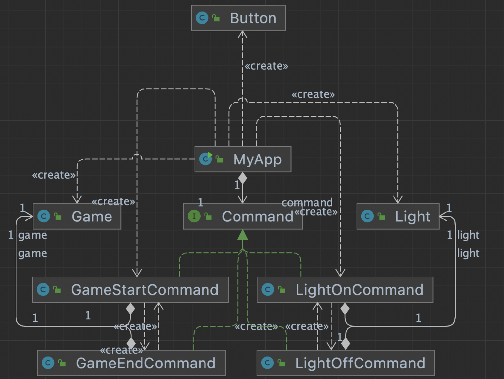

## 1. intro


요청을 캡슐화하여 호출자(invoker)와 수신자(receiver)를 분리하는 패턴.

- 요청을 처리하는 방법이 바귀더라도, 호출자의 코드는 변경되지 않는다.


## 2. implement

- Invoker와 Receiver의 관계가 타이트 할 경우 기능 변경 시 자주 소스코드를 바꿔야 한다.
- Invover 코드는 건드릴 필요가 없다
- Receiver도 바뀔수도 있다.
- Command는 바뀌어야 한다.

Receiver : Light, Game

Invoker : Button

### 변경 전




- invoker 와 receiver 관계가 밀접하다.
  - receiver 의 내용이 변경되면, invoker의 내용도 변경되어야 한다.

### 변경 후

- 리시버가 변경되면, 커맨드가 변경되어야 하지만 인보커는 변경되지 않는다.
- 커맨드가 추가되어도 리시버는 변경되지만, 인보커는 변경되지 않는다.




- client

```java
public static void main(String[] args) {
        Button button = new Button();
        button.press(new GameStartCommand(new Game()));
        button.press(new LightOnCommand(new Light()));
        button.undo();
        button.undo();
    }
```

- Invoker class
  - Command 에 정의되어있는 함수를 사용한다.

```java
public class Button {

    private Stack<Command> commands = new Stack<>();

    public void press(Command command) {
        command.execute();
        commands.push(command);
    }

    public void undo() {
        if (!commands.isEmpty()) {
            Command command = commands.pop();
            command.undo();
        }
    }
}
```

- command

```java
public class GameEndCommand implements Command {

    private Game game;

    public GameEndCommand(Game game) {
        this.game = game;
    }

    @Override
    public void execute() {
        game.end();
    }

    @Override
    public void undo() {
        new GameStartCommand(this.game).execute();
    }
}
```


## 3. Strength and Weakness

요청을 캡슐화 하여 호출자 (invoker)와 수신자(receiver)를 분리하는 패턴.

### 장점

- 기존코드를 변경하지 않고 새로운 커맨드를 만들 수 있다.
- `수신자`의 코드가 변경되어도 `호출자`의 코드는 변경되지 않는다.
- 커맨드 객체를 로깅, DB에 저장, 네트워크로 전송 하는 등 다양한 방법으로 활용할 수도 있다.

### 단점

- 코드가 복잡하고 클래스가 많아진다.


## 4. API example

### Runnable

- submit 인자로 Runnable 이 입력되는데, command 단위이다.

```java
public class CommandInJava {

    public static void main(String[] args) {
        Light light = new Light();
        Game game = new Game();
        ExecutorService executorService = Executors.newFixedThreadPool(4);
        executorService.submit(() -> light.on());
        executorService.submit(game::start);
        executorService.submit(game::end);
        executorService.submit(light::off);
        executorService.shutdown();
    }
}
```

### Spring SimpleJdbcInsert

- insert 의 함수는 command로 되어있다. (소스 나중에 까보자)

```java
public class CommandInSpring {

    private DataSource dataSource;

    public CommandInSpring(DataSource dataSource) {
        this.dataSource = dataSource;
    }

    public void add(Command command) {
        SimpleJdbcInsert insert = new SimpleJdbcInsert(dataSource)
                .withTableName("command")
                .usingGeneratedKeyColumns("id");

        Map<String, Object> data = new HashMap<>();
        data.put("name", command.getClass().getSimpleName());
        data.put("when", LocalDateTime.now());
        insert.execute(data);
    }

}
```