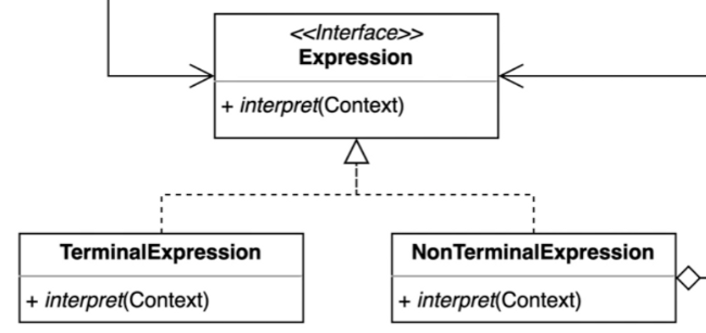
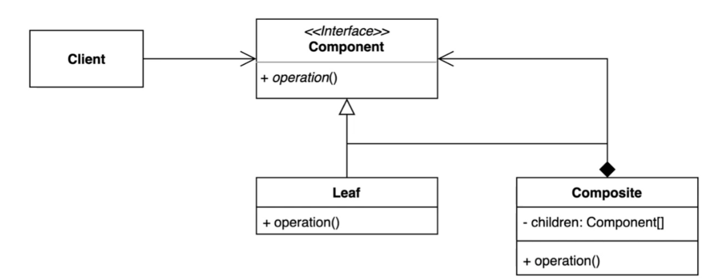
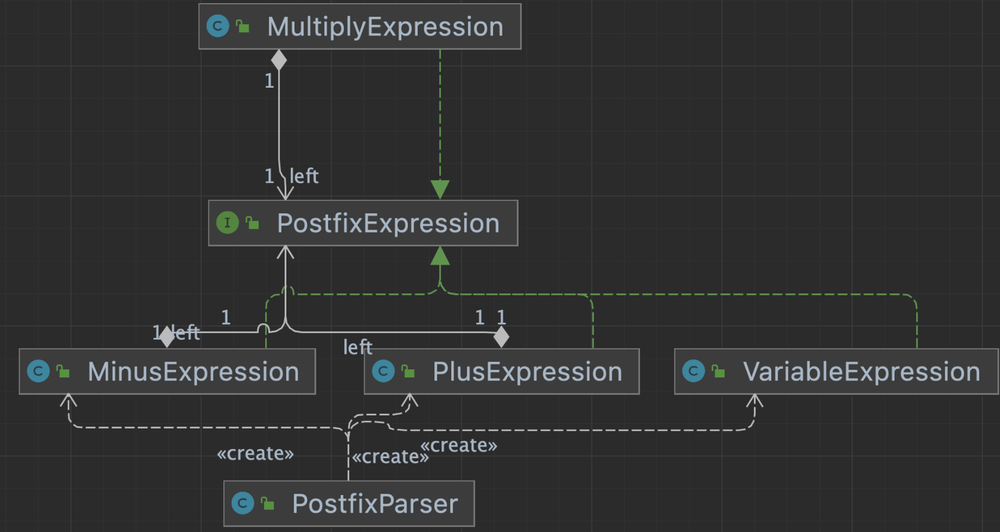
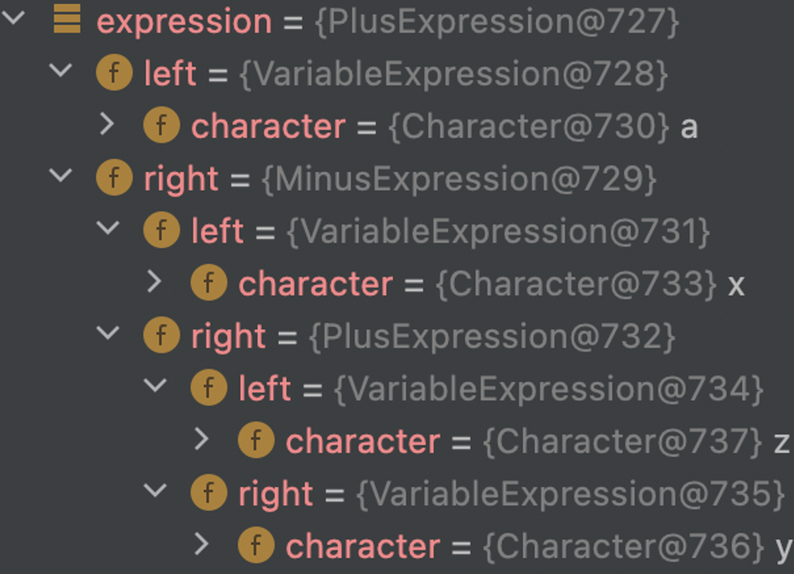

## 1. intro

ex)정규표현식

<../img src="../img/interpreter-01.png" alt="스크린샷 2023-07-16 오후 3.11.18" style="zoom:150%;" />

반복되는 문제패턴을 언어 또는 문법으로 정의하고 확장할 수 있다.


- (아래이미지) 인터프리터패턴의 이 부분이 컴포짓 패턴과 유사하다.






컴포짓 패턴을 사용해서 정의한 트리구조는 AST라고 한다. (Abstract Syntax Tree)


## 2. implement

- “xyz+-” 자체를 문법으로 사용하고싶다 (xyz : 터미널익스프레션)
- 우선 파서를 만들어야함
- 파서를 통해 파싱을 하면 expression 으로 리턴하도록 한다.
- 이 expression로 인터프리터를 수행한다. 이걸 수행할 때 컨텍스트 정보를 주어야 한다, (키벨류 키벨류 같은 정보)

### 변경 전

1. 전체 문자열을 멤버변수에 저장한다.
2. calculate() 를 수행하면
   1. 정의한 연산(+,-)이 아니면 스택에 push 한다.
   2. 정의한 연산이면, pop 해서 적당한 연산을 수행한다.

```java
public class PostfixNotation {

    private final String expression;

    public PostfixNotation(String expression) {
        this.expression = expression;
    }

    public static void main(String[] args) {
        PostfixNotation postfixNotation = new PostfixNotation("123+-");
        postfixNotation.calculate();
    }

    private void calculate() {
        Stack<Integer> numbers = new Stack<>();

        for (char c : this.expression.toCharArray()) {
            switch (c) {
                case '+':
                    numbers.push(numbers.pop() + numbers.pop());
                    break;
                case '-':
                    int right = numbers.pop();
                    int left = numbers.pop();
                    numbers.push(left - right);
                    break;
                default:
                    numbers.push(Integer.parseInt(c + ""));
            }
        }

        System.out.println(numbers.pop());
    }
}
```

### 변경 후 햇




1. `PostfixParser` 의 parer 를 호출한다.

2. parser는  

   ```
   PostfixExpression
   ```

    Stack 을 쌓는데, 

   ```
   getExpression
   ```

    에 정의 되어 잇는 +, -, 기타 로 구분해서 

   ```
   PostfixExpression
   ```

    타입의 TerminalExpression 을 리턴해서 push한다.

   - getExpression()에서 분기처리 할 때 +,- 는 숫자를 pop()하여 연산을 하는 `PostfixExpression` 타입을 리턴하므로,
   - `parse` 에서 마지막으로 pop() 해서 리턴하는건 마지막 연산이라는 의미이다.

```java
public static void main(String[] args) {
        PostfixExpression expression = PostfixParser.parse("xyz+-a+");
        int result = expression.interpret(Map.of('x', 1, 'y', 2, 'z', 3, 'a', 4));
        System.out.println(result);
    }
```

- 추가 연산을 원한다면 그에 맞는 TerminalExpression을 생성하면된다.
  - 그에 따라 `getExpression` 는 수정되어야 한다.





- 위와 같은 패턴을 abstract syntax tree 라고 한다.


## 3. Strength and Weakness

요청을 캡슐화 하여 호출자(invoker)와 수신자(receiver)를 분리하는 패턴.

### 장점

- 자주 등장하는 문제 패턴을 언어와 문법으로 정의할 수 있다.
- 기존 코드를 변경하지 않고 새로운 Expression을 추가할 수 있다.

### 단점

- 복잡한 문법을 표현하려면 Expression과 Parser가 복잡해진다.
  - 내가 개발하는 데걸리는 비용, 자주쓰이는 지 등을 고려해서 인터프리터패턴 사용 여부를 결정해야 한다.


## 4. API example

### 다른 예제들 이해가 안가서 다시 강의 봐야함

### 정규표현식

- Book의 title을 expression key 로 검색하여 value를 찾는다.

```java
public class InterpreterInSpring {

    public static void main(String[] args) {
        Book book = new Book("spring");

        ExpressionParser parser = new SpelExpressionParser();
        Expression expression = parser.parseExpression("title");
        System.out.println(expression.getValue(book));
    }
}
public class Book {

    private String title;

    public Book(String title) {
        this.title = title;
    }

    public String getTitle() {
        return title;
    }

    public void setTitle(String title) {
        this.title = title;
    }
}
```