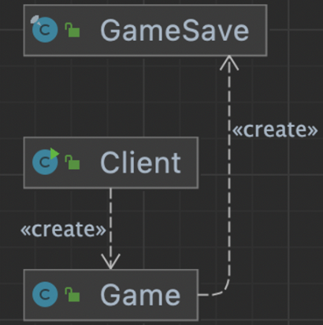

## 1. intro


- 객체상태를 외부에 저장했다가 해당상태로 다시 복구할 수 있다.


originator 의 내부정보를 caretaker가 가져와서 저장함

내부정보를 memento 로 추상화

originator : 1. creatememento 내부정보를 memento 타입으로 추상화

1. 외부에서 전달받은 memento로 복원할 수 있도록

memento : immutable 객체로 구성

caretaker : originator 정보를 memento 타입으로 가지고 있다.

원할 때 가지고있는 memento 정보로 originator를 복원한다;.

정보가 바뀔때마다 모든걸 다시 복사해서 리스토어 해야 하므로 어려움


## 2. implement

### 변경 전


- Game의 정보를 저장했다가, 필요한 순간에 restore를 하고 싶을 때

- 아래와 같은 경우는, 내부 정보를 하나씩 꺼내서 적용해야 하고, 변경이 자유롭기 때문에 문제가 될 수 있다.

```java
public class Client {

    public static void main(String[] args) {
        Game game = new Game();
        game.setRedTeamScore(10);
        game.setBlueTeamScore(20);

        int blueTeamScore = game.getBlueTeamScore();
        int redTeamScore = game.getRedTeamScore();

        Game restoredGame = new Game();
        restoredGame.setBlueTeamScore(blueTeamScore);
        restoredGame.setRedTeamScore(redTeamScore);
    }
}
```

### 변경 후




memento : GameSave

client : careTaker

- originator는 save() 와 restore()를 구현해 놓는다.

```java
public class Game {

   ...
    public GameSave save() {
        return new GameSave(this.blueTeamScore, this.redTeamScore);
    }

    public void restore(GameSave gameSave) {
        this.blueTeamScore = gameSave.getBlueTeamScore();
        this.redTeamScore = gameSave.getRedTeamScore();
    }

}
```

- mememto는 불변객체로 생성해놓는다.

```java
public final class GameSave {

    private final int blueTeamScore;

    private final int redTeamScore;

    public GameSave(int blueTeamScore, int redTeamScore) {
        this.blueTeamScore = blueTeamScore;
        this.redTeamScore = redTeamScore;
    }

    public int getBlueTeamScore() {
        return blueTeamScore;
    }

    public int getRedTeamScore() {
        return redTeamScore;
    }
}
```

- careTaker는 memento를 갖고 있으면서, 필요시 originator를 restore 해준다.

```java
public class Client {

    public static void main(String[] args) {
        Game game = new Game();
        game.setBlueTeamScore(10);
        game.setRedTeamScore(20);

        GameSave save = game.save();

        game.setBlueTeamScore(12);
        game.setRedTeamScore(22);

        game.restore(save);

        System.out.println(game.getBlueTeamScore());
        System.out.println(game.getRedTeamScore());
    }
}
```


## 3. Strength and Weakness

### 장점

객체 내부 상태를 외부에 노출하지 않고도 스냅샷을 만들 수 있다.

### 주의

저장하는 개수가 많아지만, 메모리 사용량에 영향을 줄 수 있다.

오래된 메멘토는 삭제하는 등의 관리가 필요 할 수 있다.


## 4. API example

### 직렬화 역직렬화

직렬화 :객체를 바이트스트림으로 바꿔준다 → 파일저장 , 네트워크 전송

역직렬화 : 객체를 복원할 수 있다.

1. originator 가 직렬화를 지원해야 한다.
2. caretaker 가 바이트스트림을 갖고 잇어야 한다.

```java
public class MementoInJava {

    public static void main(String[] args) throws IOException, ClassNotFoundException {
        // TODO Serializable
        Game game = new Game();
        game.setRedTeamScore(10);
        game.setBlueTeamScore(20);

        // TODO 직렬화
        try(FileOutputStream fileOut = new FileOutputStream("GameSave.hex");
        ObjectOutputStream out = new ObjectOutputStream(fileOut))
        {
            out.writeObject(game);
        }

        game.setBlueTeamScore(25);
        game.setRedTeamScore(15);

        // TODO 역직렬화
        try(FileInputStream fileIn = new FileInputStream("GameSave.hex");
            ObjectInputStream in = new ObjectInputStream(fileIn))
        {
            game = (Game) in.readObject();
            System.out.println(game.getBlueTeamScore());
            System.out.println(game.getRedTeamScore());
        }
    }
}
```