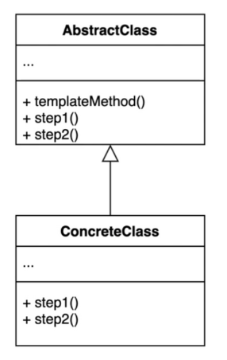
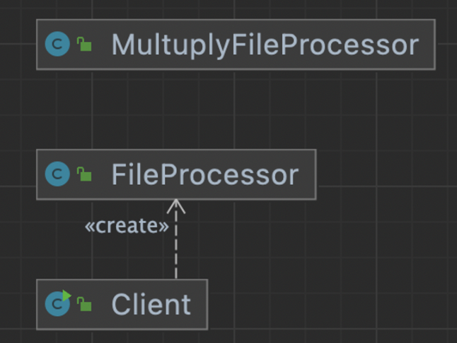
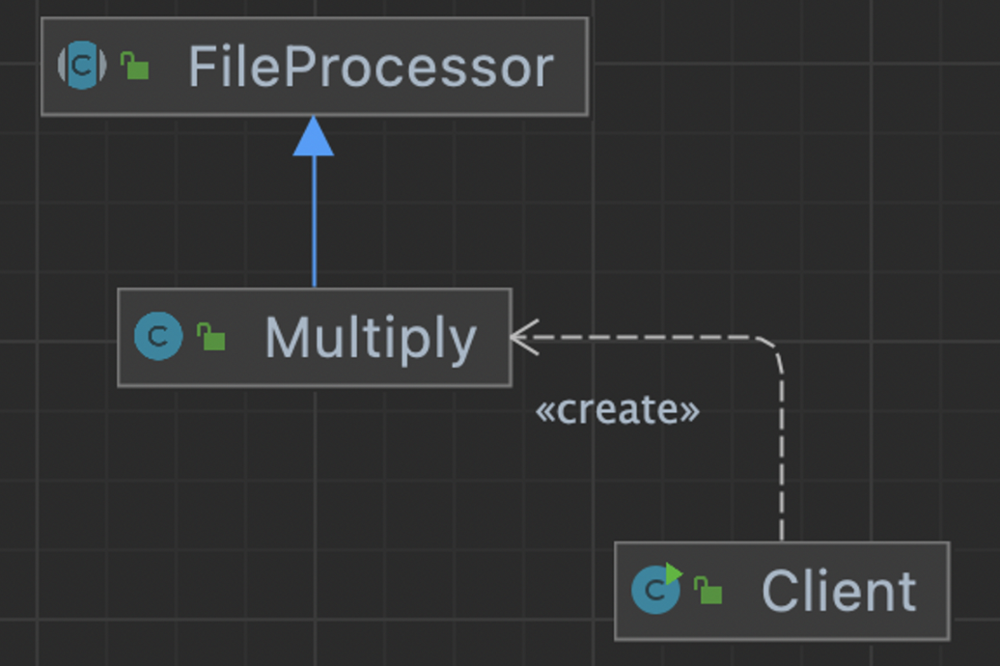

## 1. intro

- partInt → int return

- valueOf → Integer return

⇒ 경우에 따라 취사선택하도록 하자.



- 추상클래스는 템플릿을 제공하고 하위클래스는 구체적인 알고리즘을 제공한다.

제어권이 역전되어 있다.


## 2. implement

### 변경전

###  


- 상당량 코드가 중복되어 있다.

```java
public class FileProcessor {

    private String path;
    public FileProcessor(String path) {
        this.path = path;
    }

    public int process() {
        try(BufferedReader reader = new BufferedReader(new FileReader(path))) {
            int result = 0;
            String line = null;
            while((line = reader.readLine()) != null) {
                result += Integer.parseInt(line);
            }
            return result;
        } catch (IOException e) {
            throw new IllegalArgumentException(path + "에 해당하는 파일이 없습니다.", e);
        }
    }
}
public class MultuplyFileProcessor {

    private String path;
    public MultuplyFileProcessor(String path) {
        this.path = path;
    }

    public int process() {
        try(BufferedReader reader = new BufferedReader(new FileReader(path))) {
            int result = 0;
            String line = null;
            while((line = reader.readLine()) != null) {
                result *= Integer.parseInt(line);
            }
            return result;
        } catch (IOException e) {
            throw new IllegalArgumentException(path + "에 해당하는 파일이 없습니다.", e);
        }
    }
}
```

### 변경 후




- 변경될 수 있는 코드인 getResult() 를 abstract 로 만들어 상속한 자식클래스에서 정의하도록 만들어 코드 중복을 피했다.

```java
public abstract class FileProcessor {

    private String path;
    public FileProcessor(String path) {
        this.path = path;
    }

    public final int process(Operator operator) {
        try(BufferedReader reader = new BufferedReader(new FileReader(path))) {
            int result = 0;
            String line = null;
            while((line = reader.readLine()) != null) {
                result = getResult(result, Integer.parseInt(line));
            }
            return result;
        } catch (IOException e) {
            throw new IllegalArgumentException(path + "에 해당하는 파일이 없습니다.", e);
        }
    }

    protected abstract int getResult(int result, int number);

}
public class Multiply extends FileProcessor {
    public Multiply(String path) {
        super(path);
    }

    @Override
    protected int getResult(int result, int number) {
        return result *= number;
    }

}
```


## 템플릿 콜백 패턴


- 마치 전략패턴처럼 사용할 수 있다.
- 전략과 다른점은 콜백은 하나의 메소드만 사용한다.
- 전략처럼 위임을 사용할 수 있고 상속을 사용하지 않는다.
- concreteCallback은 익명클래스로 사용한다


- client 에서 컨텍스트인 FileProcessor를 사용할 때 인자로 전략인 Operator를 콜백으로 사용할 수 있다.

```java
public class Client {

    public static void main(String[] args) {
        FileProcessor fileProcessor = new Multiply("number.txt");
        int result = fileProcessor.process((sum, number) -> {
            return sum += number;
        });
        fileProcessor.process(new Operator() {
            @Override
            public int getResult(int result, int number) {
                return 0;
            }
        });
        System.out.println(result);
    }
}
```

- 컨텍스트의 함수 인자는 전략 인터페이스가 파라메터이다.

```java
public abstract class FileProcessor {

    private String path;
    public FileProcessor(String path) {
        this.path = path;
    }

    public final int process(Operator operator) {
        try(BufferedReader reader = new BufferedReader(new FileReader(path))) {
            int result = 0;
            String line = null;
            while((line = reader.readLine()) != null) {
                result = getResult(result, Integer.parseInt(line));
            }
            return result;
        } catch (IOException e) {
            throw new IllegalArgumentException(path + "에 해당하는 파일이 없습니다.", e);
        }
    }

    protected abstract int getResult(int result, int number);

}
```


## 3. Strength and Weakness

알고리듬 구조를 서브클래스가 확장할 수 있도록 템플릿으로 제공하는 방법.

### 장점

- 템플릿 코드를 재사용하고 중복코드를 줄일 수 있다.
- 템프릿 코드를 변경하지 않고 상속을 받아서 구체적인 알고리듬만 변경할 수 있다.

### 단점

- 리스코프 치환원칙을 위반할 수도 있다.
- 알고리듬 구조가 복잡할수록 템플릿을 유지하기 어려워진다,
- 리스코프 치환원칙
- 상속에서 상위클래스의 의도를 자식클래스가 모두 유지해야 한다.
  - 대안 : 관련 메소드를 final 처리해서 자식클래스가 오버라이딩 못하게 막는다.
  - 하지만, 결국 상속할수 있는 메소드가 있기에 깨질 수있다.


## 4. API example

### HttpServlet > init

- Servlet 공부할 때 참조할 수 있도록.
- 템플릿 콜백

### JDBCtemplate

### RestTemplate

⇒ 스프링에ㅐ서 분석할 수 있도록.