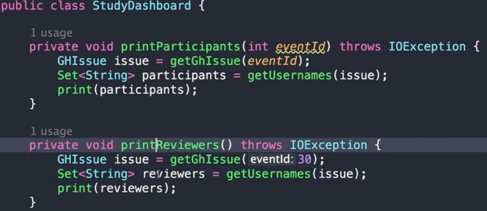
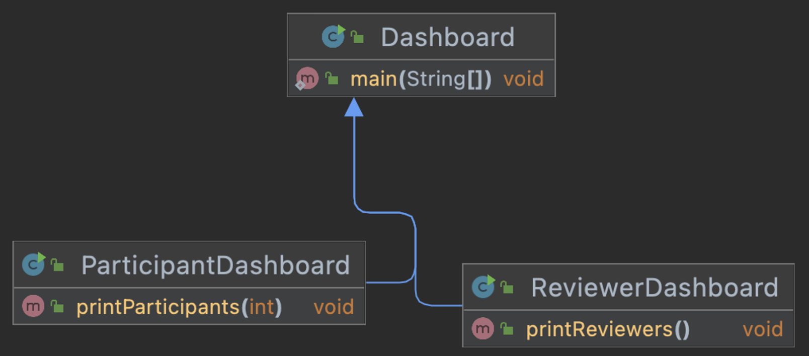
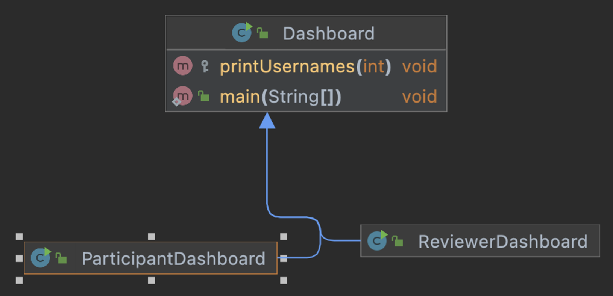

## 2. 중복코드 (Duplicatred code)

- 중복코드의 단점
  - 비슷한 지, 완전히 동일한 코드인지 주의깊게 봐야한다.
  - 코드를 변경할 때, 동일한 모든곳의 코드를 변경해야 한다.
- 사용할 수 있는 리팩토링 기술
  - 동일한 코드를 여러 메소드에서 사용하는경우, 함수 추출하기 (Extract function)
  - 코드가 비슷하게 생겼지만 완전히 같지는 않은 경우, 코드 분리하기 (Slide Statements)
  - 여러 하위 클래스에 동일한 코드가 있다면, 메소드 올리기 (Pull up, Method)


## 리팩토링 4. 함수 추출하기 (Extract Function)

- “의도”와 “구현” 분리하기
  - 주관적인 해석의 여지가 있지만, 코드를 작성할 때 코드에 의도가 러나도록 작성하는 것이 좋다. 구현에만 집중하면, 코드를 해석하기 어려워 질 수 있기 때문이다.
- 무슨 일을 하는 코드인지 알아내려고 노력해야 하는 코드라면 해당 코드를 함수로 분리하고 함수 이름으로 “무슨 일을 하는지” 표현할 수 있다.
- 한줄 짜리 메소드도 괜찮은가?
  - 괜찮다. 메소드이름을 잘 지어야 한다. 의도가 중요하니까..
- 거대한 함수 안에 들어있는 주석은 추출한 함수를 찾는데 있어서 좋은 단서가 될 수 있다.

```cpp
option + command + m : extract function
```

### 변경 전

```java
public class StudyDashboard {

    private void printParticipants(int eventId) throws IOException {
        // Get github issue to check homework
        GitHub gitHub = GitHub.connect();
        GHRepository repository = gitHub.getRepository("whiteship/live-study");
        GHIssue issue = repository.getIssue(eventId);

        // Get participants
        Set<String> participants = new HashSet<>();
        issue.getComments().forEach(c -> participants.add(c.getUserName()));

        // Print participants
        participants.forEach(System.out::println);
    }

    private void printReviewers() throws IOException {
        // Get github issue to check homework
        GitHub gitHub = GitHub.connect();
        GHRepository repository = gitHub.getRepository("whiteship/live-study");
        GHIssue issue = repository.getIssue(30);

        // Get reviewers
        Set<String> reviewers = new HashSet<>();
        issue.getComments().forEach(c -> reviewers.add(c.getUserName()));

        // Print reviewers
        reviewers.forEach(System.out::println);
    }

    public static void main(String[] args) throws IOException {
        StudyDashboard studyDashboard = new StudyDashboard();
        studyDashboard.printReviewers();
        studyDashboard.printParticipants(15);

    }

}
```

### 변경 후



- 구현중심의 로직을 함수로추출해내면서 의도를 드러내는 코드로 변경하였다.


## **리팩토링 5. 코드 정리하기 (Slide Statements)**

- 관련있는 코드끼리 묶여있어야 코드를 더 쉽게 이해할 수 있다.함수에서 사용할 변수를 상단에 미리 정의하기 보다는, 해당 변수를 사용하는 코드 바로 위에 선언하자.
- 관련있는 코드끼리 묶은 다음, 함수 추출하기 (Extract Function)를 사용해서 더 깔끔하 게 분리할 수도 있다.
- 변수는 사용되기 직전에 정의되어 있는것이 좋다.
  - 리팩토링에 용이하고, 한눈에 파악하고 문맥이 안섞인다.

### 단축키

```cpp
shift + option + 방향키위아래 : 코드 한줄이동
```

## **리팩토링 6. 메소드 올리기

Pull Up Method**

- 중복 코드는 당장은 잘 동작하더라도 미래에 버그를 만들어 낼 빌미를 제공한다.
  - 예) A에서 코드를 고치고, B에는 반영하지 않은 경우
- 여러 하위 클래스에 동일한 코드가 있다면, 손쉽게 이 방법을 적용할 수 있다.
- 비슷하지만 일부 값만 다른 경우라면, “함수 매개변수화하기 (Parameterize Function)” 리팩토링을 적 용한 이후에, 이 방법을 사용할 수 있다.
- 하위 클래스에 있는 코드가 상위 클래스가 아닌 하위 클래스 기능에 의존하고 있다면, “필드 올리기 (Pull Up Field)”를 적용한 이후에 이 방법을 적용할 수 있다.
- 두 메소드가 비슷한 절차를 따르고 있다면, “템플릿 메소드 패턴 (Template Method Pattern)” 적용을 고려할 수 있다.

### 실습

- 하위 클래스의 비슷한 로직의 함수를 Pull up하여 상위 클래스의 함수로 리팩토링 하였다.



리팩토링 전




pull up method 적용 후

### 단축키

```cpp
오른쪽 클릭 -> Refactor -> Pull Members Up
```