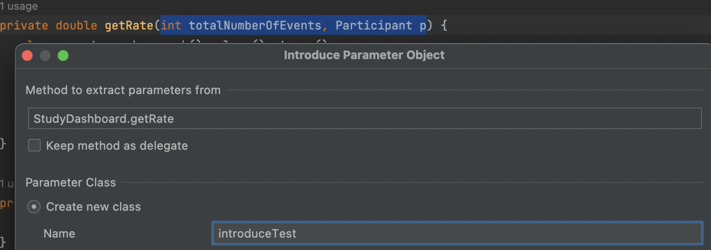
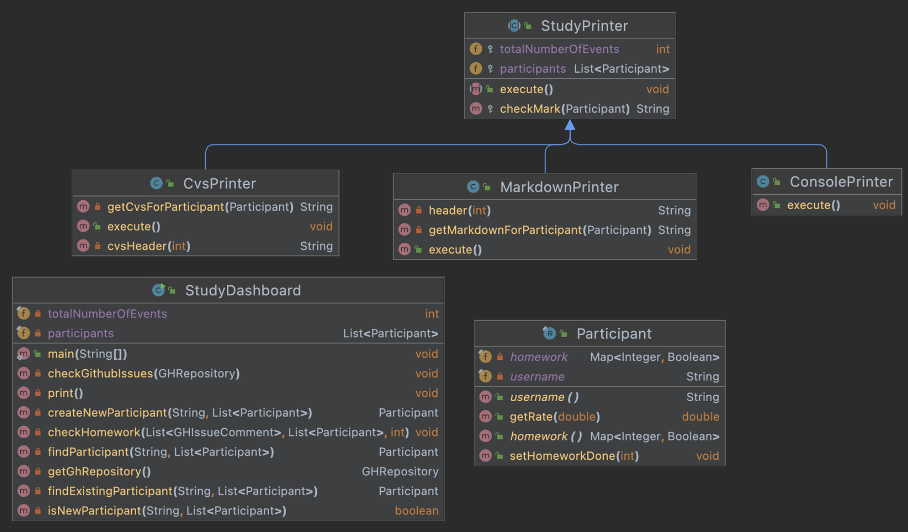

## **리팩토링 7. 임시 변수를 질의 함수로 바꾸기

Replace Temp with Query**

- 변수를 사용하면 반복해서 동일한 식을 계산하는 것을 피할 수 있고, 이름을 사용해 의미를 표현할 수도 있다.
- 긴 함수를 리팩토링할 때, 그러한 임시 변수를 함수로 추출하여 분리한다면 빼낸 함수로 전 달해야 할 매개변수를 줄일 수 있다.

1. markdownForHomework 를 getMarkdownForHomework()로 extract function
2. rate 계산식을 getRate()로 extract function
3. 파라메터로 rate를 넘기지 않고, 함수안에서 getRate()를 호출하도록 하여 인자개수를 줄임

```java
try (FileWriter fileWriter = new FileWriter("participants.md");
             PrintWriter writer = new PrintWriter(fileWriter)) {
            participants.sort(Comparator.comparing(Participant::username));

            writer.print(header(totalNumberOfEvents, participants.size()));

            participants.forEach(p -> {
                long count = p.homework().values().stream()
                        .filter(v -> v == true)
                        .count();
                double rate = count * 100 / totalNumberOfEvents;

                String markdownForHomework = String.format("| %s %s | %.2f%% |\\n", p.username(), checkMark(p, totalNumberOfEvents), rate);
                writer.print(markdownForHomework);
            });
        }
try (FileWriter fileWriter = new FileWriter("participants.md");
             PrintWriter writer = new PrintWriter(fileWriter)) {
            participants.sort(Comparator.comparing(Participant::username));

            writer.print(header(totalNumberOfEvents, participants.size()));

            participants.forEach(p -> {
                String markdownForHomework = getMarkdownForHomework(totalNumberOfEvents, p);
                writer.print(markdownForHomework);
            });
        }
    }

    private double getRate(int totalNumberOfEvents, Participant p) {
        long count = p.homework().values().stream()
                .filter(v -> v == true)
                .count();
        double rate = count * 100 / totalNumberOfEvents;
        return rate;
    }

    private String getMarkdownForHomework(int totalNumberOfEvents, Participant p) {
        return String.format("| %s %s | %.2f%% |\\n", p.username(), checkMark(p, totalNumberOfEvents), getRate(totalNumberOfEvents, p));
    }
```

## **리팩토링 8. 매개변수 객체 만들기

Introduce Parameter Object**

- 같은 매개변수들이 여러 메소드에 걸쳐 나타난다면 그 매개변수들을 묶은 자료 구조를 만 들 수 있다.
- 그렇게 만든 자료구조는:
  - 해당 데이터간의 관계를 보다 명시적으로 나타낼 수 있다.
  - 함수에 전달할 매개변수 개수를 줄일 수 있다.
  - 도메인을 이해하는데 중요한 역할을 하는 클래스로 발전할 수도 있다.




- 여러개의 파라메터를 introduce parameter object (한개의 record로 변경) 하여 매개변수를 줄일 수 있는 리팩토링을 할 수 있다.

1. 해당 예제에서는 totalNumberOfEvent를 맴버변수로 변경하여 자주 매개변수로 사용되는 부분을 리팩토링하였다.

   ```
   (introduce field refactoring)
   ```

```java
private void print() throws IOException, InterruptedException {
        GitHub gitHub = GitHub.connect();
        GHRepository repository = gitHub.getRepository("whiteship/live-study");
        List<Participant> participants = new CopyOnWriteArrayList<>();

        int totalNumberOfEvents = 15;
        ExecutorService service = Executors.newFixedThreadPool(8);
        CountDownLatch latch = new CountDownLatch(totalNumberOfEvents);
public StudyDashboard(int totalNumberOfEvents) {
        this.totalNumberOfEvents = totalNumberOfEvents;
    }
```

## **리팩토링 9. 객체 통째로 넘기기

Preserve Whole Object**

- 어떤 한 레코드에서 구할 수 있는 여러 값들을 함수에 전달하는 경우, 해당 매개변수를 레 코드 하나로 교체할 수 있다.
- 매개변수 목록을 줄일 수 있다. (향후에 추가할지도 모를 매개변수까지도...) 이 기술을 적용하기 전에 의존성을 고려해야 한다.
- 어쩌면 해당 메소드의 위치가 적절하지 않을 수도 있다. (기능 편애 “Feature Envy” 냄새에 해당한다.)

1. `getMarkdownForParticipant(String username, Map<Integer, Boolean> homework)` 에서 두개의 매개변수가 호출하는 부분이 하나의 객체로 합쳐질 수 있을 때, 하나로 합쳐도 되는가?, 그 객체(participants)에 의존하게 되지는 않는가를 판단해보고, 그 객체에만 의존한다면, `preserve whole object` 리팩토링을 적용한다.

```java
try (FileWriter fileWriter = new FileWriter("participants.md");
             PrintWriter writer = new PrintWriter(fileWriter)) {
            participants.sort(Comparator.comparing(Participant::username));

            writer.print(header(participants.size()));

            participants.forEach(p -> {
                String markdownForHomework = getMarkdownForParticipant(p.username(), p.homework());
                writer.print(markdownForHomework);
            });
        }

private String getMarkdownForParticipant(String username, Map<Integer, Boolean> homework) {
        return String.format("| %s %s | %.2f%% |\\n", username,
                checkMark(homework, this.totalNumberOfEvents),
                getRate(homework));
}
try (FileWriter fileWriter = new FileWriter("participants.md");
             PrintWriter writer = new PrintWriter(fileWriter)) {
            participants.sort(Comparator.comparing(Participant::username));

            writer.print(header(participants.size()));

            participants.forEach(p -> {
                String markdownForHomework = getMarkdownForParticipant(p);
                writer.print(markdownForHomework);
            });
        }

private String getMarkdownForParticipant(Participant p) {
        return String.format("| %s %s | %.2f%% |\\n", p.username(), checkMark(p, this.totalNumberOfEvents), getRate(p));
}
```

1. StudyDashboard class 의 getRate(Participant p) 는 이 위치가 적절한가 ?
2. StudyDashboard 가 Participant에 의존할 필요가 없는 함수이므로, 맴버변수인 totalNumberOfEvents 만 인자로 넘겨주는 형식으로 `move instance method` 리팩토링을 할 수 있다.


```java
private double getRate(Participant p) {
        long count = p.homework().values().stream()
                .filter(v -> v == true)
                .count();
        double rate = count * 100 / this.totalNumberOfEvents;
        return rate;
    }
public record Participant(String username, Map<Integer, Boolean> homework) {
    public Participant(String username) {
        this(username, new HashMap<>());
    }

    public void setHomeworkDone(int index) {
        this.homework.put(index, true);
    }

    double getRate(int totalNumberOfEvents) {
        long count = homework().values().stream()
                .filter(v -> v == true)
                .count();
        return (double) (count * 100 / totalNumberOfEvents);
    }
}
```

## **리팩토링 10. 함수를 명령으로 바꾸기

Replace Function with Command**

- 함수를 독립적인 객체인, Command로 만들어 사용할 수 있다.
- 커맨드 패턴을 적용하면 다음과 같은 장점을 취할 수 있다
  - 부가적인 기능으로 undo 기능을 만들 수도 있다.
  - 더 복잡한 기능을 구현하는데 필요한 여러 메소드를 추가할 수 있다.
  - 상속이나 템플릿을 활용할 수도 있다.
  - 복잡한 메소드를 여러 메소드나 필드를 활용해 쪼갤 수도 있다
- 대부분의 경우에 “커맨드” 보다는 “함수”를 사용하지만, 커맨드 말고 다른 방법이 없는 경우에만 사용 한다.

1. StudyDashboard class의 마크다운을 출력하는 부분은, 여러방향으로 결과를  출력할 수 있게 확장할 수 있는 로직이기 때문에, 해당로직을 Command로 변경이 필요함.
2. Studyprinter class를 생성하고, 마크다운 출력 로직을 execute()함수로 extract function 하여 이동시키고, 하위 함수들도 모두 옮긴다.
3. 파라메터로 자주사용되는 변수를 맴버변수를 변경한다. ( int totalNumberOfEvents, List<Participant> participants)

```java
try (FileWriter fileWriter = new FileWriter("participants.md");
            PrintWriter writer = new PrintWriter(fileWriter)) {
            participants.sort(Comparator.comparing(Participant::username));

            writer.print(header(participants.size()));

            participants.forEach(p -> {
                String markdownForHomework = getMarkdownForParticipant(p);
                writer.print(markdownForHomework);
            });
        }
new StudyPrinter(this.totalNumberOfEvents, participants).execute();
public class StudyPrinter {
    private int totalNumberOfEvents;
    private List<Participant> participants;

    public StudyPrinter(int totalNumberOfEvents, List<Participant> participants) {
        this.totalNumberOfEvents = totalNumberOfEvents;
        this.participants = participants;
    }

    public void execute() throws IOException {
		...
		}
}
```

## **리팩토링 11. 조건문 분해하기

Decompose Conditional**

- 여러 조건에 따라 달라지는 코드를 작성하다보면 종종 긴 함수가 만들어지는 것을 목격할 수 있다.
  - **가독성이 좋지 않다. (구현은 했지만 의도 표현이 잘 되지 않음.)**
- “조건”과 “액션” 모두 “의도”를 표현해야한다. 기술적으로는 “함수 추출하기”와 동일한 리팩토링이지만 의도만 다를 뿐이다.

1. 조건문과, 조건에 대한 액션을 모두 extract function 한다.
2. 조건과 액션 코드가 간단해 졌기에 삼항연산자로 표현한다.
3. 조건과 액션 모두 의도를 잘 표현하기에 가독성이 더 좋다.

```java
private Participant findParticipant(String username, List<Participant> participants) {
        Participant participant;
        if (participants.stream().noneMatch(p -> p.username().equals(username))) {
            participant = new Participant(username);
            participants.add(participant);
        } else {
            participant = participants.stream().filter(p -> p.username().equals(username)).findFirst().orElseThrow();
        }

        return participant;
}
private Participant findParticipant(String username, List<Participant> participants) {
        return isNewParticipant(username, participants) ?
                createNewParticipant(username, participants) :
                findExistingParticipant(username, participants);
    }

    private boolean isNewParticipant(String username, List<Participant> participants) {
        return participants.stream().noneMatch(p -> p.username().equals(username));
    }

    private Participant findExistingParticipant(String username, List<Participant> participants) {
        Participant participant;
        participant = participants.stream().filter(p -> p.username().equals(username)).findFirst().orElseThrow();
        return participant;
    }

    private Participant createNewParticipant(String username, List<Participant> participants) {
        Participant participant;
        participant = new Participant(username);
        participants.add(participant);
        return participant;
    }
```

## **리팩토링 12. 반복문 쪼개기

Split Loop**

- 하나의 반복문에서 여러 다른 작업을 하는 코드를 쉽게 찾아볼 수 있다.
- 해당 반복문을 수정할 때 여러 작업을 모두 고려하며 코딩을 해야한다.
- 반복문을 여러개로 쪼개면 보다 쉽게 이해하고 수정할 수 있다.
- 성능 문제를 야기할 수 있지만, “리팩토링”은 “성능 최적화”와 별개의 작업이다. 리팩토링을 마친 이후에 성능 최적화 시도할 수 있다.

1. 반복문1개 안에 여러개 작업이 있는경우, 그 개수만큼 쪼개서 extract function 한다. (반복문을 N번 더 순회하지만, O(n) 성능은 배수배라 그대로이다)

- 성능문제가 있을 수 있지만, 우선 리팩토링하고나서 최적화 할 수 있도록 한다.

1. 함수이름은 의도를 담아 작성하여, 최종적으로 함수가 어떤 작업을 하는지 쉽게 알수 있도록 한다.

```java
private void print() throws IOException, InterruptedException {
        GHRepository ghRepository = getGhRepository();

        ExecutorService service = Executors.newFixedThreadPool(8);
        CountDownLatch latch = new CountDownLatch(totalNumberOfEvents);

        for (int index = 1 ; index <= totalNumberOfEvents ; index++) {
            int eventId = index;
            service.execute(new Runnable() {
                @Override
                public void run() {
                    try {
                        GHIssue issue = ghRepository.getIssue(eventId);
                        List<GHIssueComment> comments = issue.getComments();
                        Date firstCreatedAt = null;
                        Participant first = null;

                        for (GHIssueComment comment : comments) {
                            Participant participant = findParticipant(comment.getUserName(), participants);
                            participant.setHomeworkDone(eventId);

                            if (firstCreatedAt == null || comment.getCreatedAt().before(firstCreatedAt)) {
                                firstCreatedAt = comment.getCreatedAt();
                                first = participant;
                            }
                        }
                        firstParticipantsForEachEvent[eventId - 1] = first;
                        latch.countDown();
                    } catch (IOException e) {
                        throw new IllegalArgumentException(e);
                    }
                }
            });
        }

        latch.await();
        service.shutdown();

        new StudyPrinter(this.totalNumberOfEvents, this.participants).execute();
        printFirstParticipants();
    }
private void print() throws IOException, InterruptedException {
        checkGithubIssues(getGhRepository());
        new StudyPrinter(this.totalNumberOfEvents, this.participants).execute();
        printFirstParticipants();
  }

private void checkGithubIssues(GHRepository ghRepository) throws InterruptedException {
    ExecutorService service = Executors.newFixedThreadPool(8);
    CountDownLatch latch = new CountDownLatch(totalNumberOfEvents);

    for (int index = 1 ; index <= totalNumberOfEvents ; index++) {
        int eventId = index;
        service.execute(new Runnable() {
            @Override
            public void run() {
                try {
                    GHIssue issue = ghRepository.getIssue(eventId);
                    List<GHIssueComment> comments = issue.getComments();

                    checkHomework(comments, eventId);
                    firstParticipantsForEachEvent[eventId - 1] = findFirst(comments);
                    latch.countDown();
                } catch (IOException e) {
                    throw new IllegalArgumentException(e);
                }
            }
        });
    }

    latch.await();
    service.shutdown();
}

private Participant findFirst(List<GHIssueComment> comments) throws IOException {
    Date firstCreatedAt = null;
    Participant first = null;
    for (GHIssueComment comment : comments) {
        Participant participant = findParticipant(comment.getUserName(), participants);

        if (firstCreatedAt == null || comment.getCreatedAt().before(firstCreatedAt)) {
            firstCreatedAt = comment.getCreatedAt();
            first = participant;
        }
    }
    return first;
}

private void checkHomework(List<GHIssueComment> comments, int eventId) {
    for (GHIssueComment comment : comments) {
        Participant participant = findParticipant(comment.getUserName(), participants);
        participant.setHomeworkDone(eventId);
    }
}
```

## **리팩토링 13. 조건문을 다형성으로 바꾸기

Replace Conditional with Polymorphism**

- 여러 타입에 따라 각기 다른 로직으로 처리해야 하는 경우에 다형성을 적용해서 조건문을보다 명확하게 분리할 수 있다. (예, 책, 음악, 음식 등...) 반복되는 switch문을 각기 다른 클래스를 만들어 제거할 수 있다.
- 공통으로 사용되는 로직은 상위클래스에 두고 달라지는 부분만 하위클래스에 둠으로써, 달라지는 부분만 강조할 수 있다.
- 모든 조건문을 다형성으로 바꿔야 하는 것은 아니다.

1. StudyPrinter class 에서 execute() 는 원래 MarkDown 기능만 제공하던 함수였으나, 기능이 확장되어 CVS, CONSOLE 출력 도 제공한다. 이를 구분해주기 위해 ENUM 을 사용하여 분기문에 따라 로직을 수행하지만, 복잡하다.
2. 이렇게 타입에 따라 로직이 분기되는 경우, 다형성을 사용하여 로직을 분리할 수 있다.

```java
public enum PrinterMode {
    CONSOLE, CVS, MARKDOWN
}

public void execute() throws IOException {
        switch (printerMode) {
            case CVS -> {
                try (FileWriter fileWriter = new FileWriter("participants.cvs");
                     PrintWriter writer = new PrintWriter(fileWriter)) {
                    writer.println(cvsHeader(this.participants.size()));
                    this.participants.forEach(p -> {
                        writer.println(getCvsForParticipant(p));
                    });
                }
            }
            case CONSOLE -> {
                this.participants.forEach(p -> {
                    System.out.printf("%s %s:%s\\n", p.username(), checkMark(p), p.getRate(this.totalNumberOfEvents));
                });
            }
            case MARKDOWN -> {
                try (FileWriter fileWriter = new FileWriter("participants.md");
                     PrintWriter writer = new PrintWriter(fileWriter)) {

                    writer.print(header(this.participants.size()));

                    this.participants.forEach(p -> {
                        String markdownForHomework = getMarkdownForParticipant(p);
                        writer.print(markdownForHomework);
                    });
                }
            }
        }
    }
```





- 호출하는 곳에서는 실제 출력하는 객체를 직접 호출하여 사용이 됨. (객체에 의존적이긴 하다)

```java
public class StudyDashboard {

    private void print() throws IOException, InterruptedException {
        checkGithubIssues(getGhRepository());
        new ConsolePrinter(this.totalNumberOfEvents, this.participants).execute();
    }
}
```

- 원래 로직을 수행하던 execute() 는 absract 함수로 변경하여, 자식클래스들이 override 하여 실제로직을 수행하도록 변경.

```java
public abstract class StudyPrinter {

    protected int totalNumberOfEvents;

    protected List<Participant> participants;

    public StudyPrinter(int totalNumberOfEvents, List<Participant> participants) {
        this.totalNumberOfEvents = totalNumberOfEvents;
        this.participants = participants;
        this.participants.sort(Comparator.comparing(Participant::username));
    }

    public abstract void execute() throws IOException;

}
```