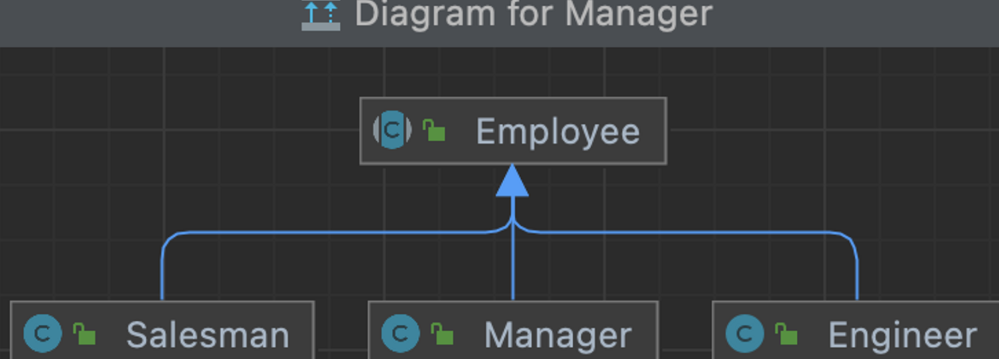
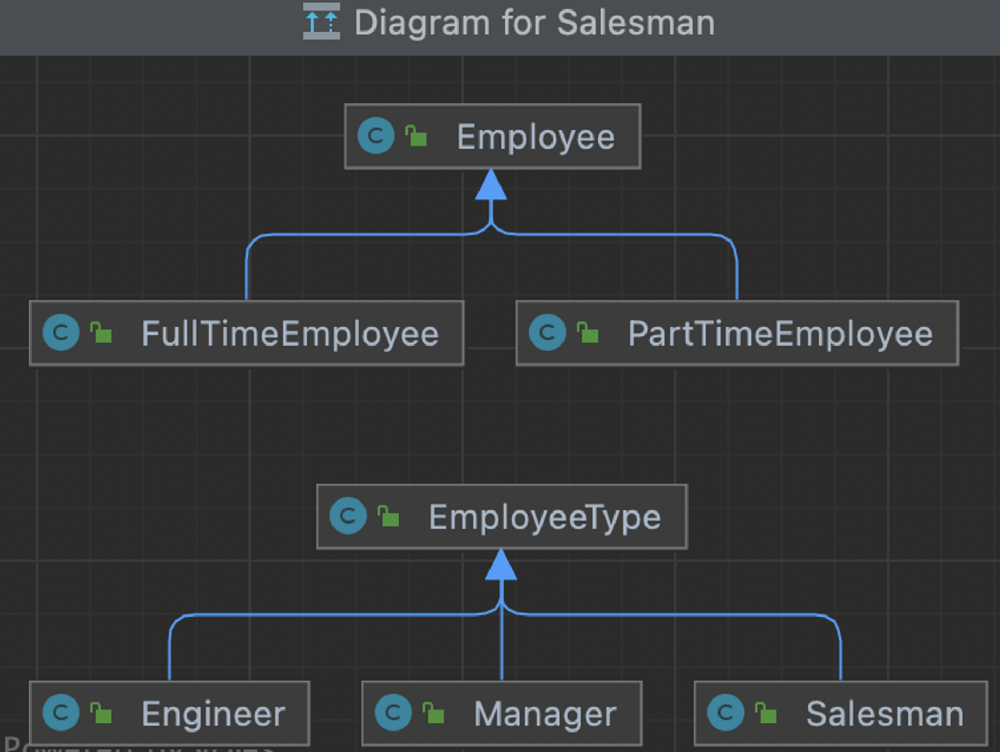
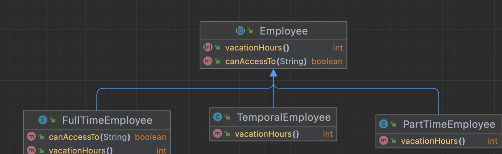
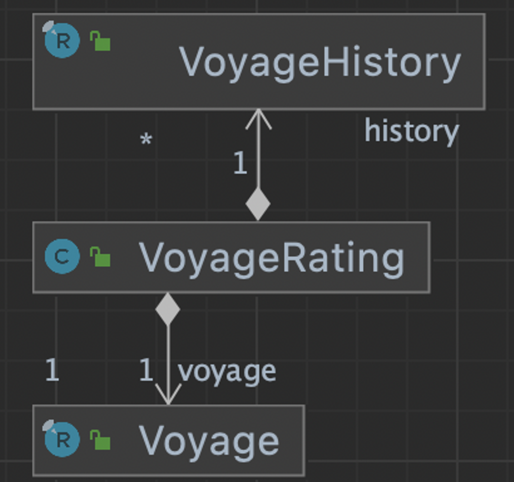

# 냄새 11. 기본형 집착 (Primitive Obsession)

- 애플리케이션이 다루고 있는 도메인에 필요한 기본 타입을 만들지 않고 프로그래밍 언어가 제공하는 기본 타입을 사용하는 경우가 많다.
  - 예) 전화번호, 좌표, 돈, 범위, 수량 등
- 기본형으로는 단위 (인치 vs 미터) 또는 표기법을 표현하기 어렵다.
- 관련 리팩토링 기술
  - **“기본형을 객체로 바꾸기 (Replace Primitive with Object)”**
  - **“타입 코드를 서브클래스로 바꾸기 (Replace Type Code with Subclasses)”**
  - **“조건부 로직을 다형성으로 바꾸기 (Replace Conditional with Polymorphism)”**
  - “클래스 추출하기 (Extract Class)”
  - “매개변수 객체 만들기 (Introduce Parameter Object)”


## 리팩토링 30. 기본형을 객체로 바꾸기 (Replace Primitive with Object)

- 개발 초기에는 기본형 (숫자 또는 문자열)으로 표현한 데이터가 나중에는 해당 데이터와 관 련있는 다양한 기능을 필요로 하는 경우가 발생한다.
  - 예) 문자열로 표현하던 전화번호의 지역 코드가 필요하거나 다양한 포맷을 지원하는 경우.
  - 예) 숫자로 표현하던 온도의 단위 (화씨, 섭씨)를 변환하는 경우.
- 기본형을 사용한 데이터를 감싸 줄 클래스를 만들면, 필요한 기능을 추가할 수 있다.

1. priority 변수는 실제로 일정한 형식이 있는 문자열이고, 비교 등의 기능이 필요하지만 현재는 모든 문자열을 입력받을 수 있고, 비교구문도 일일이 로직을 만들어 주어야 한다.
2. 이를 해결하기 위해 String인 Priority변수를 객체로 변환 해준다.

```java
public class Order {

    private String priority;

    public Order(String priority) {
        this.priority = priority;
    }

    public String getPriority() {
        return priority;
    }
}
public class OrderProcessor {
    public long numberOfHighPriorityOrders(List<Order> orders) {
        return orders.stream()
                .filter(o -> o.getPriority() == "high" || o.getPriority() == "rush")
                .count();
    }
}
```

1. Priority class 를 만든다.
2. 특정 문자의 객체만 생성할 수 있도록 legalValue 리스트를 만들어 그 외 문자열은 checked exception 을 발생시킨다.
3. 우선순위 크기 여부를 판단해주기 위해 index(), higherThan() 을 생성해준다.

```java
public class Priority {

    private String value;

    List<String> legalValue = List.of("low", "normal", "high", "rush");

    public Priority(String value) {
        if (legalValue.contains(value))
        {
            this.value = value;
        } else {
            throw new IllegalArgumentException("illgal value priority : " + this.value);
        }
    }

    @Override
    public String toString() {
        return this.value;
    }
    private int index() {
        return this.legalValue.indexOf(this.value);
    }

    public boolean higherThen(Priority other)
    {
        return index() > other.index();
    }
}
public class OrderProcessor {
    public long numberOfHighPriorityOrders(List<Order> orders) {
        return orders.stream()
                .filter(o -> o.getPriority().higherThen(new Priority("normal")))
                .count();
    }
}
public class Order {

    private String priorityValue;

    private Priority priority;

    public Order(Priority priority) {
        this.priority = priority;
    }

    public Priority getPriority() {
        return priority;
    }

}
class OrderProcessorTest {

    @Test
    void numberOfHighPriorityOrders() {
        OrderProcessor orderProcessor = new OrderProcessor();
        long highPriorityOrders = orderProcessor.numberOfHighPriorityOrders(
                List.of(new Order(new Priority("low")),
                        new Order(new Priority("normal")),
                        new Order(new Priority("high")),
                        new Order(new Priority("rush"))));
        assertEquals(2, highPriorityOrders);
    }

}
```


## 리팩토링 31. 타입 코드를 서브클래스로 바꾸기 (Replace Type Code with Subclasses)

- 비슷하지만 다른 것들을 표현해야 하는 경우, 문자열(String), 열거형 (enum), 숫자 (int) 등으 로 표현하기도 한다.
  - 예) 주문 타입, “일반 주문”, “빠른 주문”
  - 예) 직원 타입, “엔지니어”, “매니저”, “세일즈”
- 타입을 서브클래스로 바꾸는 계기
  - 조건문을 다형성으로 표현할 수 있을 때, 서브클래스를 만들고 “조건부 로직을 다형성으로 바꾸기”를 적용한다.
  - 특정 타입에만 유효한 필드가 있을 때, 서브클래스를 만들고 “필드 내리기”를 적용한다.

### 예제1) 서브클래스가 없을경우

1. String type을 제거한다.
2. type 을 사용할 신규 class 는 Employee 를 상속받는다.
3. Employee class 는 static method로 type에 맞게 인스턴스를 생성하도록 method를 생성한다.
4. 테스트 : static method를 통해 인스턴스를 생성하게 된다.

```java
public class Employee {

    private String name;

    private String type;

    public Employee(String name, String type) {
        this.validate(type);
        this.name = name;
        this.type = type;
    }

    private void validate(String type) {
        List<String> legalTypes = List.of("engineer", "manager", "salesman");
        if (!legalTypes.contains(type)) {
            throw new IllegalArgumentException(type);
        }
    }

    public String getType() {
        return type;
    }

    @Override
    public String toString() {
        return "Employee{" +
                "name='" + name + '\\'' +
                ", type='" + type + '\\'' +
                '}';
    }
}
```




```java
public abstract class Employee {

    private String name;

    protected Employee(String name) {
        this.name = name;

    }

    public static Employee createEmployee(String name, String type) {
        switch(type) {
            case "engineer" : return new Engineer(name);
            case "manager" : return new Manager(name);
            case "salesman" : return new Salesman(name);
            default: throw new IllegalArgumentException(type);
        }
    }

    private void validate(String type) {
        List<String> legalTypes = List.of("engineer", "manager", "salesman");
        if (!legalTypes.contains(type)) {
            throw new IllegalArgumentException(type);
        }
    }

    public abstract String getType();

    @Override
    public String toString() {
        return "Employee{" +
                "name='" + name + '\\'' +
                ", type='" + this.getType() + '\\'' +
                '}';
    }
}
public class Engineer extends Employee{
    public Engineer(String name) {
        super(name);
    }

    @Override
    public String getType() {
        return "engineer";
    }
}
@Test
    void employeeType() {
        assertEquals("engineer", Employee.createEmployee("keesun", "engineer").getType());
        assertEquals("manager", Employee.createEmployee("keesun", "manager").getType());
        assertThrows(IllegalArgumentException.class, () -> Employee.createEmployee("keesun", "wrong type"));
    }
```

### 예제2) 서브클래스가 있을경우

1. String type 에 대한 type class 를 생성한다.
2. capitalizedType() 는 type class 가 가져간다.
3. EmployeeType type을 생성하고, type에 의해 하위 class를 생성하는 employeeType() method를 만든다. 하위 class는 EmployeeType 을 상속한다.
4. type 에 의해 생성되는 class들을 만들고 테스트해본다

```java
public class Employee {

    private String name;

    private String type;

    public Employee(String name, String type) {
        this.validate(type);
        this.name = name;
        this.type = type;
    }

    private void validate(String type) {
        List<String> legalTypes = List.of("engineer", "manager", "salesman");
        if (!legalTypes.contains(type)) {
            throw new IllegalArgumentException(type);
        }
    }

    public String capitalizedType() {
        return this.type.substring(0, 1).toUpperCase() + this.type.substring(1).toLowerCase();
    }

    @Override
    public String toString() {
        return "Employee{" +
                "name='" + name + '\\'' +
                ", type='" + type + '\\'' +
                '}';
    }
}
public class FullTimeEmployee extends Employee {
    public FullTimeEmployee(String name, String type) {
        super(name, type);
    }
}
```





```java
public class Employee {

    private String name;

    //private String typeValue;

    private EmployeeType type;

    public Employee(String name, String type) {
        //this.validate(type);
        this.name = name;
        this.type = this.employeeType(type);
    }

    private EmployeeType employeeType(String typeValue)
    {
        switch (typeValue) {
            case "engineer" : return new Engineer();
            case "manager" : return new Manager();
            case "salesman" : return new Salesman();
            default: throw new IllegalArgumentException(typeValue);
        }
    }

    public String capitalizedType() {
        return this.type.capitalizedType();
    }

    @Override
    public String toString() {
        return "Employee{" +
                "name='" + name + '\\'' +
                ", type='" + this.type + '\\'' +
                '}';
    }
}
public class EmployeeType {
    public String capitalizedType() {
        return this.toString().substring(0, 1).toUpperCase() + this.toString().substring(1).toLowerCase();
    }
}
public class Manager extends EmployeeType {
    @Override
    public String toString() {
        return "manager";
    }
}
@Test
    void capitalizedType() {
        assertEquals("Manager", new FullTimeEmployee("keesun", "manager").capitalizedType());
        assertEquals("Engineer", new PartTimeEmployee("keesun", "engineer").capitalizedType());
        assertThrows(IllegalArgumentException.class, () -> new Employee("keesun", "wrong type"));
    }
```


## 리팩토링 32. 조건부 로직을 다형성으로 바꾸기 (Replace Conditional with Polymorphism)

- 복잡한 조건식을 상속과 다형성을 사용해 코드를 보다 명확하게 분리할 수 있다.
- swich 문을 사용해서 타입에 따라 각기 다른 로직을 사용하는 코드.
- 기본 동작과 (타입에 따른) 특수한 기능이 섞여있는 경우에 상속 구조를 만들어서 기본 동작을 상위클래스에 두고 특수한 기능을 하위클래스로 옮겨서 각 타입에 따른 “차이점”을 강조할 수 있다.
- 모든 조건문을 다형성으로 옮겨야 하는가? 단순한 조건문은 그대로 두어도 좋다. 오직 복잡한 조건문을 다형성을 활용해 좀 더 나은 코드로 만들 수 있는 경우에만 적용한다. (과용을 조심하자.)

### switches

### 변경 전

```java
public class Employee {

    private String type;

    private List<String> availableProjects;

    public Employee(String type, List<String> availableProjects) {
        this.type = type;
        this.availableProjects = availableProjects;
    }

    public int vacationHours() {
        return switch (type) {
            case "full-time" -> 120;
            case "part-time" -> 80;
            case "temporal" -> 32;
            default -> 0;
        };
    }

    public boolean canAccessTo(String project) {
        return switch (type) {
            case "full-time" -> true;
            case "part-time", "temporal" -> this.availableProjects.contains(project);
            default -> false;
        };
    }
}
class EmployeeTest {

    @Test
    void fulltime() {
        Employee employee = new Employee("full-time", List.of("spring", "jpa"));
        assertEquals(120, employee.vacationHours());
        assertTrue(employee.canAccessTo("new project"));
        assertTrue(employee.canAccessTo("spring"));
    }

    @Test
    void partime() {
        Employee employee = new Employee("part-time", List.of("spring", "jpa"));
        assertEquals(80, employee.vacationHours());
        assertFalse(employee.canAccessTo("new project"));
        assertTrue(employee.canAccessTo("spring"));
    }

    @Test
    void temporal() {
        Employee employee = new Employee("temporal", List.of("jpa"));
        assertEquals(32, employee.vacationHours());
        assertFalse(employee.canAccessTo("new project"));
        assertFalse(employee.canAccessTo("spring"));
        assertTrue(employee.canAccessTo("jpa"));
    }

}
```

### 변경 후




1. switch 문에 type 조건으로 분기하던 로직을 하위클래스를 만들어 다형성을 고려하여 리팩토링 하였다.
2. 기존의 class 는 추상클래스로 변경 시키고,
3. switch 의 type에 의해 분기하던 로직을 타입별로 class를 만들어 관련 로직을 override 하여 직접 구현하였다.
4. client에서 사용할 때에는 직접 concrete class 를 생성한다는 점 을 빼면 나머지는 사용 방식이 같고, 오히려 type을 제거함으로서 오타 등의 위험에서 벗어나는 것 같다.

```java
public abstract class Employee {

    protected List<String> availableProjects;

    public Employee(List<String> availableProjects) {
        this.availableProjects = availableProjects;
    }

    public Employee() {
    }

    public abstract int vacationHours();

    public boolean canAccessTo(String project) {
        return this.availableProjects.contains(project);
    }
}
public class FullTimeEmployee extends Employee {

    @Override
    public int vacationHours() {
        return 120;
    }
    @Override
    public boolean canAccessTo(String project) {
        return true;
    }
}
public class PartTimeEmployee extends Employee {

    public PartTimeEmployee(List<String> availableProjects) {
        super(availableProjects);
    }
    @Override
    public int vacationHours() {
        return 80;
    }
}
public class TemporalEmployee extends Employee {

    public TemporalEmployee(List<String> availableProjects) {
        super(availableProjects);
    }
    @Override
    public int vacationHours() {
        return 32;
    }
}
```

- Employee 의 concrete class 를 직접 생성하고, 그 외 테스트 로직은 변경이 없다.

```java
class EmployeeTest {

    @Test
    void fulltime() {
        Employee employee = new FullTimeEmployee();
        assertEquals(120, employee.vacationHours());
        assertTrue(employee.canAccessTo("new project"));
        assertTrue(employee.canAccessTo("spring"));
    }

    @Test
    void partime() {
        Employee employee = new PartTimeEmployee(List.of("spring", "jpa"));
        assertEquals(80, employee.vacationHours());
        assertFalse(employee.canAccessTo("new project"));
        assertTrue(employee.canAccessTo("spring"));
    }

    @Test
    void temporal() {
        Employee employee = new TemporalEmployee(List.of("jpa"));
        assertEquals(32, employee.vacationHours());
        assertFalse(employee.canAccessTo("new project"));
        assertFalse(employee.canAccessTo("spring"));
        assertTrue(employee.canAccessTo("jpa"));
    }

}
```

### variation

### 변경 전




- 함수 내에 분기 로직 조건이 중복되는 케이스가 존재한다.

```java
public class VoyageRating {

    private Voyage voyage;

    private List<VoyageHistory> history;

    public VoyageRating(Voyage voyage, List<VoyageHistory> history) {
        this.voyage = voyage;
        this.history = history;
    }

    public char value() {
        final int vpf = this.voyageProfitFactor();
        final int vr = this.voyageRisk();
        final int chr = this.captainHistoryRisk();
        return (vpf * 3 > (vr + chr * 2)) ? 'A' : 'B';
    }

    private int captainHistoryRisk() {
        int result = 1;
        if (this.history.size() < 5) result += 4;
        result += this.history.stream().filter(v -> v.profit() < 0).count();
        if (this.voyage.zone().equals("china") && this.hasChinaHistory()) result -= 2;
        return Math.max(result, 0);
    }

    private int voyageRisk() {
        int result = 1;
        if (this.voyage.length() > 4) result += 2;
        if (this.voyage.length() > 8) result += this.voyage.length() - 8;
        if (List.of("china", "east-indies").contains(this.voyage.zone())) result += 4;
        return Math.max(result, 0);
    }

    private int voyageProfitFactor() {
        int result = 2;

        if (this.voyage.zone().equals("china")) result += 1;
        if (this.voyage.zone().equals("east-indies")) result +=1 ;
        if (this.voyage.zone().equals("china") && this.hasChinaHistory()) {
            result += 3;
            if (this.history.size() > 10) result += 1;
            if (this.voyage.length() > 12) result += 1;
            if (this.voyage.length() > 18) result -= 1;
        } else {
            if (this.history.size() > 8) result +=1 ;
            if (this.voyage.length() > 14) result -= 1;
        }

        return result;
    }

    private boolean hasChinaHistory() {
        return this.history.stream().anyMatch(v -> v.zone().equals("china"));
    }

}
public record Voyage(String zone, int length) {
}
public record VoyageHistory(String zone, int profit) {
}
```

### 변경 후

- **오류발생함 다시 해보자..**