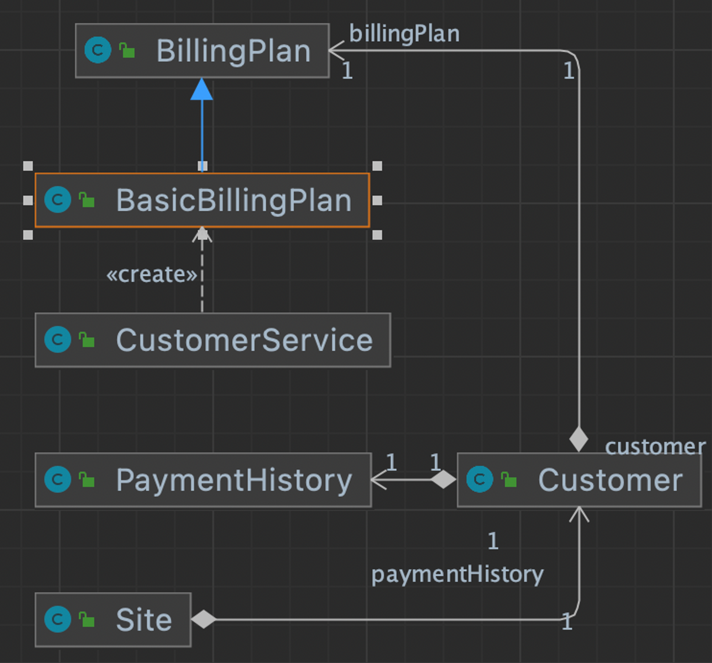
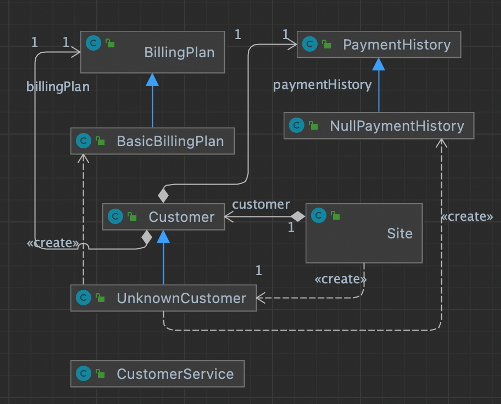

# 냄새16. 임시필드 (Temporary Field)

- 클래스에 있는 어떤 필드가 특정한 경우에만 값을 갖는 경우.
- 어떤 객체의 필드가 “특정한 경우에만” 값을 가진다는 것을 이해하는 것은 일반적으로 예상하지 못하기때문에 이해하기 어렵다.
- 관련 리팩토링
    - “클래스 추출하기 (Extract Class)”를 사용해 해당 변수들을 옮길 수 있다.
    - “함수 옮기기 (Move Function)”을 사용해서 해당 변수를 사용하는 함수를 특정 클래스로 옮길 수 있
    다.
    - **“특이 케이스 추가하기 (Introduce Special Case)”**를 적용해 “특정한 경우”에 해당하는 클래스를
    만들어 해당 조건을 제거할 수 있다.

## 리팩토링 36. 특이 케이스 추가하기 (Introduce Special Case)

- 어떤 필드의 특정한 값에 따라 동일하게 동작하는 코드가 반복적으로 나타난다면, 해당 필
드를 감싸는 “특별한 케이스”를 만들어 해당 조건을 표현할 수 있다.
- 이러한 매커니즘을 “특이 케이스 패턴”이라고 부르고 “Null Object 패턴”을 이러한 패턴의
특수한 형태라고 볼 수 있다.

### 변경 전



- customer의 name이 “unknown” 일 때의 케이스를 처리하기 위해 각 함수에 분기문으로 처리하고 있다.
- 특이케이스가 특정 경우이고, 여러상황에서 발생할 때 다형성을 적용해서 로직을 보다 간단하게 만들 수 있다.

```java
public class CustomerService {

    public String customerName(Site site) {
        Customer customer = site.getCustomer();

        String customerName;
        if (customer.getName().equals("unknown")) {
        customerName = "occupant";
        } else {
            customerName = customer.getName();
        }

        return customerName;
}

    public BillingPlan billingPlan(Site site) {
        Customer customer = site.getCustomer();
        return customer.getName().equals("unknown") ? new BasicBillingPlan() : customer.getBillingPlan();
    }

    public int weeksDelinquent(Site site) {
        Customer customer = site.getCustomer();
        return customer.getName().equals("unknown") ? 0 : customer.getPaymentHistory().getWeeksDelinquentInLastYear();
    }

}
```

### 변경 후



1. customer의 name이 “unknown” 인 경우를 처리하기 위해 UnknownCustomer class를 만든다.
2. PaymentHistory 객체가 null인 경우를 처리하기 위해 NullPaymentHistory class를 만든다.

- 생성자에 첫번째 인자를 “unknown” 로 명시 하였다.
    - 두번 째 인자는 new BasicBillingPlan() 로 세팅.
    - 세번 째 인자는 new NullPaymentHistory() 로 세팅.
- 해당 클래스는 무조건 “unknown” 이므로 isUnknown() 는 true 를 리턴한다.
- 해당 클래스 이름은 "occupant" 로 변경되서 리턴된다.

```java
public class UnknownCustomer extends Customer {

    public UnknownCustomer() {
        super("unknown", new BasicBillingPlan(), new NullPaymentHistory());
    }

    @Override
    public boolean isUnknown() {
        return true;
    }

    @Override
    public String getName() {
        return "occupant";
    }
}
```

- PaymentHistory 가 null일 때는 `weeksDelinquentInLastYear` 가 0이므로, 그에 맞게 생성자를 만든다.

```java
public class NullPaymentHistory extends PaymentHistory {
    public NullPaymentHistory() {
        super(0);
    }
}
```

- customer 객체르 생성할 때, “unkown” 일경우  new UnknownCustomer() 를 생성하도록 한다.

```java
public class Site {

    private Customer customer;

    public Site(Customer customer) {
        this.customer = customer.getName().equals("unknown") ? new UnknownCustomer() : customer;
    }

    public Customer getCustomer() {
        return customer;
    }
}
```

- 함수 내에 특이케이스를  처리하기 위한 복잡한 분기로직을 모두 깔끔하게 개선하였다.
    - customerName() : “unknown” 일 때 name이 "occupant” 이 되도록 UnkownCustomer 에서 처리 하였다.
    - billingPlan() : “unkown” 일 때 new BasicBillingPlan() 를 반환하도록 UnkownCustomer 에서 처리하였다.
    - weeksDelinquent() : “unknown” 일 때, getWeeksDelinquentInLastYear 이 0이 되도록, NullPaymentHistory를 생성하여 처리하였다.

```java
public class CustomerService {

    public String customerName(Site site) {
        return site.getCustomer().getName();
    }

    public BillingPlan billingPlan(Site site) {
        return site.getCustomer().getBillingPlan();
    }

    public int weeksDelinquent(Site site) {
        return site.getCustomer().getPaymentHistory().getWeeksDelinquentInLastYear();
    }

}
```

- 테스트 코드

```java
class CustomerServiceTest {

    CustomerService customerService = new CustomerService();
    Customer unknown = new Customer("unknown", null, null);

    BillingPlan keesunBillingPlan = new BillingPlan();
    Customer keesun = new Customer("keesun", keesunBillingPlan, new PaymentHistory(1));

    @Test
    void customerName() {
        String unknownCustomerName = customerService.customerName(new Site(unknown));
        assertEquals("occupant", unknownCustomerName);

        String customer = customerService.customerName(new Site(keesun));
        assertEquals("keesun", customer);
    }

    @Test
    void billingPlan() {
        assertTrue((customerService.billingPlan(new Site(unknown)) instanceof BasicBillingPlan));

        assertEquals(keesunBillingPlan, customerService.billingPlan(new Site(keesun)));
    }

    @Test
    void weeksDelingquent() {
        assertEquals(1, customerService.weeksDelinquent(new Site(keesun)));

        assertEquals(0, customerService.weeksDelinquent(new Site(unknown)));
    }

}
```