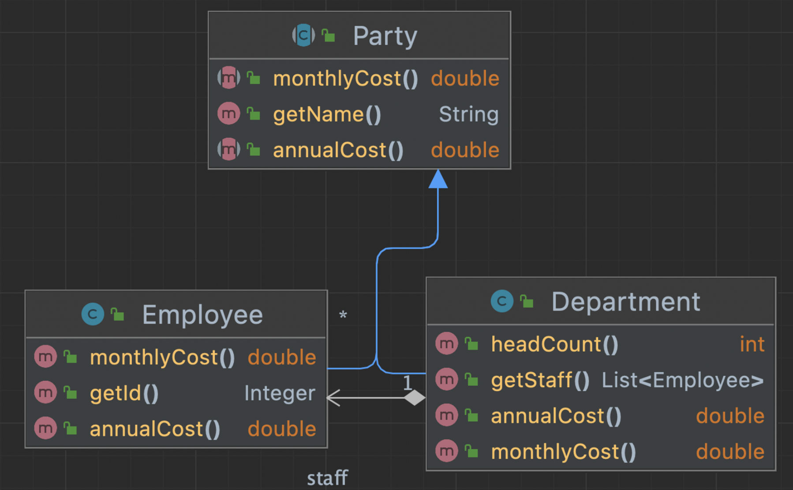

# 냄새 20. 거대한 클래스 (Large Class)

어떤 클래스가 너무 많은 일을 하다보면 필드도 많아지고 중복 코드도 보이기 시작한다.

- 클라이언트가 해당 클래스가 제공하는 기능 중에 일부만 사용한다면 각각의 세부 기능을 별도의 클래스로 분리할 수 있다.
  - “클래스 추출하기 (Extract Class)”를 사용해 관련있는 필드를 한 곳으로 모을 수 있다.
  - 상속 구조를 만들 수 있다면 **“슈퍼클래스 추출하기 (Extract Superclass)”**또는 “타입 코드를 서브클래스로 교체하기”를 적용할 수 있다.
- 클래스 내부에 산재하는 중복 코드는 메소드를 추출하여 제거할 수 있다.

# 리팩토링 41. 슈퍼클래스 추출하기 (Extract Superclass)

- 두개의 클래스에서 비슷한 것들이 보인다면 상속을 적용하고, 슈퍼클래스로 “필드 올리기 (Pull Up Field)”와 “메소드 올리기 (Pull Up Method)”를 사용한다.
- 대안으로는 “클래스 추출하기 (Extract Class)”를 적용해 위임을 사용할 수 있다.
- 우선은 간단히 상속을 적용한 이후, 나중에 필요하다면 “슈퍼클래스를 위임으로 교체하기” 를 적용한다.

### 변경 전

- 클래스간 공통 내용이 존재한다면, 슈퍼클래스로 필드올리기, 메소드올리기를 적용해볼 수 있다,

```java
public class Employee {

    private Integer id;

    private String name;

    private double monthlyCost;

    public double annualCost() {
        return this.monthlyCost * 12;
    }

    public Integer getId() {
        return id;
    }

    public String getName() {
        return name;
    }

    public double getMonthlyCost() {
        return monthlyCost;
    }
}
public class Department {

    private String name;

    private List<Employee> staff;

    public String getName() {
        return name;
    }

    public List<Employee> getStaff() {
        return staff;
    }

    public double totalMonthlyCost() {
        return this.staff.stream().mapToDouble(e -> e.getMonthlyCost()).sum();
    }

    public double totalAnnualCost() {
        return this.totalMonthlyCost() * 12;
    }

    public int headCount() {
        return this.staff.size();
    }
}
```

### 변경 후



- Party 라는 추상클래스를 생성해서, 필드올리기와 메소드올리기를 사용해서 슈퍼클래스 추출하기를 적용해 보았다..

```java
public abstract class Party {

    private String name;

    public Party(String name) {
        this.name = name;
    }

    public abstract double annualCost();

    public abstract double monthlyCost();

    public String getName() {
        return name;
    }
}
public class Employee extends Party{

    private Integer id;
    private double monthlyCost;

    public Employee(String name) {
        super(name);
    }

    @Override
    public double annualCost() {
        return this.monthlyCost * 12;
    }

    public Integer getId() {
        return id;
    }

    @Override
    public double monthlyCost() {
        return monthlyCost;
    }
}
public class Department extends Party{

    private List<Employee> staff;

    public Department(String name) {
        super(name);
    }

    public List<Employee> getStaff() {
        return staff;
    }

    @Override
    public double monthlyCost() {
        return this.staff.stream().mapToDouble(e -> e.monthlyCost()).sum();
    }

    @Override
    public double annualCost() {
        return this.monthlyCost() * 12;
    }

    public int headCount() {
        return this.staff.size();
    }
}
```