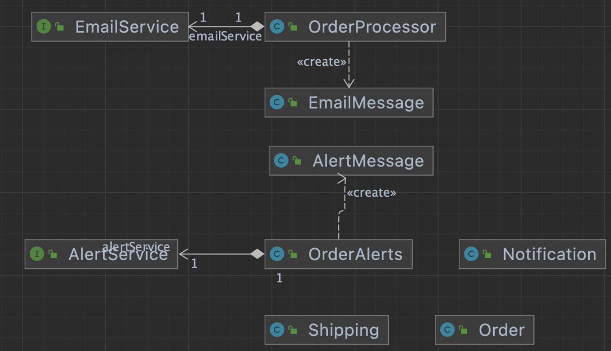
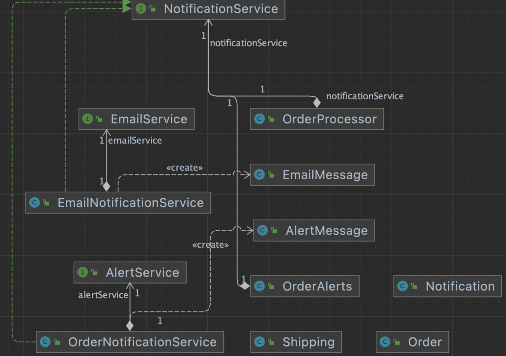

# 냄새 21. 서로 다른 인터페이스의 대안 클래스들  (Alternative Classes with Different Interfaces)

- 비슷한 일을 여러 곳에서 서로 다른 규약을 사용해 지원하고 있는 코드 냄새.
- 대안 클래스로 사용하려면 동일한 인터페이스를 구현하고 있어야 한다.
- “함수 선언 변경하기 (Change Function Declaration)”와 “함수 옮기기 (MoveFunction)을 사용해서 서로 동일한 인터페이스를 구현하게끔 코드를 수정할 수 있다.
- 두 클래스에서 일부 코드가 중복되는 경우에는“슈퍼클래스 추출하기 (ExtractSuperclass)”를 사용해 중복된 코드를 슈퍼클래스로 옮기고 두 클래스를 새로운 슈퍼클래스의 서브클래스로 만들 수 있다.

### 변경 전

- 주어진 인터페이스를 고칠 수 없는 경우
- 추상화를 하나 더올린다




```java
public class OrderProcessor {

    private EmailService emailService;

    public void notifyShipping(Shipping shipping) {
        EmailMessage emailMessage = new EmailMessage();
        emailMessage.setTitle(shipping.getOrder() + " is shipped");
        emailMessage.setTo(shipping.getEmail());
        emailMessage.setFrom("no-reply@whiteship.com");
        emailService.sendEmail(emailMessage);
    }

}
public class OrderAlerts {

    private AlertService alertService;
    
    public void alertShipped(Order order) {
        AlertMessage alertMessage = new AlertMessage();
        alertMessage.setMessage(order.toString() + " is shipped");
        alertMessage.setFor(order.getEmail());
        alertService.add(alertMessage);
    }
}
```

### 변경 후



- NotificationService interface로 EmailService, AlertService 두 api를 엮어서 한번 더 추상화 하였다.
  - OrderProcessor, OrderAlerts class에서 NotificationService 에 기능을 위임하여 EmailNotificationService, OrderNotificationService 에서 EmailMessage, AlertMessage를 사용하도록 한다.
  - 결국 NotificationService는 두 인터페이스 api를 하나의 인터페이스로 추상화시켜 엮은 셈이 된다.

```java
public interface NotificationService {
    void sendNotification(Notification notification);
}
public class OrderNotificationService implements NotificationService {

    AlertService alertService;
    @Override
    public void sendNotification(Notification notification) {
        AlertMessage alertMessage = new AlertMessage();
        alertMessage.setMessage(notification.getTitle());
        alertMessage.setFor(notification.getReceiver());
        alertService.add(alertMessage);
    }
}
public class OrderAlerts {

    public NotificationService notificationService;

    public OrderAlerts(NotificationService notificationService) {
        this.notificationService = notificationService;
    }

    public void alertShipped(Order order) {
        Notification notification = Notification.newNotification(order.toString() + " is shipped")
                .receiver(order.getEmail());

        sendNotification(notification);
    }

    private void sendNotification(Notification notification) {
        notificationService.sendNotification(notification);
    }
}
public class EmailNotificationService implements NotificationService {

    EmailService emailService;

    @Override
    public void sendNotification(Notification notification) {
        EmailMessage emailMessage = new EmailMessage();
        emailMessage.setTitle(notification.getTitle());
        emailMessage.setTo(notification.getReceiver());
        emailMessage.setFrom(notification.getSender());
        emailService.sendEmail(emailMessage);
    }
}
public class OrderProcessor {
    public NotificationService notificationService;

    public OrderProcessor(NotificationService notificationService) {
        this.notificationService = notificationService;
    }

    public void notifyShipping(Shipping shipping) {
        Notification notification = Notification.newNotification(shipping.getOrder() + " is shipped")
                        .receiver(shipping.getEmail())
                        .sender("no-reply@whiteship.com");
        notificationService.sendNotification(notification);
    }

}
```