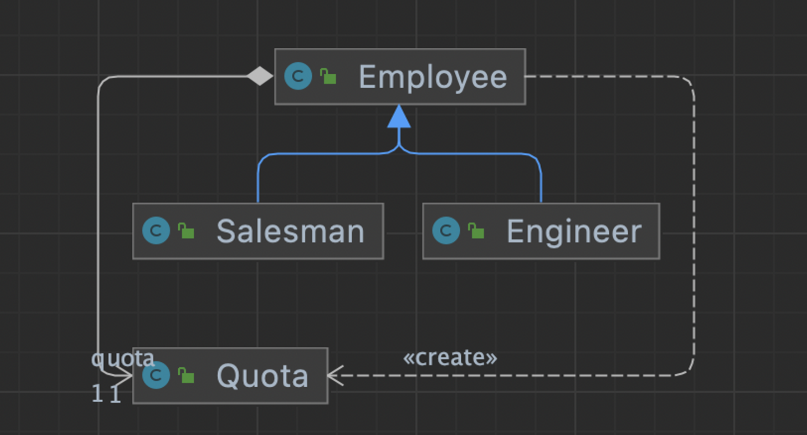

# 냄새23. 상속포기 (Refused Bequest)

- 서브클래스가 슈퍼클래스에서 제공하는 메소드나 데이터를 잘 활용하지 않는다는 것은 해 당 상속 구조에 문제가 있다는 뜻이다.
  - 기존의 서브클래스 또는 새로운 서브클래스를 만들고 슈퍼클래스에서 “메소드와 필드를 내려주면 (Push Down Method / Field)” 슈퍼클래스에 공동으로 사용하는 기능만 남 길 수 있다.
- 서브클래스가 슈퍼클래스의 기능을 재사용하고 싶지만 인터페이스를 따르고 싶지 않은 경 우에는 “슈퍼클래스 또는 서브클래스를 위임으로 교체하기” 리팩토링을 적용할 수 있다.

슈퍼페이스가 인터페이스 등에서 정의해 놓은 규약이 있을텐데, 이 의도를 무시하고 사용하게 되는 경우 위임으로 변경하도록 리팩토링을 한다.

### 변경 전



- Employee가 정의하고 있는 함수를 Salesman은 사용하고 Engineer는 사용하지 않는다면, 해당 함수를 Salesman으로 옮겨주는 리팩토링을 진행한다.

```java
public class Employee {

    protected Quota quota;

    protected Quota getQuota() {
        return new Quota();
    }

}
public class Salesman extends Employee {

}
public class Engineer extends Employee {

}
```

### 변경 후

```java
public class Employee {
}
public class Salesman extends Employee {

    protected Quota quota;

    protected Quota getQuota() {
        return new Quota();
    }

}
public class Engineer extends Employee {

}
```