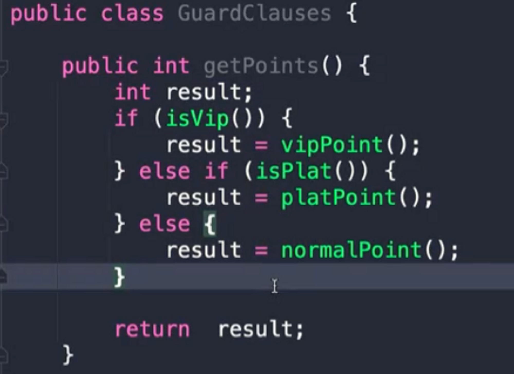
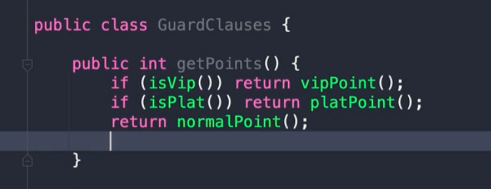

# 카탈로그 1. 기본 기술 (가장 자주 사용하는 리팩토링 기술)

- 함수 추출하기 (Extract Function)
- 함수 인라인하기 (Inline Function)
- **변수 추출하기 (Extract Variable)**
- **변수 인라인하기 (Inline Variable)**
- 함수 선언 변경하기 (Change Function Declaration)
- 변수 캡슐화하기 (Encapsulate Vraiable)
- **변수 이름 바꾸기 (Rename Variable)**
- 매개변수 객체 만들기 (Introduce Parameter Object)
- 여러 함수를 클래스로 묶기 (Combine Functions into Class)
- 여러 함수를 변환 함수로 묶기 (Combine Functions into Trasnform)
- 단계 쪼개기 (Split Phase)

# 카탈로그 2. 캡슐화 (모듈에서 외부 시스템으로 공개하지 않아도 되는 데이터를 숨기는 기술)

- 레코드 캡슐화하기 (Encapsulate Record)
    - 필드접근 못하게 메소드로 접근하게
- **컬렉션 캡슐화하기 (Encapsulate Collection)**
    - 컬렉션의 복사본을 전달하던가, 메소드로 접근할 수 있도록 해야 한다.
- 기본형을 객체로 바꾸기 (Replace Prinitive with Object)
- 임시 변수를 질의 함수로 바꾸기 (Replace Temp with Query)
- 클래스 추출하기 (Extract Class)
- 클래스 인라인하기 (Inline Class)
- 위임 숨기기 (Hide Delegate)
    - 반대가 중재자 제거하기이다.
- 중재자 제거하기 (Remove Middle Man)
- **알고리듬 교체하기 (Substitute Algorithm)**

# 카탈로그 3. 기능 옮기기 (함수나 필드 또는 문장을 적절한 위치로 옮기는 기술)

- 함수 옮기기 (Move Function)
- 필드 옮기기 (Move Field)
- **문장을 함수로 옮기기 (Move Statements into Function)**
- **문장을 호출한 곳으로 옮기기 (Move Statements to Callers)**
- **인라인 코드를 함수 호출로 바꾸기 (Replace Inline Code with Function Call)**
- 문장 슬라이드하기 (Slide Statements)반복문 쪼개기 (Split Loop)
- 반복문을 파이프라인으로 바꾸기 (Replace Loop with Pipeline)
- 죽은 코드 제거하기 (Remove Dead Code)

# 카탈로그 4. 데이터 조직화 (데이터 구조를 다루는 기술)

- 변수 쪼개기 (Split Variable)
- 필드 이름 바꾸기 (Rename Field)
- 파생 변수를 질의 함수로 바꾸기 (Replace Derived Variable with Query)
- **참조를 값으로 바꾸기 (Change References to Value)**
- **값을 참조로 바꾸기 (Change Value to Reference)**

# 카탈로그 5. 조건부 로직 간소화 (복잡한 조건문을 다루는 기술)

- 조건문 분해하기 (Decompose Conditional)
- **조건식 통합하기 (Consolidate Conditional Expression)**
- **중첩 조건문을 보호 구문으로 바꾸기 (Replace Nested Conditional with Guard
Clauses)**
    
    
    
    
    
- 조건부 로직을 다형성으로 바꾸기 (Replace Conditional with Polymorphism)
- 특이 케이스 추가하기 (Introduce Special Case)
- 어서션 추가하기 (Introduce Assertion)

# 카탈로그 6. API 리팩토링 (쉽고 이해하고 사용할 수 있는 API를 만드는 기술)

- 질의 함수와 변경 함수 분리하기 (Separate Query from Modifier)
- **함수 매개변수화하기 (Parameterize Function)**
- 플래그 인수 제거하기 (Remove Flag Argument)
- 객체 통째로 넘기기 (Preserve Whole Object)
- 매개변수를 질의 함수로 바꾸기 (Replace Parameter with Query)
- **질의 함수를 매개변수로 바꾸기 (Replace Query with Parameter)**
- 세터 제거하기 (Remove Setting Method)
- **생성자를 팩토리 함수로 바꾸기 (Replace Constructor with Factory Function)**
- 함수를 명령으로 바꾸기 (Replace Function with Command)
    - 커맨드 패턴 참조
- **명령을 함수로 바꾸기 (Replace Command with Function)**

# 카탈로그 7. 상속 다루기 (상속을 제대로 사용하는 기술)

- 메소드 올리기 (Pull Up Method)
- **필드 올리기 (Pull Up Field)**
- **생성자 본문 올리기 (Pull Up Constructor Body)**
- 메서드 내리기 (Push Down Method)
- 필드 내리기 (Push Down Field)
- 타입 코드를 서브클래스로 바꾸기 (Replace Type Code with Subclasses)
- **서브클래스 제거하기 (Remove Subclass)**
- 슈퍼클래스 추출하기 (Extract Superclass)
- 계층 합치기 (Collapse Hierarchy)
- 서브클래스를 위임으로 바꾸기 (Replace Subclass with Delegate)
- 슈퍼클래스를 위임으로 바꾸기 (Replace Superclass with Delegate)