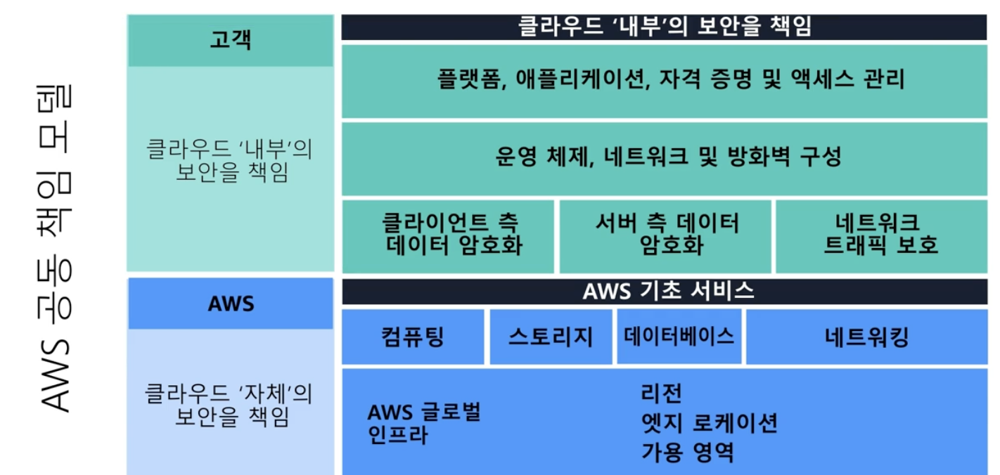

# 06. Security

- 공동 책임 모델
- Multi-Factor Authentication(MFA)
- AWS Identity and Access Management(IAM)
- AWS Organizations
- 보안 정책을 기본 수준에서 설명할 수 있습니다.
- AWS를 사용한 규정 준수의 이점을 요약할 수 있습니다.
- 추가 AWS 보안 서비스를 기본 수준에서 설명할 수 있습니다.

## **1. AWS 공동 책임 모델**

### 클라우드 내부 보안

- 고객 책임
- AWS 클라우드 내에서 생성하고 배치하는 모든 것의 보안을 책임짐
- 액세스 권한 부여, 관리 및 해지도 고객이 제어함.
- 서비스, 시스템 복잡성, 회사별 운영 및 보안 요구 사항과 같은 요소에 따라 보안 단계가 달라짐.
- 이러한 단계에는 Amazon EC2 인스턴스에서 실행할 운영 체제 선택, 구성 및 패치, 보안그룹구성, 사용자 계정 관리 등의 단계 포함

###  클라우드 자체 보안

- 인프라의 모든 계층에서 구성 요소를 운영, 관리 및 제어

- 심지어 서비스가 작동하는 데이터 센터의 물리적 보안 영역도 포함.

- AWS 리전, 가용 영역 및 엣지 로케이션등의 글로벌 인프라도 보호.

- 특히, 리소스를 호스팅하는 물리적 인프라를 관리하는데. 여기에는 다음과 같은 내용들이 포함됨.
  1. 데이터 센터의 물리적 보안
  2. 하드웨어 및 소프트웨어
  3. 인프라
  4. 네트워크 인프라

  5. 가상화 인프라

## 2. 사용자 권한 및 액세스

### **AWS Identify and Access Management**

- IAM
- AWS 서비스 및 리소스에 대한 권한을 부여하거나 거부하는 문서
- AWS 서비스와 리소스에 대한 액세스를 안전하게 관리 하게 해주는 서비스
- 회사의 고유 운영 및 보안 요구 사항에 따라 액세스 권한 구성의 "유연성" 제공
  1. IAM 사용자, 그룹 및 역할
  2. IAM 정책
  3. Multi-Factor Authentication 

### **AWS 계정 루트 사용자**

- AWS 계정을 처음 만들면 "루트 사용자" 로 시작
- 계정의 모든 AWS 서비스 및 리소스에 대한 전체 액세스 권한을 가짐.
- "커피숍 점주" 와 비슷한 맥락

### **IAM 사용자**

- 사용자가 AWS에서 생성하는 자격 증명
- "이름" "자격증명" 으로 구성됨.
- 기본적으로 AWS에서 새 IAM 사용자를 생성하면 해당 사용자와 연결된 권한이 X
- EC2 인스턴스 시작, S3 버킷 생성 등 특정 작업을 수행할 수 있도록 허용하려면 IAM 사용자에게 필요 권한을 부여 해야함.
- ex) AWS에 액세스해야 하는 각 사용자마다 개별 IAM 사용자를 생성하는 것이 좋다.

###  **IAM 정책**

- AWS 서비스 및 리소스에 대한 권한을 허용하거나 거부하는 문서
- IAM 정책을 사용하면 사용자가 리소스에 액세스할 수 있는 수준을 사용자 지정할 수 있다.
- ex) 사용자가 AWS 계정 내의 모든 Amazon S3 버킷에 액세스하거나 특정 버킷에만 액세스하도록 허용 가능.
- ※ 권한 부여 시 "최소 권한" 보안 원칙을 따르십시오. 필요한 것보다 많은 권한을 갖는 것을 방지함.

**IAM 그룹**

- IAM 사용자의 모음
- 그룹에 IAM 정책을 할당하면 해당 그룹의 모든 사용자에게 정책에 지정된 권한 부여
- 점주는 계산원마다 권한을 할당하는 대신 '계산원' IAM 그룹을 생성할 수 있다.
- 그런 다음에 IAM 사용자를 추가하고 그룹 수준에서 권한을 연결할 수 있음.
- 이렇게 되면 직원이 직무를 전환하는 경우 권한을 손쉽게 조정할 수 있다! 예를 들어, 계산원이 인벤토리 담당자가 되는 경우 점주는 해당 계산원을 '계산원' IAM 그룹에서 제거하고 '인벤토리 전문가' IAM 그룹에 추가하면 됨!
- 직원들은 IAM 역할을 통해 필요한 액세스 권한을 얻을 수 있다! 

#### **IAM 역할**

- 임시로 권한에 액세스하기 위해 수임할 수 있는 자격 증명
- 이전 역할에 지정된 모든 권한을 포기하고 새 역할에 지정된 권한을 수임!
- 장기적이 아니라 "일시적"으로 부여해야 하는 상황에 이상적

#### **Multi-Factor Authentication**

- MFA
- 추가 보안 계층 제공

 

## 3. AWS Organizations

- 조직을 생성하면 AWS Organizations가 조직의 모든 계정에 대한 상위 컨테이너 **루트**를 자동으로 생성한다.
- AWS Organizations에서는 [**서비스 제어 정책(SCP)**](https://docs.aws.amazon.com/organizations/latest/userguide/orgs_manage_policies_scps.html)을 사용하여 조직의 계정에 대한 권한을 중앙에서 제어할 수 있다.
- SCP를 사용하면 각 계정의 사용자 및 역할이 액세스할 수 있는 AWS 서비스, 리소스 및 개별 API 작업을 제한할 수 있다.

### SCP

AWS Organizations에서 서비스 제어 정책(SCP)을 조직 루트, 개별 멤버 계정 또는 OU에 적용할 수 있다. 
SCP는 AWS 계정 루트 사용자를 포함하여 계정 내의 모든 IAM 사용자, 그룹 및 역할에 영향을 준다.

### **조직 단위**

AWS Organizations에서는 계정을 조직 단위(OU)로 그룹화하여 비슷한 비즈니스 또는 보안 요구 사항이 있는 계정을 관리.
OU에 정책을 적용하면 OU의 모든 계정이 정책에 지정된 권한을 자동으로 상속합니다.  

개별 계정을 OU로 구성하면 특정 보안 요구 사항이 있는 워크로드 또는 애플리케이션을 격리. 
  예를 들어 회사에 특정 규정 요구 사항을 충족하는 AWS 서비스에만 액세스할 수 있는 계정이 있다면, 이러한 계정을 한 OU에 배치할 수 있다. 그런 다음 규제 요구 사항을 충족하지 않는 다른 모든 AWS 서비스에 대한 액세스를 차단하는 정책을 해당 OU에 연결가능.

## 4. 규정 준수

 **AWS Artifact**

- AWS 보안 및 규정 준수 보고서 및 일부 온라인 계약에 대한 온디맨드 액세스를 제공하는 서비스
- AWS Artifact Agreements 및 AWS Artifact Reports 두가지로 구성

 **AWS Artifact Agreements**

- 개별 계정 및 AWS Organizations 내 모든 계정에 대한 계약을 검토, 수락 및 관리 가능.
- 회사에서 AWS 서비스 전체에서 "특정 유형"의 정보를 사용하기 위해 계약 체결 시 유용!
- HIPAA와 같은 특정 규정의 적용을 받는 해결을 위한 다양한 유형의 계약이 제공됨.

 **AWS Artifact Reports**

- 외부 감사 기관이 작성한 규정 준수 보고서를 제공
- 항상 최신 상태로 유지
- AWS 감사 아티팩트를 제공

### **고객 규정 준수 센터**

- 규제 대상 업종의 기업들이 다양한 규정 준수, 거버넌스 및 감사 과제를 어떻게 해결했는지 확인 가능
- AWS 규정 준수에 대해 자세히 알아볼 수 있는 리소스가 포함됨.
- 감사자 학습 경로가 포함되어 있음.
- 아래와 같은 주제에 관한 규정 준수 백서 및 설명서에 액세스 할 수 있음.
  - 주요 규정 준수 질문에 대한 AWS 답변
  - AWS 위험 및 규정 준수 개요
  - 보안 감사 체크리스트

## 5. 서비스 거부 공격

### **서비스 거부(DoS) 공격**

- 사용자들이 웹 사이트 또는 애플리케이션을 이용할 수 없게 만들려는 의도적인 시도

### 분산 서비스 거부(DDos) 공격

- 여러 소스를 사용하여 웹 사이트 또는 애플리케이션을 사용할 수 없게 만드는 공격
- 그룹일수도, 한 명 일수도, 여러 컴퓨터(봇)을 사용함.

### **AWS Shield**

- DDoS 공격으로부터 애플리케이션을 보호하는 서비스

###  **AWS Shield Standard** 

- 모든 AWS 고객을 자동으로 보호하는 "무료 서비스" (DDoS 공격으로부터 보호)
- 다양한 분석 기법 사용, 실시간으로 악성 트래픽 탐지 및 자동 안화

### **AWS Shield Advanced**

- 상세한 공격 진단 및 정교한 DDoS 공격을 탐지하고 완화할 수 있는 "유료 서비스"
- CloudFront, Route 53, ELB 같은 다른 서비스와 통합됨.

## 6. 추가 보안 서비스

### **AWS KMS**

- AWS key Management Service
- 암호화 키를 사용하여 암호화 작업을 수행할 수 있음.
- 암호화 키를 생성, 관리 및 사용 가능.
- 광범위한 서비스 및 애플리케이션에서 키 사용을 제어할 수 있음
- 키에 필요한 액세스 제어를 "특정 수준"으로 선택 가능.
  - 키를 관리할 수 있는 IAM 사용자 및 역할 지정.
- 더 이상 사용되지 않도록 일시적으로 키 비활성화도 가능함.
- 키는 AWS KMS를 벗어나지 않고, 사용자가 항상 키를 제어할 수 있다.

### **AWS WAF**

- 네트워크 요청을 모니터링할 수 있는 웹 애플리케이션 방화벽
-  Amazon CloudFront 및 Apllication Load Balancer와 함께 작동
- AWS 리소스를 보호하기 위해 웹 ACL(액세스 제어 목록)을 사용함

### **Amazon Inspector**

- 자동 보안 평가를 실행하여 보안 및 규정 준수 개선 서비스
- Amazon EC2 인스턴스에 대한 오픈 액세스, 취약한 소프트웨어 버전 설치와 같은 내용 검사
- 평가를 수행 -> 보안 탐지 결과 목록 제공 (해결 방법 포함)
- 모든 잠재적 보안 문제가 해결됨을 보장하지 않는다.

### **Amazon GuardDuty**

- AWS 인프라 및 리소스에 대한 지능형 위협 탐지 기능을 제공하는 서비스
- AWS 환경 내의 네트워크 활동 및 계정 동작을 지속적으로 모니터링하여 위협 식별
- 추가 보안 소프트웨어 배포 및 관리 필요 X
- 문제 해결을 위한 "권장 단계"가 포함됨.
- 결과에 대한 응답으로 자동으로 문제 해결 단계를 수행하도록 "AWS Lambda" 함수 구성 가능.

