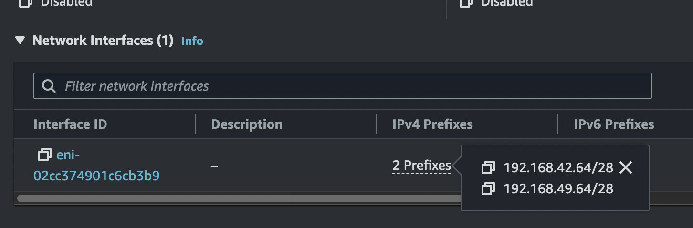
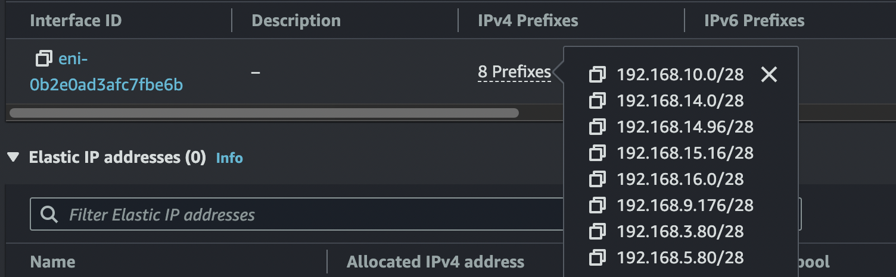
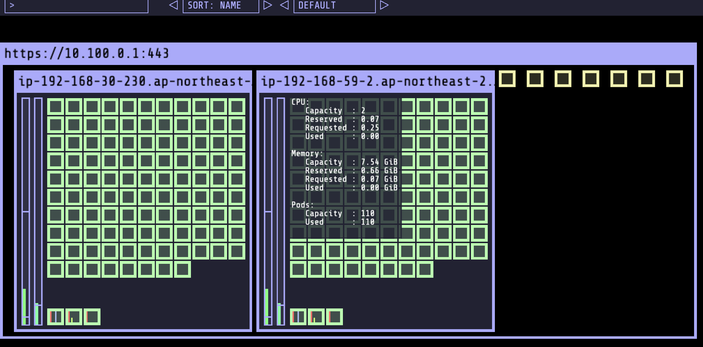

# Increase the limit on the number of pods

[AWS docs](https://docs.aws.amazon.com/ko_kr/eks/latest/userguide/cni-increase-ip-addresses.html) 를 참고해서 pod 최대 개수를 늘림.

- vpc cni version

~~~
$ kubectl describe daemonset aws-node --namespace kube-system | grep Image | cut -d "/" -f 2
~~~

~~~
amazon-k8s-cni-init:v1.15.1-eksbuild.1
amazon-k8s-cni:v1.15.1-eksbuild.1
amazon
~~~

- prifix true 설정

~~~
$ kubectl set env daemonset aws-node -n kube-system ENABLE_PREFIX_DELEGATION=true
~~~

~~~
$ k describe ds -n kube-system aws-node # 설정적용 결과 확인
~~~

- 인스턴스 별 최대 pod 개수 확인

~~~
$ curl -o max-pods-calculator.sh https://raw.githubusercontent.com/awslabs/amazon-eks-ami/master/files/max-pods-calculator.sh

$ chmod +x max-pods-calculator.sh

$ ./max-pods-calculator.sh --instance-type m5.xlarge --cni-version 1.9.0-eksbuild.1
~~~

- 미리 1개의 ip를 생성해 놓는다.

~~~
$ kubectl set env ds aws-node -n kube-system WARM_PREFIX_TARGET=1
~~~

- max pod을 지정한 새로운 노드그룹을 생성한다 (기본 노드 2개 생성됨)

~~~
$ eksctl create nodegroup --cluster eks-demo --max-pods-per-node 110
~~~

- pod 생성 가느 개수 확인

~~~
$ kubectl describe node ip-192-168-30-230.ap-northeast-2.compute.internal | grep 'pods\|PrivateIPv4Address'
~~~

~~~
  pods:               110
~~~

### 기본 prefix 현황 (kube-system에만 Pod 존재)

### pod 배포 후 개수에 따른 prefix 현황 파악

~~~yaml
cat <<EOF | kubectl apply -f -
apiVersion: apps/v1
kind: Deployment
metadata:
  name: nginx-deployment
spec:
  selector:
    matchLabels:
      app: nginx
  replicas: 80
  template:
    metadata:
      labels:
        app: nginx
    spec:
      containers:
      - name: nginx
        image: public.ecr.aws/nginx/nginx:1.21
        ports:
        - containerPort: 80
EOF
~~~

### pod 최대 개수일 때 Node의 prifiex 현황

~~~
➜  settings git:(web) ✗ k get pod -o wide | grep ip-192-168-30-230 | grep Running | wc -l
     107
➜  settings git:(web) ✗ k get pod -o wide | grep ip-192-168-59-2 | grep Running | wc -l
     107
~~~

### pod 최대 개수 (node 2ea)

~~~
➜  settings git:(web) ✗ k get pod --all_namespaces | grep Running | wc -l
     220
~~~

**고민, 추가학습

왜 처음에 구성한 노드에 설정을 못하고 새로운 노드그룹을 생성해야 하는 지 잘 모르겠다

처음 eks 생성할 때 prefix 구성후 올릴 수 있는 방법은 없나?

prefix /28 나누는 네트워크 기준 , pod 개수 늘어날때 언제 prefix 늘어나는가

## Ref

https://lcc3108.github.io/articles/2021-08/eks-too-many-pod

https://trans.yonghochoi.com/translations/aws_vpc_cni_increase_pods_per_node_limits.ko