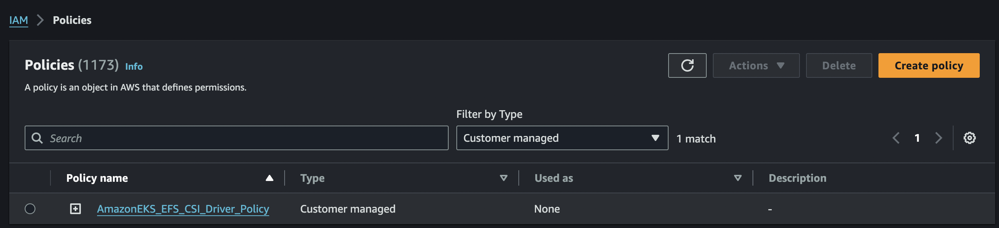
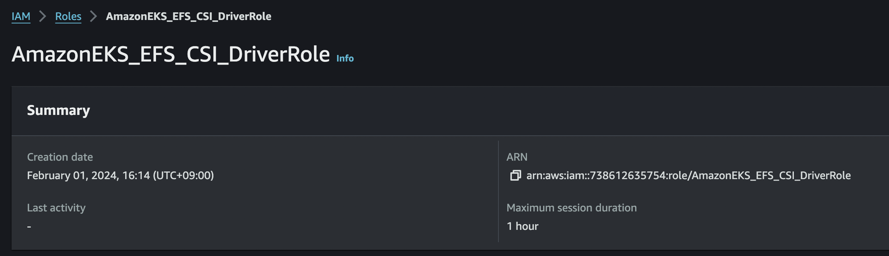
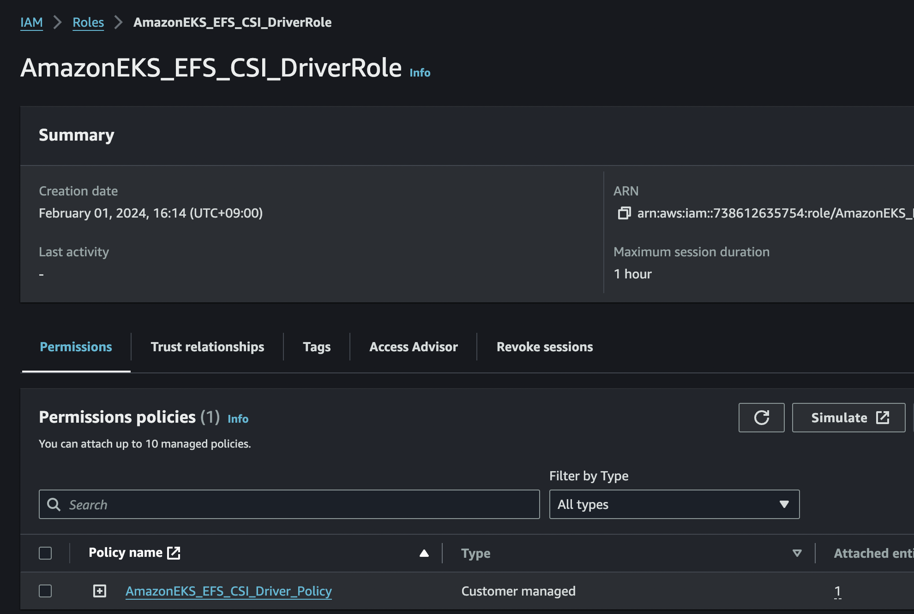
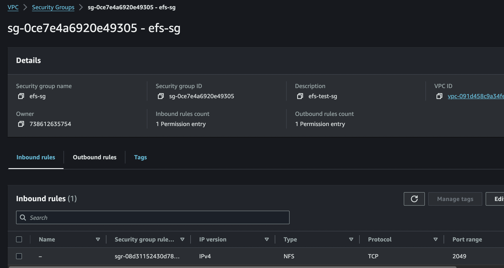
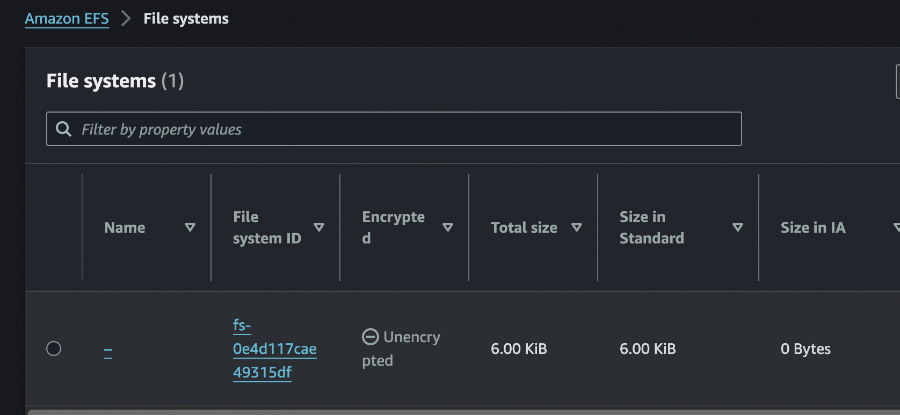
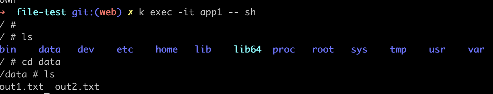

# EFS 설정


​		


1. GitHub에서 IAM 정책 문서 다운로드

~~~
curl -o iam-policy-example.json https://raw.githubusercontent.com/kubernetes-sigs/aws-efs-csi-driver/v1.2.0/docs/iam-policy-example.json
~~~


2. IAM 정책 생성 (create-policy)

~~~sh
aws iam create-policy \
    --policy-name AmazonEKS_EFS_CSI_Driver_Policy \
    --policy-document file://iam-policy-example.json
~~~

> {
>     "Policy": {
>         "PolicyName": "AmazonEKS_EFS_CSI_Driver_Policy",
>         "PolicyId": "ANPA2X6F6NBVDTRT3WIU6",
>         "Arn": "arn:aws:iam::738612635754:policy/AmazonEKS_EFS_CSI_Driver_Policy",
>         "Path": "/",
>         "DefaultVersionId": "v1",
>         "AttachmentCount": 0,
>         "PermissionsBoundaryUsageCount": 0,
>         "IsAttachable": true,
>         "CreateDate": "2024-02-01T06:59:30+00:00",
>         "UpdateDate": "2024-02-01T06:59:30+00:00"
>     }
> }




#### OIDC 식별값 확인

~~~
aws eks describe-cluster --name "eks name" --query "cluster.identity.oidc.issuer" --output text
~~~

> ~~~
> https://oidc.eks.ap-northeast-2.amazonaws.com/id/34398962779637F4536CE3432D078541
> ~~~


3. IAM Trust Policy 생성

- Principal, StringEquals에 oidc 정보를 입력한다.
- system:serviceaccount:kube-system:efs-csi-controller-sa 
  - efs-csi-controller-sa  는 serviceaccount인데, efs생성 시 자동생성됨

~~~
cat <<EOF > trust-policy.json
{
  "Version": "2012-10-17",
  "Statement": [
    {
      "Effect": "Allow",
      "Principal": {
        "Federated": "arn:aws:iam::738612635754:oidc-provider/oidc.eks.ap-northeast-2.amazonaws.com/id/34398962779637F4536CE3432D078541"
      },
      "Action": "sts:AssumeRoleWithWebIdentity",
      "Condition": {
        "StringEquals": {
          "oidc.eks.ap-northeast-2.amazonaws.com/id/34398962779637F4536CE3432D078541:sub": "system:serviceaccount:kube-system:efs-csi-controller-sa"
        }
      }
    }
  ]
}
EOF
~~~


4. IAM 역할 생성

~~~
aws iam create-role \
  --role-name AmazonEKS_EFS_CSI_DriverRole \
  --assume-role-policy-document file://"trust-policy.json"
~~~

> {
>   "Version": "2012-10-17",
>   "Statement": [
>     {
> {
>     "Role": {
>         "Path": "/",
>         "RoleName": "AmazonEKS_EFS_CSI_DriverRole",
>         "RoleId": "AROA2X6F6NBVCV37PZ274",
>         "Arn": "arn:aws:iam::738612635754:role/AmazonEKS_EFS_CSI_DriverRole",
>         "CreateDate": "2024-02-01T07:14:31+00:00",
>         "AssumeRolePolicyDocument": {
>             "Version": "2012-10-17",
>             "Statement": [
>                 {
>                     "Effect": "Allow",
>                     "Principal": {
>                         "Federated": "arn:aws:iam::738612635754:oidc-provider/oidc.eks.ap-northeast-2.amazonaws.com/id/34398962779637F4536CE3432D078541"
>                     },
>                     "Action": "sts:AssumeRoleWithWebIdentity",
>                     "Condition": {
>                         "StringEquals": {
>                             "oidc.eks.ap-northeast-2.amazonaws.com/id/34398962779637F4536CE3432D078541:sub": "system:serviceaccount:kube-system:efs-csi-controller-sa"
>                         }
>                     }
>                 }
>             ]
>         }
>     }
> }



5. 새 IAM 정책을 역할에 연결

~~~
aws iam attach-role-policy \
  --policy-arn arn:aws:iam::738612635754:policy/AmazonEKS_EFS_CSI_Driver_Policy \
  --role-name AmazonEKS_EFS_CSI_DriverRole
~~~




## EFS CIS Driver Install


1. 매니페스트를 다운로드하여 퍼블릭 Amazon ECR 레지스트리에 저장된 이미지를 사용해 드라이버를 설치한다.

~~~
kubectl kustomize "github.com/kubernetes-sigs/aws-efs-csi-driver/deploy/kubernetes/overlays/stable/?ref=release-1.3" > public-ecr-driver.yaml
~~~


2. efs-csi-controller-sa 에 AmazonEKS_EFS_CSI_DriverRole을 추가한다.

~~~
apiVersion: v1
kind: ServiceAccount
metadata:
  labels:
    app.kubernetes.io/name: aws-efs-csi-driver
  annotations:
    eks.amazonaws.com/role-arn: arn:aws:iam::738612635754:role/AmazonEKS_EFS_CSI_DriverRole
  name: efs-csi-controller-sa
  namespace: kube-system
~~~

3. 배포

~~~
kubectl apply -f public-ecr-driver.yaml

serviceaccount/efs-csi-controller-sa created
serviceaccount/efs-csi-node-sa created
clusterrole.rbac.authorization.k8s.io/efs-csi-external-provisioner-role created
clusterrolebinding.rbac.authorization.k8s.io/efs-csi-provisioner-binding created
deployment.apps/efs-csi-controller created
daemonset.apps/efs-csi-node created
csidriver.storage.k8s.io/efs.csi.aws.com created
~~~

4. Amazon EKS 클러스터에 대한 VPC ID 확인

~~~
aws eks describe-cluster --name eks-demo --query "cluster.resourcesVpcConfig.vpcId" --output text
~~~

> vpc-091d458c9a34fe4aa

5. VPC CIDR 확인

~~~
aws ec2 describe-vpcs --vpc-ids "VPC ID"--query "Vpcs[].CidrBlock" --output text
~~~

> 192.168.0.0/16


6. Security Group 생성

- Amazon EFS 탑재 지점에 대한 인바운드 네트워크 파일 시스템(NFS) 트래픽을 허용하는 보안 그룹 생성

~~~
aws ec2 create-security-group --description "보안그룹이름" --group-name efs-sg --vpc-id "VPC ID"
~~~

> {
>     "GroupId": "sg-0ce7e4a6920e49305"
> }


7. VPC의 리소스가 Amazon EFS 파일 시스템과 통신할 수 있도록 NFS 인바운드 규칙 추가

~~~
aws ec2 authorize-security-group-ingress --group-id sg-0ce7e4a6920e49305 --protocol tcp --port 2049 --cidr 192.168.0.0/16
~~~

> {
>     "Return": true,
>     "SecurityGroupRules": [
>         {
>             "SecurityGroupRuleId": "sgr-08d31152430d7805d",
>             "GroupId": "sg-0ce7e4a6920e49305",
>             "GroupOwnerId": "738612635754",
>             "IsEgress": false,
>             "IpProtocol": "tcp",
>             "FromPort": 2049,
>             "ToPort": 2049,
>             "CidrIpv4": "192.168.0.0/16"
>         }
>     ]
> }



8. EFS 생성

~~~
aws efs create-file-system --creation-token eks-efs
~~~

> {
>     "OwnerId": "738612635754",
>     "CreationToken": "eks-efs",
>     "FileSystemId": "fs-0e4d117cae49315df",
>     "FileSystemArn": "arn:aws:elasticfilesystem:ap-northeast-2:738612635754:file-system/fs-0e4d117cae49315df",
>     "CreationTime": "2024-02-01T16:27:19+09:00",
>     "LifeCycleState": "creating",
>     "NumberOfMountTargets": 0,
>     "SizeInBytes": {
>         "Value": 0,
>         "ValueInIA": 0,
>         "ValueInStandard": 0,
>         "ValueInArchive": 0
>     },
>     "PerformanceMode": "generalPurpose",
>     "Encrypted": false,
>     "ThroughputMode": "bursting",
>     "Tags": [],
>     "FileSystemProtection": {
>         "ReplicationOverwriteProtection": "ENABLED"
>     }
> }




9. Amazon EFS mount target 생성

```
aws efs create-mount-target --file-system-id "FileSystemId" --subnet-id "SubnetID" --security-group "sg-xxx"
```

- FileSystemId: EFS FileSystemId
- SubnetID - eks node subnet id
- sg-xxx: NFS용 보안그룹 id
- 여러 서브넷에 mount target을 생성하려면 서브넷id마다 각각 생성한다. 
  mount targe이 있는 가용 영역의 모든 node가 파일 시스템을 사용할 수 있다.

~~~
  aws efs create-mount-target --file-system-id fs-0e4d117cae49315df --subnet-id subnet-0e052157abf175d45 --security-group sg-0ce7e4a6920e49305


{
    "OwnerId": "738612635754",
    "MountTargetId": "fsmt-0e87cc3c7a4d153db",
    "FileSystemId": "fs-0e4d117cae49315df",
    "SubnetId": "subnet-0e052157abf175d45",
    "LifeCycleState": "creating",
    "IpAddress": "192.168.56.229",
    "NetworkInterfaceId": "eni-0d832809bd755b6f9",
    "AvailabilityZoneId": "apne2-az4",
    "AvailabilityZoneName": "ap-northeast-2d",
    "VpcId": "vpc-091d458c9a34fe4aa"
}

aws efs create-mount-target --file-system-id fs-0e4d117cae49315df --subnet-id subnet-097a4a0497e42aa0e --security-group sg-0ce7e4a6920e49305

{
    "OwnerId": "738612635754",
    "MountTargetId": "fsmt-0abc0c66dc817638f",
    "FileSystemId": "fs-0e4d117cae49315df",
    "SubnetId": "subnet-097a4a0497e42aa0e",
    "LifeCycleState": "creating",
    "IpAddress": "192.168.89.233",
    "NetworkInterfaceId": "eni-0d83c71d1cfed9eab",
    "AvailabilityZoneId": "apne2-az2",
    "AvailabilityZoneName": "ap-northeast-2b",
    "VpcId": "vpc-091d458c9a34fe4aa"
}
~~~


## EFS CSI 드라이버 테스트

[테스트 레포지토리](git clone https://github.com/kubernetes-sigs/aws-efs-csi-driver.git) 의 코드를 참조하여 [file-test](./file-test) 폴더에 작성함


- EFS filesystem id

~~~
aws efs describe-file-systems --query "FileSystems[*].FileSystemId" --output text
~~~

> fs-0e4d117cae49315df


- PV의 volumeHandle 수정

~~~
apiVersion: v1
kind: PersistentVolume
metadata:
  name: efs-pv
spec:
  capacity:
    storage: 5Gi
  volumeMode: Filesystem
  accessModes:
    - ReadWriteMany
  persistentVolumeReclaimPolicy: Retain
  storageClassName: efs-sc
  csi:
    driver: efs.csi.aws.com
    volumeHandle: fs-0e4d117cae49315df
~~~


- 실행 후 확인

~~~
total 40
-rw-r--r--  1 staek  staff  185  1 30 15:34 claim.yaml
-rw-r--r--  1 staek  staff  377  2  1 16:41 pod1.yaml
-rw-r--r--  1 staek  staff  377  1 30 15:34 pod2.yaml
-rw-r--r--  1 staek  staff  301  2  1 16:37 pv.yaml
-rw-r--r--  1 staek  staff  103  1 30 15:34 storageclass.yaml
~~~

~~~
kubectl exec -it app1 -- tail /data/out1.txt 
kubectl exec -it app2 -- tail /data/out1.txt
~~~





### Ref

[blog](https://waspro.tistory.com/778)


