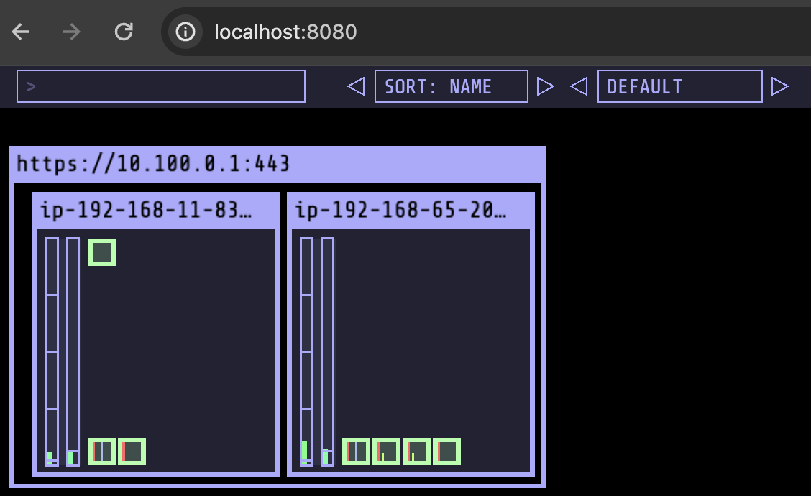

## Kubernetes Operational View

- helm을 이용해서 설치

~~~sh
$ helm repo add stable https://charts.helm.sh/stable
$ helm repo add k8s-at-home https://k8s-at-home.com/charts/

$ helm install kube-ops-view k8s-at-home/kube-ops-view
$ POD_NAME=$(kubectl get pods --namespace default -l "app.kubernetes.io/name=kube-ops-view,app.kubernetes.io/instance=kube-ops-view" -o jsonpath="{.items[0].metadata.name}")
~~~

- local에서 보기위해 port-forward 

~~~sh
$ kubectl port-forward $POD_NAME 8080:8080
~~~

~~~sh
$ helm repo list
NAME       	URL
stable     	https://charts.helm.sh/stable
k8s-at-home	https://k8s-at-home.com/charts/
~~~

~~~sh
$ k get pod,svc
NAME                                 READY   STATUS    RESTARTS   AGE
pod/kube-ops-view-5586c796bd-jpgsk   1/1     Running   0          10m

NAME                    TYPE        CLUSTER-IP     EXTERNAL-IP   PORT(S)    AGE
service/kube-ops-view   ClusterIP   10.100.39.45   <none>        8080/TCP   10m
~~~

~~~sh
$ helm list
NAME         	NAMESPACE	REVISION	UPDATED                             	STATUS  	CHART              	APP VERSION
kube-ops-view	default  	1       	2024-01-28 18:44:54.806159 +0900 KST	deployed	kube-ops-view-1.2.2	20.4.0
~~~

### 조회

