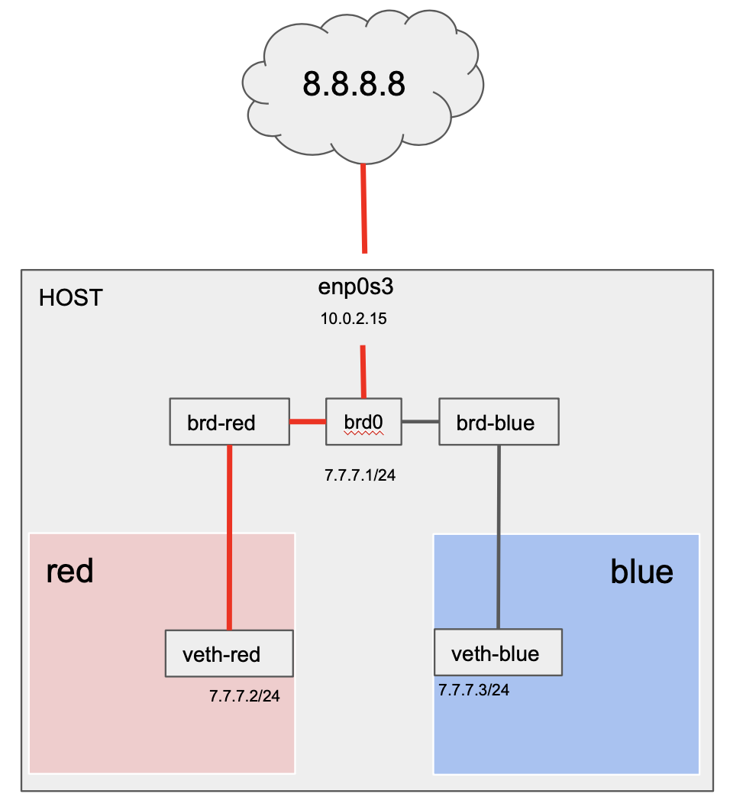

# bridge to internet

## 1. bridge 구성

~~~sh
# add red namespace, virtual ethenet, bridge
ip netns add red
ip link add veth-red type veth peer name brd-red
ip link set veth-red netns red

# add blue namespace, virtual ethenet, bridge
ip netns add blue
ip link add veth-blue type veth peer name brd-blue
ip link set veth-blue netns blue

# bridge를 추가하고, namesapce에 연결된 bridge선과 연결한다.
ip link add brd0 type bridge
ip link set brd-red master brd0
ip link set brd-blue master brd0

# 각 namespace의 virtual ethenet 에 ip를 할당.
ip netns exec red ip addr add 7.7.7.2/24 dev veth-red
ip netns exec blue ip addr add 7.7.7.3/24 dev veth-blue

# 모든 스위치를 켜준다.
ip netns exec red ip link set veth-red up
ip link set brd-red up
ip netns exec blue ip link set veth-blue up
ip link set brd-blue up
ip link set brd0 up
~~~

## 2. host ip에서 red ns로 ping 통신

### host

- 통신실패

~~~sh
$ ping 7.7.7.2
PING 7.7.7.2 (7.7.7.2) 56(84) bytes of data.
~~~

- red 에서 패킷을 확인해보자.

  - ~~~sh
    # 아무런 반응이 없다.
    root@seongtki:~# tcpdump -li any
    tcpdump: verbose output suppressed, use -v or -vv for full protocol decode
    listening on any, link-type LINUX_SLL (Linux cooked), capture size 262144 bytes
    ~~~

- 요청한 ip는 라우터에 없는 정보이다. 그래서 brd0에 접근할 수 있도록 route 정보를 추가해 보자.

~~~sh
ip addr add 7.7.7.1/24 dev brd0 # 7.7.7.1 는 brd0 ip
~~~

- route  table에 추가됨.

~~~sh
root@seongtki:~# ip route
default via 10.0.2.2 dev enp0s3 proto dhcp src 10.0.2.15 metric 100
7.7.7.0/24 dev brd0 proto kernel scope link src 7.7.7.1
10.0.2.0/24 dev enp0s3 proto kernel scope link src 10.0.2.15
10.0.2.2 dev enp0s3 proto dhcp scope link src 10.0.2.15 metric 100
~~~

- 통신성공

~~~sh
root@seongtki:~# ping 7.7.7.2
PING 7.7.7.2 (7.7.7.2) 56(84) bytes of data.
64 bytes from 7.7.7.2: icmp_seq=1 ttl=64 time=0.062 ms
64 bytes from 7.7.7.2: icmp_seq=2 ttl=64 time=0.053 ms
~~~

### red

- arp 정보에 brd0 (7.7.7.1) 추가를 확인.

~~~sh
# red
$ arp
Address                  HWtype  HWaddress           Flags Mask            Iface
7.7.7.1                  ether   5e:09:1c:5e:67:29   C                     veth-red
7.7.7.3                  ether   52:13:d2:7c:86:d1   C                     veth-red
~~~

## 3. red ns의 ip에서 host의 brd0 로 ping 통신

### red

- 통신성공. (물리적으로 연결해놓았으니 가능.)

~~~
root@seongtki:~# ping 7.7.7.1
PING 7.7.7.1 (7.7.7.1) 56(84) bytes of data.
64 bytes from 7.7.7.1: icmp_seq=1 ttl=64 time=0.033 ms
64 bytes from 7.7.7.1: icmp_seq=2 ttl=64 time=0.075 ms
~~~

## 4. red ns의 ip에서  host ip로 ping 통신

### red

- 통신 실패

~~~sh
root@seongtki:~# ping 10.0.2.15
connect: Network is unreachable
~~~

- 요청한 ip는 2계층에 없었고, route table에도 매핑정보가 없다.

~~~sh
root@seongtki:~# ip route
7.7.7.0/24 dev veth-red proto kernel scope link src 7.7.7.2
~~~

- 아래와 같이 brd0 로 이동하라고 매핑을 추가한다.

~~~sh
$ ip route add default via 7.7.7.1
~~~

- route table 확인

~~~sh
root@seongtki:~# ip route
default via 7.7.7.1 dev veth-red
7.7.7.0/24 dev veth-red proto kernel scope link src 7.7.7.2
~~~

- 통신성공

~~~sh
root@seongtki:~# ping 10.0.2.15
PING 10.0.2.15 (10.0.2.15) 56(84) bytes of data.
64 bytes from 10.0.2.15: icmp_seq=1 ttl=64 time=0.029 ms
64 bytes from 10.0.2.15: icmp_seq=2 ttl=64 time=0.055 ms
~~~

## 5. red ns의 ip에서 구글 ip로 ping 통신

### red

- 구글로 통신 실패

~~~sh
root@seongtki:~# ping 8.8.8.8
PING 8.8.8.8 (8.8.8.8) 56(84) bytes of data.

--- 8.8.8.8 ping statistics ---
3 packets transmitted, 0 received, 100% packet loss, time 2032ms
~~~

- host에서 brd0의 패킷을 보자.

  - ~~~sh
    root@seongtki:~# tcpdump -li brd0
    tcpdump: verbose output suppressed, use -v or -vv for full protocol decode
    listening on brd0, link-type EN10MB (Ethernet), capture size 262144 bytes
    05:14:50.472549 IP 7.7.7.2 > dns.google: ICMP echo request, id 2255, seq 1, length 64
    05:14:51.482030 IP 7.7.7.2 > dns.google: ICMP echo request, id 2255, seq 2, length 64
    05:14:52.504940 IP 7.7.7.2 > dns.google: ICMP echo request, id 2255, seq 3, length 64
    ~~~

    - 여기서는 구글로 요청을 계속 하고 있다. (응답x)

### POSTROUTING

- 라우팅 outbound, 포워딩 트래픽에 의해 트리거되는 netfilter hook
- nat(table) : NAT 대상 패킷의 출발지 혹은 목적지 address 수정방법을 결정 -> POSTROUTING 에서는 SNAT(Source NAT)
- 패킷이 network로 direct access가 불가능 할 때 사용한다.
- 내부망 아이피인 7.7.7.0 를 host ip 10.0.2.15 로 둔갑시켜 준다. (NAT)

~~~sh
$ iptables -t nat -A POSTROUTING -s 7.7.7.0/24 -j MASQUERADE
$ iptables -t nat -L
~~~

- 외부(src) -> 외부(dst) 통신일 경우, FORWARD 가 트리거 되는데,
- 외부에서 7.7.7.0으로 오는 경우에도 접근을 허용하도록 룰을 추가하자.
- 반대로 7.7.7.0 에서 출발할 때에도 룰을 추가해야 한다. ( $ iptables -t filter -A FORWARD -s 7.7.7.0/24 -j ACCEPT )

~~~sh
iptables -t filter -A FORWARD -d 7.7.7.0/24 -j ACCEPT
~~~

~~~sh
root@seongtki:~# iptables -t filter -L
Chain INPUT (policy ACCEPT)
target     prot opt source               destination

Chain FORWARD (policy ACCEPT)
target     prot opt source               destination
ACCEPT     all  --  anywhere             7.7.7.0/24 # add

Chain OUTPUT (policy ACCEPT)
target     prot opt source               destination
~~~

### IP Forwarding (routing)

- 커널의 IP Forwarding (routing) 기능 켜기
- 1: on, 0: off

~~~sh
 echo 1 -n >  /proc/sys/net/ipv4/ip_forward
~~~

- 통신 확인

~~~sh
root@seongtki:~# ping 8.8.8.8
PING 8.8.8.8 (8.8.8.8) 56(84) bytes of data.
64 bytes from 8.8.8.8: icmp_seq=1 ttl=61 time=46.7 ms
64 bytes from 8.8.8.8: icmp_seq=2 ttl=61 time=59.9 ms
64 bytes from 8.8.8.8: icmp_seq=3 ttl=61 time=35.7 ms
64 bytes from 8.8.8.8: icmp_seq=4 ttl=61 time=50.2 ms
~~~

