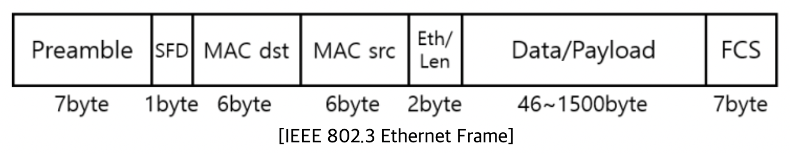
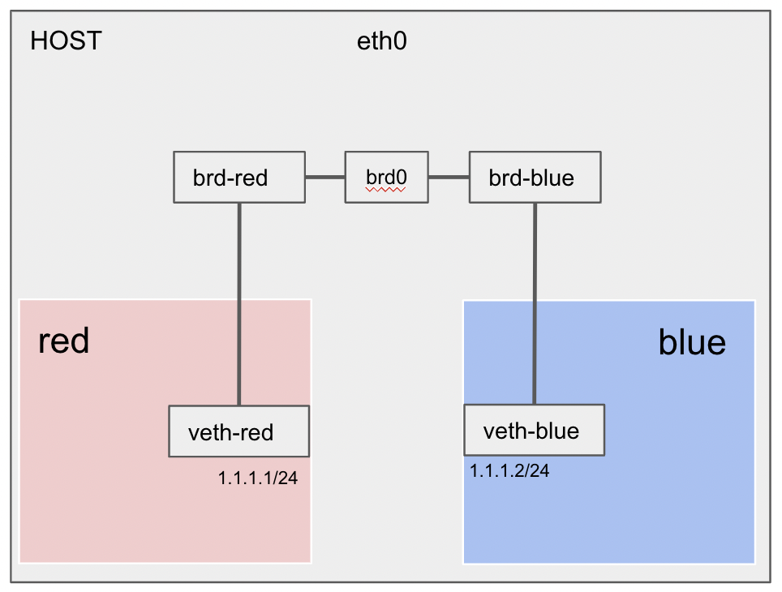
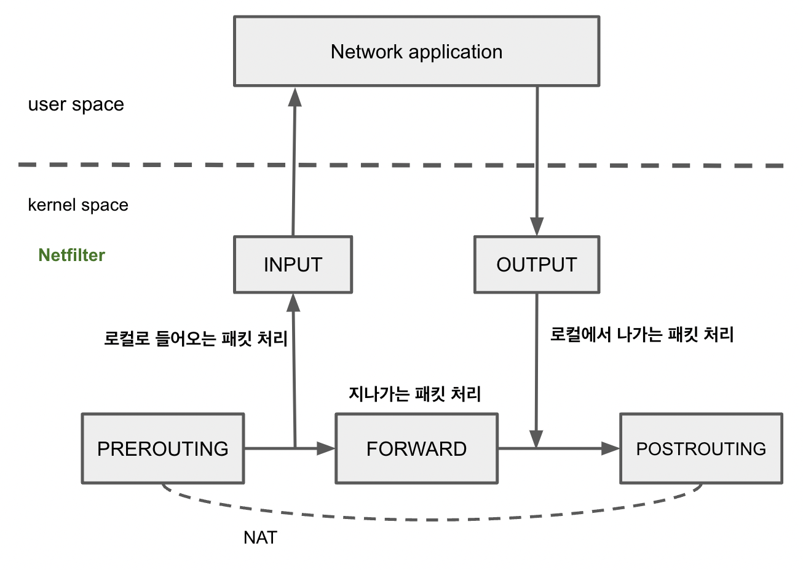

# bridge

### bridge?

- 하나의 LAN 내부에서 단말이 많아질 경우 bridge를 사용하여 개선할 수 있다.
- 단말기가 많아졌을 경우 발생하는 Collision Domain을 분리해 주는 역할을 한다.
- 2계층 송수신을 처리한다.

### Ethenet Frame

- OSI L2계층 (data link) 을 처리 한다.
- 패킷 유입 > 목적지 MAC 주소확인 > 주소 테이블과 비교 > 해당 디바이스가 연결된 포트로 패킷 전달.

### bridge 기능

~~~
Learning.
출발지의 맥 어드레스를 배운다.
브리지/스위치는 포트에 연결된 PC "A"가 통신을 위해 프레임을 내보내면
그때 이 PC의 MAC 주소를 읽어서 자신의 bridge table에 저장한다.
** bridge-table: 스위치나 브리지에 연결된 사용자들의 맥 주소를 저장하는 데이터베이스

Flooding.
들어온 포트를 제외한 나머지를 모든 포트로 데이터를 뿌린다.
PC "A"가 통신하고자 하는 목적지 PC의 맥 주소가 브리지 테이블에 없으면
모든 포트에 데이터를 전송한다. (브로드캐스트 라고 생각해도 됨. 브로드캐스트도 Flooding이 발생함)

Forwarding
Flooding과 반대로 목적지 PC의 맥 주소를 알고 그 목적지가 브릿지를 건너야 할때
오직 그 해당 포트쪽으로만 데이터를 전송한다.
 
Filtering
브릿지를 넘어가지 못하게 막는것.
출발지와 목적지가 같은 세그먼트에 있을때 일어남.
[세그먼트: 브릿지, 라우터, 허브 또는 스위치에 의해 묶어있는 네트워크의 한 부분]
이 Filtering 기능 때문에 허브와 다르게 콜리젼 도메인을 나눌 수 있다.

Aging
브리지 테이블에 출발지의 MAC 주소가 들어오면 300초 동안 타이머를 설정한다.
300초가 지나도록 다시 그 출발지 주소의 프레임이 들어오지 않으면 브리지 테이블에서 삭제한다.
~~~

## Netfilter 

커널 모듈로 **네트워크 패킷을 처리**하는 프레임워크이다.
네트워크 연산을 핸들러 형태로 처리할 수 있도록 hook 지점을 제공
패킷이 어떻게 **전송될 지**에 대한 결정 방법을 제공한다.

### Netfilter 항목

| 항목           | 내용                                 | 키워드                                               |
| -------------- | ------------------------------------ | ---------------------------------------------------- |
| table          | 용도별 rule 모음                     | filter, nat, mangle                                  |
| chain          | 패팃이 지나가는 hook 별로 존재       | PREROUTING, FORWARD, INPUT (netfilter의 hook에 매핑) |
| rule           | table과 chain matrix에 대해서 정의함 | protocol type, dest/src address ..                   |
| action(target) | 패킷이 룰에 매칭되면 트리거 됨       | ACCEPT, DROP, REJECT                                 |

### red -> bridge -> blue 통신

- bridge 관점에서 보자.

- 패킷은 netfilter에서 파놓은 여러 hook을 통과하는데 hook별로 iptables에 정의한 각 체인룰을 점검한다.

- hook에 정의된 체인은 테이블 순서대로 등록된 룰을 체크하고 조건을 만족하면 action(target)을 트리거한다.

- 외부(src) -> 외부(dst) 패킷이므로 FORWARD 체인의 filter 테이블 룰을 봐야 한다.
  - FORWARD: NF_IP_FORWARD (hook) 에 등록된 체인
  - NF_IP_FORWARD: incoming 패킷이 다른 호스트로 포워딩 되는 경우 트리거되는 netfilter hook
  - filter(table): 패킷을 목적지로 전송여부를 결정

- **rule 설정**

  - **테이블 filter 에서 FORWARD 체인을 추가한다. 출발지가 1.1.1.0/24 이면, ACCEPT 로 설정한다.**

  - ~~~sh
    iptables -t filter -A FORWARD -s 1.1.1.0/24 -j ACCEPT
    ~~~

### iptalbes

- netfilter가 파놓은 hook에 룰을 등록하고 관리하는 방법을 제공하는 툴
- netfilter에 내가 원하는 정책을 넣어야 하는데 그럴 때 사용하는 프로그램. 룰을 넣고 조회하는 역할을 한다.

### 정리

A ns 에서 B ns 로 통신하기 위해 중간에 bridge 를 통과한다.
bridge 는 2계층 데이터 를 처리하는데, A, B 사이의 ARP 테이블을 채워주게 한다.
ping의 경우, ICMP를 이용해 송수신하는데 이 때 Netfilter 의 hook이 트리거 되어 ACCEPT 인 경우에만
송수신이 가능하다.
결국은 arp, bridge fdb 정보를 이용해서 통신하고 iptables rule에 따라 전송여부가 결정된다.
