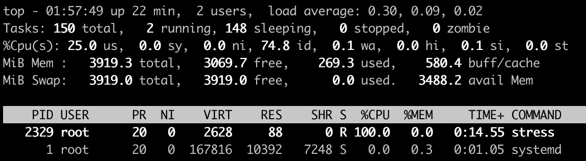
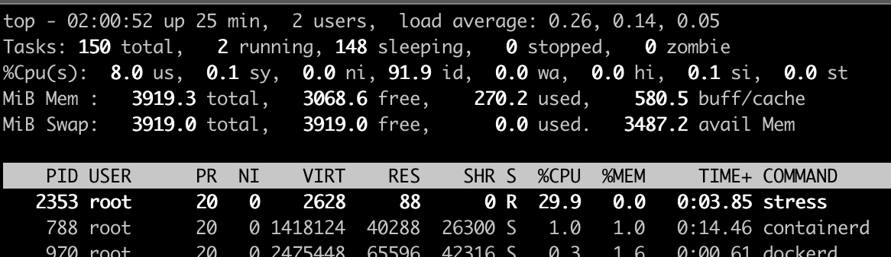

# cgroups

- Cgroups, Control Groups
- 컨테이너 별로 자원을 분배하고 limit 내에서 운용
- 하나 또는 복수의 장치를 묶어서 그룹
- 프로세스가 사용하는 리소스 통제

### Cgroup 파일시스템

- 자원할당과 제어를 파일시스템으로 제공
- cgroup 네임스페이스로 격리할 수 있다.

~~~sh
seongtki@seongtki:~$ tree -L 1 /sys/fs/cgroup/cpu
/sys/fs/cgroup/cpu
├── cgroup.clone_children
├── cgroup.procs
├── cgroup.sane_behavior
├── cpuacct.stat
├── cpuacct.usage
├── cpuacct.usage_all
├── cpuacct.usage_percpu
├── cpuacct.usage_percpu_sys
├── cpuacct.usage_percpu_user
~~~

### cgroup-tools,  stress 설치

~~~sh
root@seongtki:~# apt install -y cgroup-tools
root@seongtki:~# apt install -y stress
~~~

### 프로세스 실행 및 cpu 사용률 확인

- top으로 CPU 100% 확인

~~~sh
root@seongtki:~# stress -c 1
stress: info: [2328] dispatching hogs: 1 cpu, 0 io, 0 vm, 0 hdd
~~~

### 자원제한을 위한 cgroup 제어그룹 생성

- -a : 소유자 정의 (<agid>:<auid>)
- -g : 추가할 그룹을 정의한다. (<controllers>:<path>)

~~~sh
root@seongtki:~# cgcreate -a root -g cpu:mycgroup
~~~

- 디렉토리만 만들면 내용은 커널이 다만들어준다 (mycgroup이 관리할 내용을)

~~~sh
root@seongtki:~# tree /sys/fs/cgroup/cpu/mycgroup/
/sys/fs/cgroup/cpu/mycgroup/
├── cgroup.clone_children
├── cgroup.procs
├── cpuacct.stat
├── cpuacct.usage
├── cpuacct.usage_all
├── cpuacct.usage_percpu
├── cpuacct.usage_percpu_sys
├── cpuacct.usage_percpu_user
├── cpuacct.usage_sys
├── cpuacct.usage_user
├── cpu.cfs_period_us
├── cpu.cfs_quota_us
...
~~~

### 리소스 설정 및 프로세스 할당

- cpu.cfs_period_us : CPU 할당량을 사용할 수 있는 기간을 마이크로초(µs) 단위로 설정
  - 기본값이 100000 
- cpu.cfs_quota_us : 프로세스 그룹에 할당되는 CPU 시간의 한계를 마이크로초(µs) 단위로 설정
  - cpu.cfs_quota_us / cfs_period_us  * 100 => 30000 / 100000 * 100 = 30%
- **30%가 넘지 않게 커널이 cgroup정보를 활용해서 쓰로틀링을 걸어준다**

~~~sh
root@seongtki:~# cgset -r cpu.cfs_quota_us=30000 mycgroup;
root@seongtki:~# cgexec -g cpu:mycgroup stress -c 1
stress: info: [2352] dispatching hogs: 1 cpu, 0 io, 0 vm, 0 hdd
~~~

### cgroups 삭제

~~~sh
cgdelete cpu:mycgroup
~~~

### Cgroup 파일 시스템으로 리소스 관리 요약

- 제어그룹(controller group) 생성
  - 우리 예제는 mycgroup이라는 제어그룹을 생성
- 제어그룹 리소스 설정
  - cpu.cfs_quota_us 을 통해 사용률을 설정
- 제어그룹 프로세스 할당
  - cgexec 를사용해서 mycgroup 에 stress 프로세스를 할당해서 실행.

