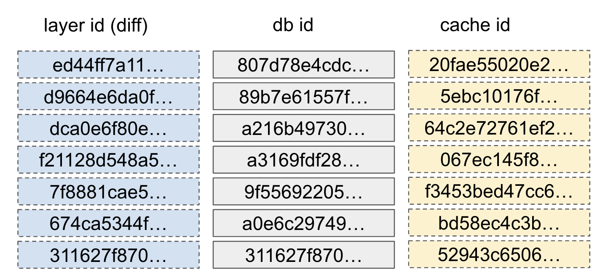

## 컨테이너 레이어 스택

- 컨테이너 설치 시 이미지가 어떤 방식, 구조로 저장되는지 알아보자

- 도커 컨테이너 , 이미지 삭제

~~~sh
\# docker rm $(docker ps -a -q)
\# docker rmi -f $(docker images -q)
~~~

- docker pull nginx:latest

~~~sh
root@seongtki:/# docker pull nginx:latest
latest: Pulling from library/nginx
e886f0f47ef5: Pull complete # 배포id (distribution id)
9a9138853e32: Pull complete
598a42ec6587: Pull complete
82e490cc2043: Pull complete
948128637a91: Pull complete
e4cad15ac3f6: Pull complete
096332b242c2: Pull complete
Digest: sha256:32da30332506740a2f7c34d5dc70467b7f14ec67d912703568daff790ab3f755
Status: Downloaded newer image for nginx:latest
docker.io/library/nginx:latest
~~~

- image id 확인

~~~sh
root@seongtki:/# docker images
REPOSITORY   TAG       IMAGE ID       CREATED      SIZE
nginx        latest    2a4fbb36e966   9 days ago   192MB
~~~

- layer id 확인 (image id 조회)

~~~sh
root@seongtki:/# docker image inspect 2a4fbb36e966 | jq '.[].RootFS'
{
  "Type": "layers",
  "Layers": [
    "sha256:311627f8702d2d97e63b916cad711aa9f962a1f20da5572d68b8f223ff051e73", # layer id
    "sha256:674ca5344f959090515e9eac79055d8630851b21bbd584ac32765315284c05c5",
    "sha256:7f8881cae5296e2ef0103706a326235494b5f1dcd9ea960656165cf7643ddd47",
    "sha256:f21128d548a5122f430a58f123deb9c8b80f70b9fc98df280a9619b7e38b6a32",
    "sha256:dca0e6f80e8df5d85d45426101fefba3d41abe4fc90be994074066d4b135bef5",
    "sha256:d9664e6da0f787fb8c04e80f1e731223f8ef93f6e097e934442e1792da614dff",
    "sha256:ed44ff7a11e0afd3e5b58c730514faeac7d6a12faff3f52aa33d33e0369e7aad"
  ]
}
~~~

- 도커는 다운로드한 이미지를 로컬에 저장하고 관리하기 위해 **"레이어 DB"**를 사용한다.

~~~sh
root@seongtki:/var/lib/docker/image/overlay2# tree -L 2
.
├── distribution
│   ├── diffid-by-digest
│   └── v2metadata-by-diffid
├── imagedb
│   ├── content
│   └── metadata
├── layerdb  # 레이어 스택 정보
│   ├── mounts
│   ├── sha256
│   └── tmp
└── repositories.json
~~~

| 레이어디비 항목 | 내용                                                         |
| --------------- | ------------------------------------------------------------ |
| db id           | 로컬에서 레이어식별을 위한 레이어디비 id 이미지를 pull 받을 때 레이어 별로 생성됨. (받을 때마다 달라짐) |
| cache id        | 레이어가 저장된 로컬경로 id (경로를 식별) - /var/lib/docker/overlay2/{cache-id} |
| diff            | layer id (레이어를 식별)                                     |
| parent          | 부모레이어를 가리키는 포인터 (db id) 어떤 레이어 위로 올라갈지 지정 |

### db id

~~~sh
root@seongtki:/var/lib/docker/image/overlay2/layerdb# tree -L 2 sha256 -I "tar-*|size"
sha256
├── 311627f8702d2d97e63b916cad711aa9f962a1f20da5572d68b8f223ff051e73 # db id
│   ├── cache-id
│   └── diff # layer id
├── 807d78e4cdc589c2cdefb7bb6049a31bcc7bf0f90f335a8a8de1abeb0e6a3993
│   ├── cache-id
│   ├── diff
│   └── parent
├── 89b7e61557f3502dc01aeae499b451574376c3e4c46e49294c72e22cd2d9634c
│   ├── cache-id
│   ├── diff
│   └── parent
├── 9f55692205d904037fbc69a1d59354665af3c0c2a767b5e799e719170085bc11
│   ├── cache-id
│   ├── diff
│   └── parent
├── a0e6c2974935e56e8d57d6fea041399b290da1566d82ea1a7d9c3ec7ef60a366
│   ├── cache-id
│   ├── diff
│   └── parent
├── a216b497301a9fc6283077c0906140e22b8f3a67ba92ab6253f036f48e1ff4b1
│   ├── cache-id
│   ├── diff
│   └── parent
└── a3169fdf28b9329e3f1882c095bf11e12a465419c759169682ca706de81bef84
    ├── cache-id
    ├── diff
    └── parent
~~~

- tree -L 2 sha256 -I "tar-*|size" 에서 -I 는 제외항목을 작성

### cache-id : db-id

- cache-id 리스트
  - 포맷: "cache-id" ./sha256/"db id"

~~~sh
root@seongtki:/var/lib/docker/image/overlay2/layerdb# find . -name cache-id -exec cat {} \; -print
52943c6506870bd23a1bec337a8fcfc018fd0b6581be161ddc4d3bb0363b8b5d./sha256/311627f8702d2d97e63b916cad711aa9f962a1f20da5572d68b8f223ff051e73/cache-id
bd58ec4c3b456591049ce5ad929fac42a96ad23fc28836a29917039d07295ed4./sha256/a0e6c2974935e56e8d57d6fea041399b290da1566d82ea1a7d9c3ec7ef60a366/cache-id
5ebc10176fffee11727b0baa5f552146a74a4fa53935268e2c10726f08f61aa7./sha256/89b7e61557f3502dc01aeae499b451574376c3e4c46e49294c72e22cd2d9634c/cache-id
20fae55020e28561082510b431ec0f85a8bb3a1cebb34f36916b91acc3833c84./sha256/807d78e4cdc589c2cdefb7bb6049a31bcc7bf0f90f335a8a8de1abeb0e6a3993/cache-id
f3453bed47cc62a3d58d00327b6a76fbf15612220a7b1b4825936296fd0b845f./sha256/9f55692205d904037fbc69a1d59354665af3c0c2a767b5e799e719170085bc11/cache-id
64c2e72761ef2dbf88db1e27bf590f901f5d0e7b3f778635ee976a2f834478ba./sha256/a216b497301a9fc6283077c0906140e22b8f3a67ba92ab6253f036f48e1ff4b1/cache-id
067ec145f89b61cd0b6fd41745163c76e04f86db5b4a59a5358cc82a3099526a./sha256/a3169fdf28b9329e3f1882c095bf11e12a465419c759169682ca706de81bef84/cache-id
~~~

-  레이어의 로컬 저장 경로(/var/lib/docker/overlay2/{cache-id})

~~~sh
root@seongtki:/var/lib/docker/overlay2# ls -l
total 32
drwx--x--- 4 root root 4096 Sep 30 12:31 067ec145f89b61cd0b6fd41745163c76e04f86db5b4a59a5358cc82a3099526a
drwx--x--- 4 root root 4096 Sep 30 12:31 20fae55020e28561082510b431ec0f85a8bb3a1cebb34f36916b91acc3833c84
drwx--x--- 3 root root 4096 Sep 30 12:31 52943c6506870bd23a1bec337a8fcfc018fd0b6581be161ddc4d3bb0363b8b5d
drwx--x--- 4 root root 4096 Sep 30 12:31 5ebc10176fffee11727b0baa5f552146a74a4fa53935268e2c10726f08f61aa7
drwx--x--- 4 root root 4096 Sep 30 12:31 64c2e72761ef2dbf88db1e27bf590f901f5d0e7b3f778635ee976a2f834478ba
drwx--x--- 4 root root 4096 Sep 30 12:31 bd58ec4c3b456591049ce5ad929fac42a96ad23fc28836a29917039d07295ed4
drwx--x--- 4 root root 4096 Sep 30 12:31 f3453bed47cc62a3d58d00327b6a76fbf15612220a7b1b4825936296fd0b845f
drwx------ 2 root root 4096 Sep 30 12:31 l
~~~

### layer id : db id

- 앞에가 **layer id**, 뒤에가 db id 이다.

~~~sh
root@seongtki:/var/lib/docker/image/overlay2/layerdb# find . -name diff -exec cat {} \; -print
sha256:311627f8702d2d97e63b916cad711aa9f962a1f20da5572d68b8f223ff051e73./sha256/311627f8702d2d97e63b916cad711aa9f962a1f20da5572d68b8f223ff051e73/diff
sha256:674ca5344f959090515e9eac79055d8630851b21bbd584ac32765315284c05c5./sha256/a0e6c2974935e56e8d57d6fea041399b290da1566d82ea1a7d9c3ec7ef60a366/diff
sha256:d9664e6da0f787fb8c04e80f1e731223f8ef93f6e097e934442e1792da614dff./sha256/89b7e61557f3502dc01aeae499b451574376c3e4c46e49294c72e22cd2d9634c/diff
sha256:ed44ff7a11e0afd3e5b58c730514faeac7d6a12faff3f52aa33d33e0369e7aad./sha256/807d78e4cdc589c2cdefb7bb6049a31bcc7bf0f90f335a8a8de1abeb0e6a3993/diff
sha256:7f8881cae5296e2ef0103706a326235494b5f1dcd9ea960656165cf7643ddd47./sha256/9f55692205d904037fbc69a1d59354665af3c0c2a767b5e799e719170085bc11/diff
sha256:dca0e6f80e8df5d85d45426101fefba3d41abe4fc90be994074066d4b135bef5./sha256/a216b497301a9fc6283077c0906140e22b8f3a67ba92ab6253f036f48e1ff4b1/diff
sha256:f21128d548a5122f430a58f123deb9c8b80f70b9fc98df280a9619b7e38b6a32./sha256/a3169fdf28b9329e3f1882c095bf11e12a465419c759169682ca706de81bef84/diff
~~~

### parent id : db id

-  parent 파일은 부모레이어의 db id를 갖고 있음 (가장 밑바닥은 parent 없음)

- sha256:"db-id"./sha256/"parent-id"
- 311627f8702d2d97e63b916cad711aa9f962a1f20da5572d68b8f223ff051e73 가 최상위 부모 db -id 이다.

~~~sh
root@seongtki:/var/lib/docker/image/overlay2/layerdb# find . -name parent -exec cat {} \; -print
sha256:311627f8702d2d97e63b916cad711aa9f962a1f20da5572d68b8f223ff051e73./sha256/a0e6c2974935e56e8d57d6fea041399b290da1566d82ea1a7d9c3ec7ef60a366/parent
sha256:a216b497301a9fc6283077c0906140e22b8f3a67ba92ab6253f036f48e1ff4b1./sha256/89b7e61557f3502dc01aeae499b451574376c3e4c46e49294c72e22cd2d9634c/parent
sha256:89b7e61557f3502dc01aeae499b451574376c3e4c46e49294c72e22cd2d9634c./sha256/807d78e4cdc589c2cdefb7bb6049a31bcc7bf0f90f335a8a8de1abeb0e6a3993/parent
sha256:a0e6c2974935e56e8d57d6fea041399b290da1566d82ea1a7d9c3ec7ef60a366./sha256/9f55692205d904037fbc69a1d59354665af3c0c2a767b5e799e719170085bc11/parent
sha256:a3169fdf28b9329e3f1882c095bf11e12a465419c759169682ca706de81bef84./sha256/a216b497301a9fc6283077c0906140e22b8f3a67ba92ab6253f036f48e1ff4b1/parent
sha256:9f55692205d904037fbc69a1d59354665af3c0c2a767b5e799e719170085bc11./sha256/a3169fdf28b9329e3f1882c095bf11e12a465419c759169682ca706de81bef84/parent
~~~

### 레이어 스택

- layer id : 레이어 식별
- db id : 레이어관리
- cache-id : 레이어 저장

### 실제저장 위치

- cache id 폴더이름

~~~sh
root@seongtki:/var/lib/docker/overlay2# tree -L 1
.
├── 067ec145f89b61cd0b6fd41745163c76e04f86db5b4a59a5358cc82a3099526a
├── 20fae55020e28561082510b431ec0f85a8bb3a1cebb34f36916b91acc3833c84
├── 52943c6506870bd23a1bec337a8fcfc018fd0b6581be161ddc4d3bb0363b8b5d
├── 5ebc10176fffee11727b0baa5f552146a74a4fa53935268e2c10726f08f61aa7
├── 64c2e72761ef2dbf88db1e27bf590f901f5d0e7b3f778635ee976a2f834478ba
├── bd58ec4c3b456591049ce5ad929fac42a96ad23fc28836a29917039d07295ed4
├── f3453bed47cc62a3d58d00327b6a76fbf15612220a7b1b4825936296fd0b845f
└── l
~~~

- l 디렉터리에는 레이어 저장소(cache-id) 심볼릭 링크가 존재

