# container layer

- 컨테이너 레이어구조 (overlayFS)를 알아보고, 장점에 대해 알아보자

### docker info (overlay2)

-  Storage Driver: overlay2
-  Docker Root Dir: /var/lib/docker

~~~sh
root@seongtki:/# docker info
...
 Storage Driver: overlay2
...
 Cgroup Driver: cgroupfs
...
 Docker Root Dir: /var/lib/docker
...
WARNING: No swap limit support
~~~

~~~sh
root@seongtki:/# docker info | grep Storage
WARNING: No swap limit support
 Storage Driver: overlay2
~~~

## 도커 이미지 레이어 구조

- 오버레이 파일시스템과 같음 

Image layers == Lower Dir R/O (Read Only, 읽기 전용) 
Container layer == Upper Dir  R/W (Read-Write) - 컨테이너 실행 시 image layer 위에 올라감

- 레이어 구조는 중복도 최소화하고 동일한 레이어를 사용할 경우 공유할 수 있어 저장공간을 절약한다.
- 대신 컨테이너에서 Image layer의 파일을 변경해야 할 경우에는 CoW (Copy-On-Write)로 동작한다.
  - 이 때, 변경할 파일을 Container layer(Thin R/W layer)로 복사해 와서 처리해야 하므로, 일반적인 write와 비교해서 속도도 느리고 오버헤드가 발생한다. (따라서 Image layer의 파일 변경은 되도록 피해야 한다)

### 도커 이미지삭제

~~~
\# docker rm $(docker ps -a -q)
\# docker rmi -f $(docker images -q)
~~~

### 레이어 구조

- 도커 이미지의 레이어 구조는 "GraphDriver"에 나타나 있다.
- LowerDir 옵션은 콜론(:) 을 기준으로 여러개 레이어를 설정할 수 있다. 맨 뒤가 베이스레이어 이다.
- [layer db stack 구조](./container-layer-stack.md)

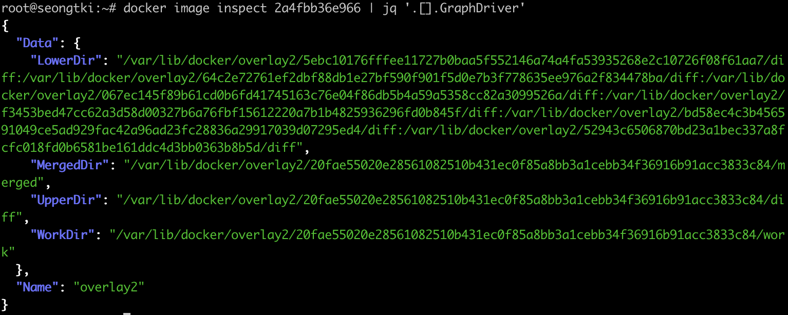

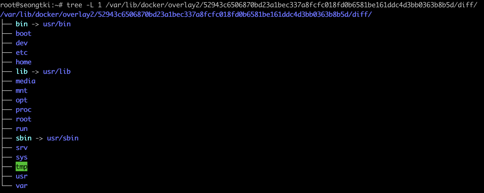

- 베이스레이어 cache-id 로 들어가면 이미지 디렉토리가 보임

- 도커는 내부적으로 Debian 12 slim

~~~sh
root@seongtki:/var/lib/docker/overlay2/52943c6506870bd23a1bec337a8fcfc018fd0b6581be161ddc4d3bb0363b8b5d/diff/etc# cat issue
Debian GNU/Linux 12 \n \l
~~~

- debian:12-slim 는 nginx 이미지레이어에 이미 존재하므로 새로 받지 않는다.
  - 레이어는 받지 않지만, 이미지 정보에는 추가됨 (docker images)

~~~sh
root@seongtki:~# docker pull debian:12-slim
12-slim: Pulling from library/debian
e886f0f47ef5: Already exists # 해당 distribution id 는 이미 있다고 받지 않음
Digest: sha256:24c92a69df28b21676d721fe18c0bf64138bfc69b486746ad935b49cc31b0b91
Status: Downloaded newer image for debian:12-slim
docker.io/library/debian:12-slim
~~~

- 두 개 이미지의 레이어를 조회했을 때, 데비안은 nginx 의 레이어 중 하나와 공유한다.

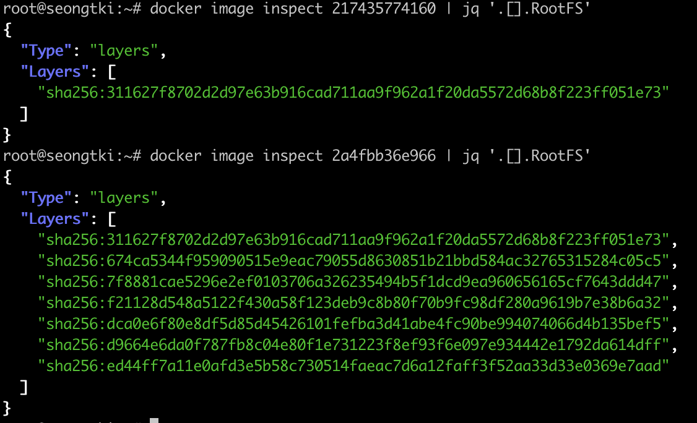

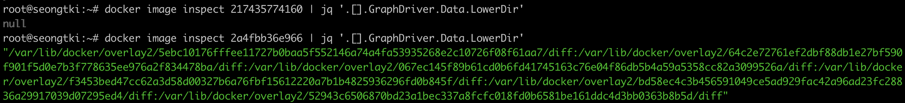

### 이미지레이어 공유 확인

- lowerDir의 실제 저장소에서 파일을 저장해본다
  - ** lowerDir는 RO인데, 이렇게 host권한을 이용하는건 어쩔수 없다. 컨테이너 실행중에 실제로 이런식으로 사용하면 안됨

~~~sh
root@seongtki:/var/lib/docker/overlay2/52943c6506870bd23a1bec337a8fcfc018fd0b6581be161ddc4d3bb0363b8b5d/diff# echo "hello worled" > world
~~~

- debian:12-slim 컨테이너실행 (두개실행한다)
  - lowerDir에서 변경한 데이터 확인 가능

~~~sh
root@seongtki:~# docker run -it debian:12-slim
root@c267289b8c2b:/# cat world
hello worled
~~~

- 컨테이너 두개 구조를 살펴보면, LowerDir 은 Debian의 cache-id 에 있던 id와 같음을 알 수 있다.

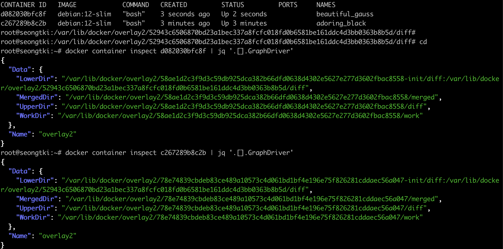

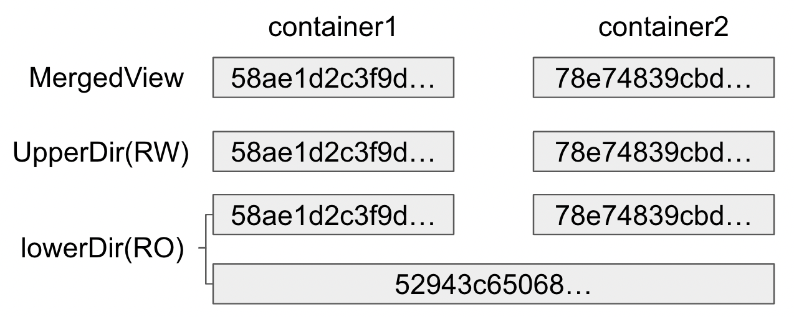

- 컨테이너의 overlay 구조를 mount에서 파악 가능

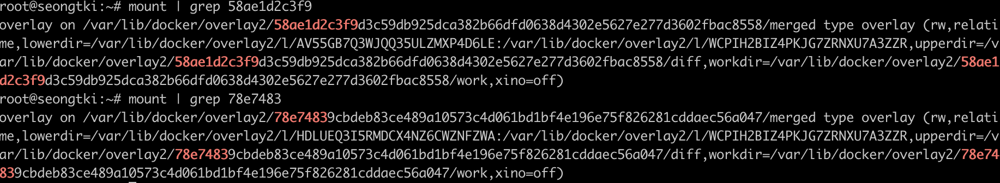

- 위 명령어결과에서 lowerDir 는 심볼릭링크 되어있는데, 따라가보면 실제 이미지저장장소가 나옴

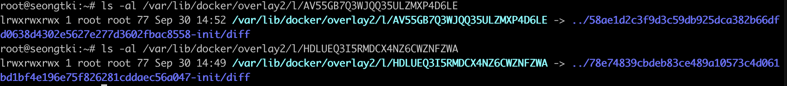

### 컨테이너 데이터 변경

컨테이너의 쓰기는 UpperDir에서 이루어진다.

- 컨테이너1에서 hello파일을 변경하면, 컨테이너1의 UpperDir에서 COW 가 이루어져 쓰기가 발생하고, 변경내용을 읽을 수 있다.
- 하지만 컨테이너2에서 world 파일을 변경한 내용은 읽을 수 없다. 

~~~sh
root@c267289b8c2b:/# cat world
hello worled
root@c267289b8c2b:/# echo "container mod" > hello
root@c267289b8c2b:/# cat hello
container mod
root@c267289b8c2b:/# cat world
hello worled
~~~

- 컨테이너2도 마찬가지.

~~~sh
root@d082030bfc8f:/# cat hello
hello
root@d082030bfc8f:/# echo "container2 mod" > world
root@d082030bfc8f:/# cat hello
hello
root@d082030bfc8f:/# cat world
container2 mod
~~~

- lowerDir  에서도 컨테이너가 변경한 내용을 볼 수 없다.
  - 단지, lowerDir에서 다시 hello 파일 내용을 변경했을때, UpperDir 가존재하는 컨테이너1에서는 변경내용을 못읽지만
  - UpperDir가 없는 container2는 읽을 수 있다.

~~~sh
root@seongtki:/var/lib/docker/overlay2/52943c6506870bd23a1bec337a8fcfc018fd0b6581be161ddc4d3bb0363b8b5d/diff# cat hello
hello
root@seongtki:/var/lib/docker/overlay2/52943c6506870bd23a1bec337a8fcfc018fd0b6581be161ddc4d3bb0363b8b5d/diff# cat world
hello worled
~~~

- overlayFS 와 같은 개념이라고 보면 된다.

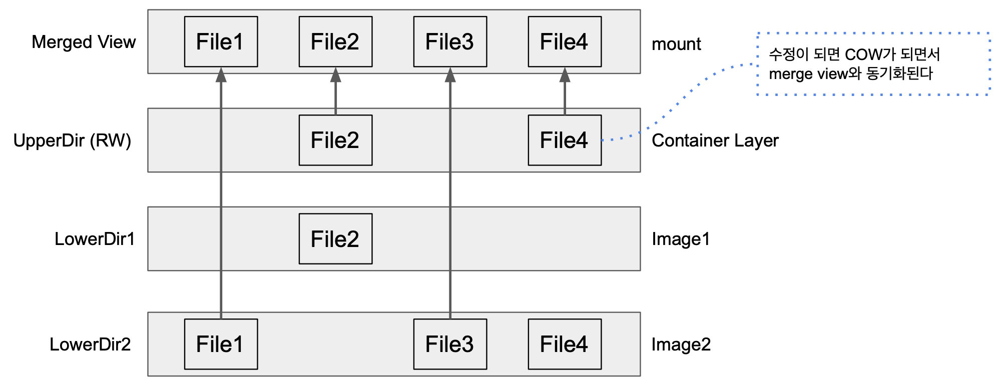

- history 로 이미지 distribution id 확인 가능.

~~~sh
root@seongtki:/var/lib/docker/overlay2# docker history nginx
IMAGE          CREATED       CREATED BY                                      SIZE      COMMENT
2a4fbb36e966   9 days ago    /bin/sh -c #(nop)  CMD ["nginx" "-g" "daemon…   0B
<missing>      9 days ago    /bin/sh -c #(nop)  STOPSIGNAL SIGQUIT           0B
<missing>      9 days ago    /bin/sh -c #(nop)  EXPOSE 80                    0B
<missing>      9 days ago    /bin/sh -c #(nop)  ENTRYPOINT ["/docker-entr…   0B
<missing>      9 days ago    /bin/sh -c #(nop) COPY file:9e3b2b63db9f8fc7…   4.62kB
<missing>      9 days ago    /bin/sh -c #(nop) COPY file:57846632accc8975…   3.02kB
<missing>      9 days ago    /bin/sh -c #(nop) COPY file:3b1b9915b7dd898a…   298B
<missing>      9 days ago    /bin/sh -c #(nop) COPY file:caec368f5a54f70a…   2.12kB
<missing>      9 days ago    /bin/sh -c #(nop) COPY file:01e75c6dd0ce317d…   1.62kB
<missing>      9 days ago    /bin/sh -c set -x     && groupadd --system -…   94.9MB
<missing>      9 days ago    /bin/sh -c #(nop)  ENV PKG_RELEASE=1~bookworm   0B
<missing>      9 days ago    /bin/sh -c #(nop)  ENV NJS_VERSION=0.8.0        0B
<missing>      9 days ago    /bin/sh -c #(nop)  ENV NGINX_VERSION=1.25.2     0B
<missing>      9 days ago    /bin/sh -c #(nop)  LABEL maintainer=NGINX Do…   0B
<missing>      10 days ago   /bin/sh -c #(nop)  CMD ["bash"]                 0B
<missing>      10 days ago   /bin/sh -c #(nop) ADD file:ec1a6e0aedd76c8fd…   97.1M
~~~

~~~
root@seongtki:~# docker run --nginx=nginx --rm -it 2a4fbb36e966
unknown flag: --nginx
See 'docker run --help'.
root@seongtki:~# docker run --nginx=nginx --rm -it 2a4fbb36e966 /bin/bash
unknown flag: --nginx
See 'docker run --help'.
root@seongtki:~# docker run --name=nginx --rm -it 2a4fbb36e966 /bin/bash
root@0d2ed11b96f0:/# rm /bin/
Display all 281 possibilities? (y or n)^C
root@0d2ed11b96f0:/# rm /bin/cat
~~~

~~~
root@seongtki:/var/lib/docker/overlay2/52943c6506870bd23a1bec337a8fcfc018fd0b6581be161ddc4d3bb0363b8b5d# docker container diff nginx
C /usr
C /usr/bin
D /usr/bin/cat
~~~

~~~
root@seongtki:/var/lib/docker/overlay2/52943c6506870bd23a1bec337a8fcfc018fd0b6581be161ddc4d3bb0363b8b5d# docker container commit nginx nginx:rm_cat
sha256:6f8e2630eee109051d1878733b1d064b5e5158af1eae73f5a5a44a8b6c032d76
root@seongtki:/var/lib/docker/overlay2/52943c6506870bd23a1bec337a8fcfc018fd0b6581be161ddc4d3bb0363b8b5d# docker imsages
docker: 'imsages' is not a docker command.
See 'docker --help'
root@seongtki:/var/lib/docker/overlay2/52943c6506870bd23a1bec337a8fcfc018fd0b6581be161ddc4d3bb0363b8b5d# docker images
REPOSITORY   TAG       IMAGE ID       CREATED         SIZE
nginx        rm_cat    6f8e2630eee1   9 seconds ago   192MB
nginx        latest    2a4fbb36e966   10 days ago     192MB
debian       12-slim   217435774160   10 days ago     97.1MB
~~~

~~~
root@seongtki:/var/lib/docker/overlay2/52943c6506870bd23a1bec337a8fcfc018fd0b6581be161ddc4d3bb0363b8b5d# docker history nginx:rm_cat
IMAGE          CREATED          CREATED BY                                      SIZE      COMMENT
6f8e2630eee1   29 seconds ago   /bin/bash                                       0B
2a4fbb36e966   10 days ago      /bin/sh -c #(nop)  CMD ["nginx" "-g" "daemon…   0B
<missing>      10 days ago      /bin/sh -c #(nop)  STOPSIGNAL SIGQUIT           0B
<missing>      10 days ago      /bin/sh -c #(nop)  EXPOSE 80                    0B
<missing>      10 days ago      /bin/sh -c #(nop)  ENTRYPOINT ["/docker-entr…   0B
<missing>      10 days ago      /bin/sh -c #(nop) COPY file:9e3b2b63db9f8fc7…   4.62kB
<missing>      10 days ago      /bin/sh -c #(nop) COPY file:57846632accc8975…   3.02kB
<missing>      10 days ago      /bin/sh -c #(nop) COPY file:3b1b9915b7dd898a…   298B
<missing>      10 days ago      /bin/sh -c #(nop) COPY file:caec368f5a54f70a…   2.12kB
<missing>      10 days ago      /bin/sh -c #(nop) COPY file:01e75c6dd0ce317d…   1.62kB
<missing>      10 days ago      /bin/sh -c set -x     && groupadd --system -…   94.9MB
<missing>      10 days ago      /bin/sh -c #(nop)  ENV PKG_RELEASE=1~bookworm   0B
<missing>      10 days ago      /bin/sh -c #(nop)  ENV NJS_VERSION=0.8.0        0B
<missing>      10 days ago      /bin/sh -c #(nop)  ENV NGINX_VERSION=1.25.2     0B
<missing>      10 days ago      /bin/sh -c #(nop)  LABEL maintainer=NGINX Do…   0B
<missing>      10 days ago      /bin/sh -c #(nop)  CMD ["bash"]                 0B
<missing>      10 days ago      /bin/sh -c #(nop) ADD file:ec1a6e0aedd76c8fd…   97.1M
~~~

## 기존 이미지에 레이어 추가

- 컨테이너 실행후, 파일변경

~~~sh
root@seongtki:~# docker run --name=nginx --rm -it 2a4fbb36e966 /bin/bash
root@db6d1638925b:/# rm /bin/ta
tabs     tac      tail     tar      taskset
root@db6d1638925b:/# rm /bin/ta
tabs     tac      tail     tar      taskset
root@db6d1638925b:/# rm /bin/tar
~~~

- 호스트에서 파일 변경 확인하고, 새로운 이미지로 커밋한다.

~~~sh
docker container diff nginx
docker container commit nginx nginx:rm_tar
~~~

- 새로운 레이어를 확인한다.

~~~
 docker image inspect nginx:rm_tar | jq '.[].RootFS'
~~~

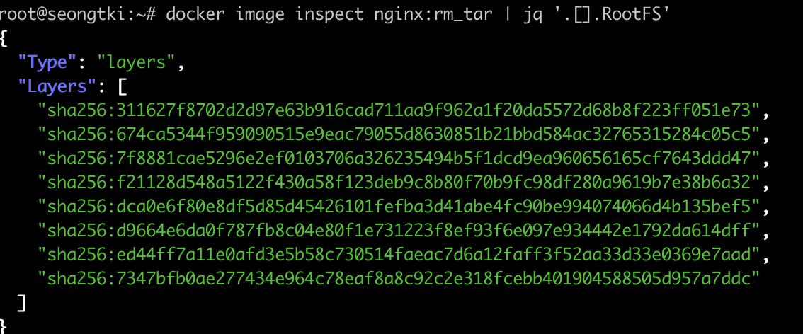

- 마지막에 layerid 하나가 추가되었다.

- layerid 에대한 db-id 확인후, cacheid 를 확인해서 실제 레이어 저장소로 이동한다.

~~~sh
 find /var/lib/docker/image/overlay2/layerdb -name "diff" -exec cat {} \; -print
~~~

- writeout 정보가 있음을 확인.

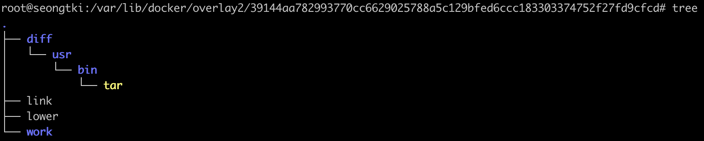

