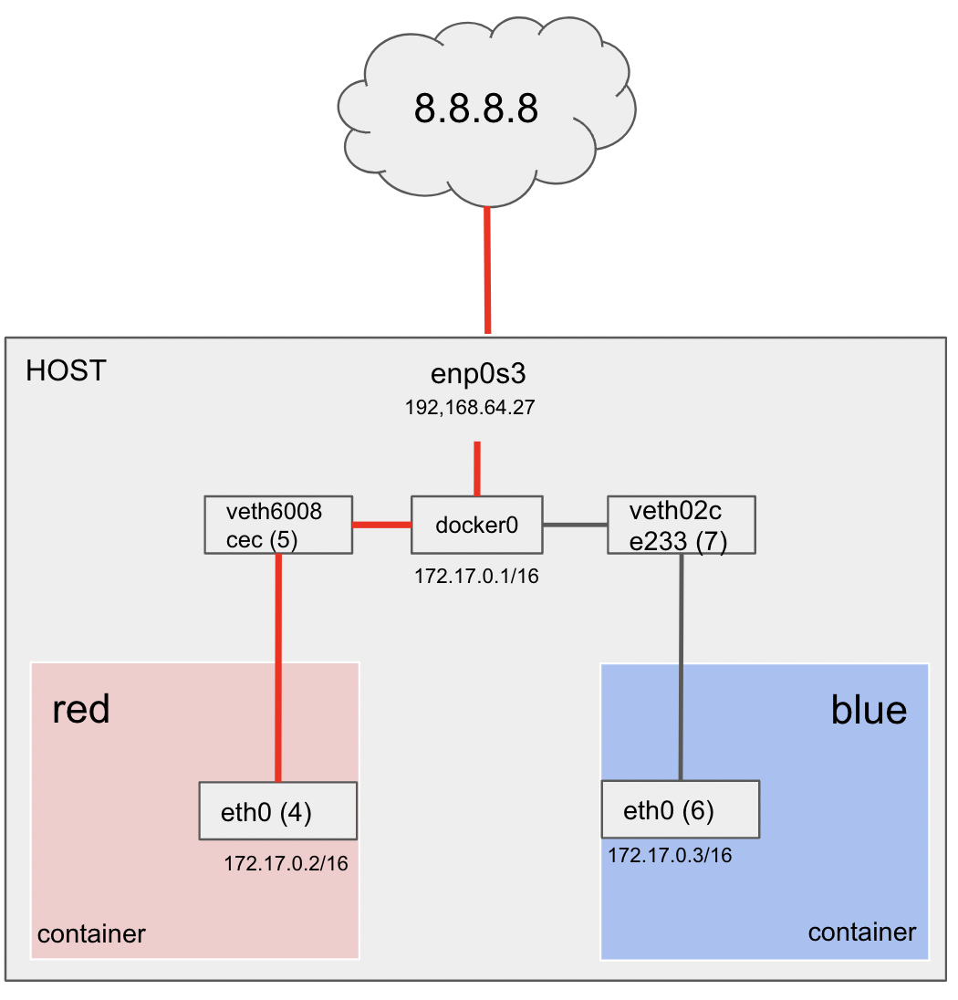

# docker to internet

- docker 내부 컨테이너를 외부망에 ping 테스트 해보자.
- bridge to internet 과 비교해보자

## docker container 생성

### docker bridge

- namespace테스트할 때 생성했던  bridge가 여기도 있다.

~~~sh
root@seongtki:~# docker network ls
NETWORK ID     NAME      DRIVER    SCOPE
e9f8463dc960   bridge    bridge    local
ba45e28be887   host      host      local
bfe581bee6a5   none      null      local
~~~

- "Driver": "bridge" 

  - ~~~
    "Subnet": "172.17.0.0/16",
    "Gateway": "172.17.0.1"
    ~~~

~~~sh
root@seongtki:~# docker inspect bridge
[
    {
        "Name": "bridge",
        "Id": "e9f8463dc96066a997b68404d6b87803c070795fe9ef89acbde59685d50e9659",
        "Created": "2023-09-22T23:54:48.214177336Z",
        "Scope": "local",
        "Driver": "bridge",
        "EnableIPv6": false,
        "IPAM": {
            "Driver": "default",
            "Options": null,
            "Config": [
                {
                    "Subnet": "172.17.0.0/16",
                    "Gateway": "172.17.0.1"
                }
            ]
        },
        "Internal": false,
        "Attachable": false,
        "Ingress": false,
        "ConfigFrom": {
            "Network": ""
        },
        "ConfigOnly": false,
        "Containers": {},
        "Options": {
            "com.docker.network.bridge.default_bridge": "true",
            "com.docker.network.bridge.enable_icc": "true",
            "com.docker.network.bridge.enable_ip_masquerade": "true",
            "com.docker.network.bridge.host_binding_ipv4": "0.0.0.0",
            "com.docker.network.bridge.name": "docker0",
            "com.docker.network.driver.mtu": "1500"
        },
        "Labels": {}
    }
]
~~~

### docker0 는 이전에 생성했던 brd0 와 비슷한 모양이다.

- 여긴 state DOWN 인데 왜인지는 잘 모름 (내가 생성했던 bridge 는 up 해주어서 state UP 였다 )

~~~sh
root@seongtki:~# ip addr show
3: docker0: <NO-CARRIER,BROADCAST,MULTICAST,UP> mtu 1500 qdisc noqueue state DOWN group default
    link/ether 02:42:75:07:2a:20 brd ff:ff:ff:ff:ff:ff
    inet 172.17.0.1/16 brd 172.17.255.255 scope global docker0
       valid_lft forever preferred_lft forever
~~~

### brctl (ethenet bridge administration)

- 아직 연결된 인터페이스가 없다.

~~~sh
root@seongtki:~# brctl show
bridge name	bridge id		STP enabled	interfaces
docker0		8000.024275072a20	no
~~~

### red container 생성

- namespace 라고 봐도 된다.

~~~sh
docker run -it --name=red busybox
~~~

### blue container 생성

~~~sh
docker run -it --name=blue busybox
~~~

### 컨테이너 조회

~~~sh
root@seongtki:~# docker ps
CONTAINER ID   IMAGE     COMMAND   CREATED          STATUS          PORTS     NAMES
dad7b7094a48   busybox   "sh"      5 seconds ago    Up 5 seconds              blue
83f83cfc4b9b   busybox   "sh"      53 seconds ago   Up 53 seconds             red
~~~

## virtual ethenet peer

### host

- 5: veth6008cec@if4 (red container)
- 7: veth02ce233@if6 (blue container)

~~~sh
root@seongtki:~# ip a
3: docker0: <BROADCAST,MULTICAST,UP,LOWER_UP> mtu 1500 qdisc noqueue state UP group default
    link/ether 02:42:75:07:2a:20 brd ff:ff:ff:ff:ff:ff
    inet 172.17.0.1/16 brd 172.17.255.255 scope global docker0
       valid_lft forever preferred_lft forever
    inet6 fe80::42:75ff:fe07:2a20/64 scope link
       valid_lft forever preferred_lft forever
5: veth6008cec@if4: <BROADCAST,MULTICAST,UP,LOWER_UP> mtu 1500 qdisc noqueue master docker0 state UP group default
    link/ether 8a:a2:28:fc:88:58 brd ff:ff:ff:ff:ff:ff link-netnsid 0
    inet6 fe80::88a2:28ff:fefc:8858/64 scope link
       valid_lft forever preferred_lft forever
7: veth02ce233@if6: <BROADCAST,MULTICAST,UP,LOWER_UP> mtu 1500 qdisc noqueue master docker0 state UP group default
    link/ether d2:97:cf:02:30:01 brd ff:ff:ff:ff:ff:ff link-netnsid 1
    inet6 fe80::d097:cfff:fe02:3001/64 scope link
       valid_lft forever preferred_lft forever
~~~

- interface가 생성되었다

~~~sh
root@seongtki:~# brctl show
bridge 		name	bridge id					STP enabled		interfaces
docker0					8000.024275072a20	no						veth02ce233
																								veth6008cec
~~~

### red container

- 4: eth0@if5:

~~~sh
# ip a
1: lo: <LOOPBACK,UP,LOWER_UP> mtu 65536 qdisc noqueue qlen 1000
    link/loopback 00:00:00:00:00:00 brd 00:00:00:00:00:00
    inet 127.0.0.1/8 scope host lo
       valid_lft forever preferred_lft forever
4: eth0@if5: <BROADCAST,MULTICAST,UP,LOWER_UP,M-DOWN> mtu 1500 qdisc noqueue
    link/ether 02:42:ac:11:00:02 brd ff:ff:ff:ff:ff:ff
    inet 172.17.0.2/16 brd 172.17.255.255 scope global eth0
       valid_lft forever preferred_lft forever
~~~

### blue container

- 6: eth0@if7

~~~sh
1: lo: <LOOPBACK,UP,LOWER_UP> mtu 65536 qdisc noqueue qlen 1000
    link/loopback 00:00:00:00:00:00 brd 00:00:00:00:00:00
    inet 127.0.0.1/8 scope host lo
       valid_lft forever preferred_lft forever
6: eth0@if7: <BROADCAST,MULTICAST,UP,LOWER_UP,M-DOWN> mtu 1500 qdisc noqueue
    link/ether 02:42:ac:11:00:03 brd ff:ff:ff:ff:ff:ff
    inet 172.17.0.3/16 brd 172.17.255.255 scope global eth0
       valid_lft forever preferred_lft forever
~~~

## 컨테이너 간 통신

### red container

- blue container 로 통신 성공

~~~sh
/ # ping 172.17.0.3
PING 172.17.0.3 (172.17.0.3): 56 data bytes
64 bytes from 172.17.0.3: seq=0 ttl=64 time=0.610 ms
64 bytes from 172.17.0.3: seq=1 ttl=64 time=0.376 ms
64 bytes from 172.17.0.3: seq=2 ttl=64 time=0.446 ms
64 bytes from 172.17.0.3: seq=3 ttl=64 time=0.304 ms
64 bytes from 172.17.0.3: seq=4 ttl=64 time=0.314 ms
~~~

### host - bridge

- docker0 를 통해 ARP, ICMP 통신이 잘 됨을 확인.

~~~
root@seongtki:~# tcpdump -li docker0
tcpdump: verbose output suppressed, use -v or -vv for full protocol decode
listening on docker0, link-type EN10MB (Ethernet), capture size 262144 bytes
00:51:13.636954 ARP, Request who-has 172.17.0.3 tell 172.17.0.2, length 28
00:51:13.637063 ARP, Reply 172.17.0.3 is-at 02:42:ac:11:00:03 (oui Unknown), length 28
00:51:13.637072 IP 172.17.0.2 > 172.17.0.3: ICMP echo request, id 9, seq 0, length 64
00:51:13.637310 IP 172.17.0.3 > 172.17.0.2: ICMP echo reply, id 9, seq 0, length 64
00:51:14.638927 IP 172.17.0.2 > 172.17.0.3: ICMP echo request, id 9, seq 1, length 64
00:51:14.639126 IP 172.17.0.3 > 172.17.0.2: ICMP echo reply, id 9, seq 1, length 64
00:51:15.640112 IP 172.17.0.2 > 172.17.0.3: ICMP echo request, id 9, seq 2, length 64
00:51:15.640283 IP 172.17.0.3 > 172.17.0.2: ICMP echo reply, id 9, seq 2, length 64
~~~

### red & blue

- arp 조회

~~~sh
# red
/ # ip neigh show
172.17.0.3 dev eth0 lladdr 02:42:ac:11:00:03 used 0/0/0 probes 4 STALE
~~~

~~~sh
# blue
/ # ip neigh show
172.17.0.2 dev eth0 lladdr 02:42:ac:11:00:02 ref 1 used 0/0/0 probes 1 REACHABLE
~~~

## 외부망 통신

### route: host

~~~sh
root@seongtki:~# ip route
default via 192.168.64.1 dev enp0s1 proto dhcp src 192.168.64.27 metric 100
172.17.0.0/16 dev docker0 proto kernel scope link src 172.17.0.1
192.168.64.0/24 dev enp0s1 proto kernel scope link src 192.168.64.27
192.168.64.1 dev enp0s1 proto dhcp scope link src 192.168.64.27 metric 100
root@seongtki:~# route -n
Kernel IP routing table
Destination     Gateway         Genmask         Flags Metric Ref    Use Iface
0.0.0.0         192.168.64.1    0.0.0.0         UG    100    0        0 enp0s1
172.17.0.0      0.0.0.0         255.255.0.0     U     0      0        0 docker0
192.168.64.0    0.0.0.0         255.255.255.0   U     0      0        0 enp0s1
192.168.64.1    0.0.0.0         255.255.255.255 UH    100    0        0 enp0s1
~~~

### route: red container

~~~sh
/ # ip route
default via 172.17.0.1 dev eth0
172.17.0.0/16 dev eth0 scope link  src 172.17.0.2
/ # route -n
Kernel IP routing table
Destination     Gateway         Genmask         Flags Metric Ref    Use Iface
0.0.0.0         172.17.0.1      0.0.0.0         UG    0      0        0 eth0
172.17.0.0      0.0.0.0         255.255.0.0     U     0      0        0 eth0
~~~

### iptables: host

- filter의 FORWARD 정책이 DROP임을 확인.

- -A FORWARD -i docker0 ! -o docker0 -j ACCEPT
  -A FORWARD -i docker0 -o docker0 -j ACCEPT
  - docker0을 통과하는 FORWARD 를 모두 ACCEPT한다.
    - 도커 컨테이너간의 통신 가능
    - 외부에서 도커컨테이너로 통신 가능.

~~~sh
root@seongtki:~# iptables -t filter -S
-P INPUT ACCEPT
-P FORWARD DROP
-P OUTPUT ACCEPT
-N DOCKER
-N DOCKER-ISOLATION-STAGE-1
-N DOCKER-ISOLATION-STAGE-2
-N DOCKER-USER
-A FORWARD -j DOCKER-USER
-A FORWARD -j DOCKER-ISOLATION-STAGE-1
-A FORWARD -o docker0 -m conntrack --ctstate RELATED,ESTABLISHED -j ACCEPT
-A FORWARD -o docker0 -j DOCKER
-A FORWARD -i docker0 ! -o docker0 -j ACCEPT
-A FORWARD -i docker0 -o docker0 -j ACCEPT
-A DOCKER-ISOLATION-STAGE-1 -i docker0 ! -o docker0 -j DOCKER-ISOLATION-STAGE-2
-A DOCKER-ISOLATION-STAGE-1 -j RETURN
-A DOCKER-ISOLATION-STAGE-2 -o docker0 -j DROP
-A DOCKER-ISOLATION-STAGE-2 -j RETURN
-A DOCKER-USER -j RETURN
~~~

- nat 의 기본 polick (PREROUTING, INPUT, OUTPUT, POSTROUTING) 가 모두  ACCEPT 임을 확인.
- -A POSTROUTING -s 172.17.0.0/16 ! -o docker0 -j MASQUERADE
  - src가 172.17.0.0 대역이고 out interface가 docker0 가 아니면 MASQUERADE 설정 (SNAT)
    - 도커 컨테이너(namespace) -> 외부망 통신이 가능.

~~~sh
root@seongtki:~# iptables -t nat -S
-P PREROUTING ACCEPT
-P INPUT ACCEPT
-P OUTPUT ACCEPT
-P POSTROUTING ACCEPT
-N DOCKER
-A PREROUTING -m addrtype --dst-type LOCAL -j DOCKER
-A OUTPUT ! -d 127.0.0.0/8 -m addrtype --dst-type LOCAL -j DOCKER
-A POSTROUTING -s 172.17.0.0/16 ! -o docker0 -j MASQUERADE
-A DOCKER -i docker0 -j RETURN
~~~

### red

- 통신성공

~~~sh
/ # ping 8.8.8.8
PING 8.8.8.8 (8.8.8.8): 56 data bytes
64 bytes from 8.8.8.8: seq=0 ttl=114 time=43.324 ms
64 bytes from 8.8.8.8: seq=1 ttl=114 time=44.720 ms
64 bytes from 8.8.8.8: seq=2 ttl=114 time=42.764 ms
64 bytes from 8.8.8.8: seq=3 ttl=114 time=36.548 ms
~~~

### host - bridge

- docker0 를 경유해서 ARP, ICMP 통신을 하고 있음을 확인.

~~~sh
root@seongtki:~# tcpdump -li docker0
tcpdump: verbose output suppressed, use -v or -vv for full protocol decode
listening on docker0, link-type EN10MB (Ethernet), capture size 262144 bytes
01:27:53.570746 IP 172.17.0.3 > dns.google: ICMP echo request, id 8, seq 0, length 64
01:27:53.613814 IP dns.google > 172.17.0.3: ICMP echo reply, id 8, seq 0, length 64
01:27:54.575544 IP 172.17.0.3 > dns.google: ICMP echo request, id 8, seq 1, length 64
01:27:54.619839 IP dns.google > 172.17.0.3: ICMP echo reply, id 8, seq 1, length 64
01:27:55.577202 IP 172.17.0.3 > dns.google: ICMP echo request, id 8, seq 2, length 64
01:27:55.619712 IP dns.google > 172.17.0.3: ICMP echo reply, id 8, seq 2, length 64
01:27:56.578531 IP 172.17.0.3 > dns.google: ICMP echo request, id 8, seq 3, length 64
01:27:56.614834 IP dns.google > 172.17.0.3: ICMP echo reply, id 8, seq 3, length 64
01:27:58.816367 ARP, Request who-has 172.17.0.3 tell seongtki, length 28
01:27:58.817088 ARP, Reply 172.17.0.3 is-at 02:42:ac:11:00:03 (oui Unknown), length 28
01:27:58.817310 ARP, Request who-has seongtki tell 172.17.0.3, length 28
01:27:58.817354 ARP, Reply seongtki is-at 02:42:75:07:2a:20 (oui Unknown), length 28
~~~

## 구조도

- 이상 도커 컨테이너에서의 실습한 통신에 대한 구조도이다.
- 이전에 bridge <-> internet 통신과 비슷한 모양의 구조임을 알 수 있다.

