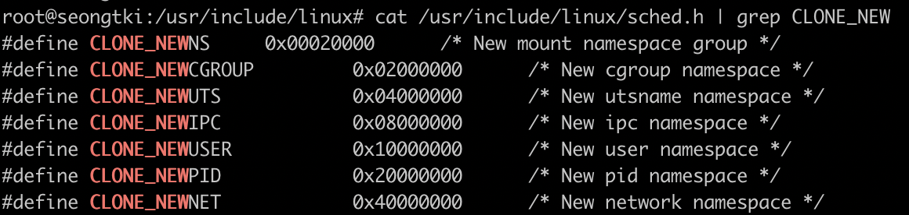
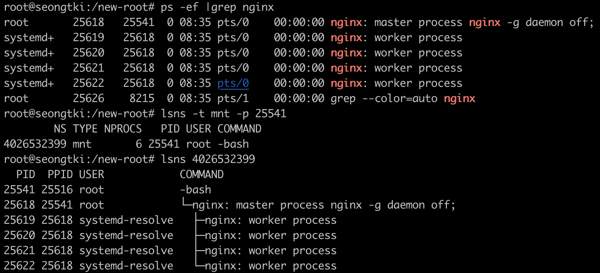

# mount namespace

## 네임스페이스(namespace)

- 하나의 시스템에서 수행되지만, 각각 별개의 독립된 공간인 것처럼 **격리된 환경을 제공**하는 **경량 프로세스 가상화 기술*
- 경량 프로세스는 부모 프로세스와 자원을 공유하는 프로세스를 의미

### LXC(LinuX Container)의 네임스페이스는 6 종류와 플래그

- 마운트 네임스페이스 : CLONE_NEWNS
- UTS 네임스페이스 : CLONE_NEWUTS
- IPC 네임스페이스 : CLONE_NEWIPC
- PID 네임스페이스 : CLONE_NEWPID
- 사용자 네임스페이스 : CLONE_NEWUSER
- 네트워크 네임스페이스 : CLONE_NEWNET

- 상수플래그 정의 (/usr/include/linux/sched.h)

### 마운트(mount) 네임스페이스란?

- 프로세스와 그 자식 프로세스가 각기 다른 파일시스템 마운트 지점을 제공
- 기본적으로 모든 프로세스는 동일한 기본 네임스페이스를 공유하기 때문에, 파일 시스템을 마운트하거나 마운트를 해제하는 등의 변경을 모든 프로세스가 인지할 수 있음
- 만약 clone() 시스템 콜을 통해 프로세스를 생성할 때 CLONE_NEWNS 플래그가 전달되면, 새로 생성되는 프로세스는 호출한 프로세스가 갖고있는 마운트 트리의 사본을 가져옴
- 이 사본은 부모 프로세스에 영향을 미치지 않고 새로 생성된 프로세스가 파일시스템을 마운트 or 언마운트 등의 변경을 할 수 있도록 함
- 이 시점부터 기본 네임스페이스의 모든 파일시스템 마운트 및 언마운트는 새로운 네임스페이스에서 볼 수 있지만, 각각의 프로세스 별 마운트 네임스페이스 내부에서의 변경을 해당 프로세스의 네임스페이스 밖에서는 알 수 없음

마운트 네임스페이스는 "mount point"를 격리 한다.
여기서 mount란 루트파일시스템에 서브파일시스템을 부착하는 시스템콜이고, mount point는 파일시스템이 부착(mount) 될 위치(디렉터리)다.

mount 하면 원래 디렉터리가 포함하고 있던 파일, 하위 디렉터리 등이 보이지 않고, 새로 부착된 파일시스템의 파일들이 보이게 됩니다. 예를 들어 USB 드라이브를 지정한 mount point로 부착을 시키면, 해당 위치에는 부착된 USB의 파일들이 보이게 됩니다. 

마운트 네임스페이스가 mount point를 격리한다는 것은 파일시스템 마운트와 해제 등의 변경사항들이 네임스페이스 밖에서는 보이지 않고, 외부에 전혀 영향을 주지 않음을 의미합니다. 마운트 네임스페이스가 생김으로써 컨테이너를 위해 pivot_root를 안전하게 실행할 수 있게 되었습니다.

### unshare mount namespace

### mount 플래그를 unshared 시스템 콜에 전달

- 부모 프로세스의 mounts를 복제
- 현재 bash 프로세스를 자체 마운트 네임스페이스로 이동
- "-m"옵션 -> 마운트 네임스페이스

~~~sh
unshare -m
root@seongtki:/tmp# mkdir tmp1
~~~

- root filesystem이 같기 때문에 양쪽다 폴더가 보임

- mount는 namespace 내부에서만 적용되어 보인다.
- tmp1 : mount point

~~~sh
root@seongtki:/tmp# mount -o size=1m -t tmpfs tmpfs tmp1
~~~

~~~sh
root@seongtki:/tmp# mount | grep tmp1
tmpfs on /tmp/tmp1 type tmpfs (rw,relatime,size=1024k)
~~~

~~~sh
# readlink 심폴릭링크를 통해 namepsace id를 가져올 수 있다.
# /proc/$$ 는 현재 bash 쉘의 프로세스 ID(PID)
$ readlink /proc/$$/ns/mnt
mnt:[4026532211]
~~~

- host

~~~sh
root@seongtki:/tmp# mount | grep tmp1
root@seongtki:/tmp#
~~~

- mount namespace는 per-process mount isolation을 제공 (프로세스에 격리된 파일시스템 마운트 제공)

### per-process mount isolation

- new-root 에 nginx를 설치한다.

~~~sh
docker export $(docker create nginx:latest) | tar -C new-root -xvf -
~~~

~~~sh
1 directory, 0 files
root@seongtki:/tmp/tmp1# tree -L 1 new-root
new-root
├── bin -> usr/bin
├── boot
├── dev
├── docker-entrypoint.d
├── docker-entrypoint.sh
├── etc
├── hello
├── home
├── lib -> usr/lib
├── media
├── mnt
├── opt
├── proc
├── root
├── run
├── sbin -> usr/sbin
├── srv
├── sys
├── tmp
├── usr
├── var
└── world
~~~

- mount

~~~sh
root@seongtki:/tmp/tmp1# mount -t tmpfs none new-root
~~~

~~~sh
root@seongtki:/tmp/tmp1# df -h | grep new
none                               2.0G     0  2.0G   0% /tmp/tmp1/new-root
~~~

### pivot_root 적용

~~~sh
/# mkdir old-root
/# pivot_root . old-root # 현재디렉토리를 루트파일시스템으로 하고, old-root 폴더에 기존 루트디렉토리를 마운트시킨다.

/# nginx -g "daemon off;" # nginx 실행
~~~

- host에서 nginx pid를 이용해서 namespace id를 가져와 해당 파일시스템을 조회해본다.
- lsns: 현존하는 namespace를 확인하기 위해 사용하는 명령어

- 자체적인 루트파일시스템이 보장되므로 서버 환경 (시스템 파일, 의존성 라이브러리 충돌, 경로 설정 등) 으로 부터 자유롭다.
- 서버의 파일시스템으로 부터 완전하게 분리됨으로써 보안상 안전함
- 컨테이너 내에서 자유롭게 마운트 변경이 가능하고 파일시스템을 확장할 수 있다.