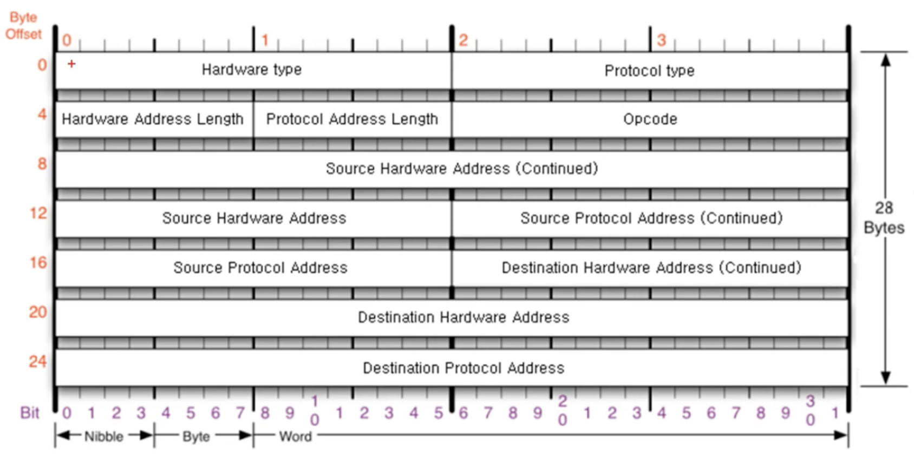
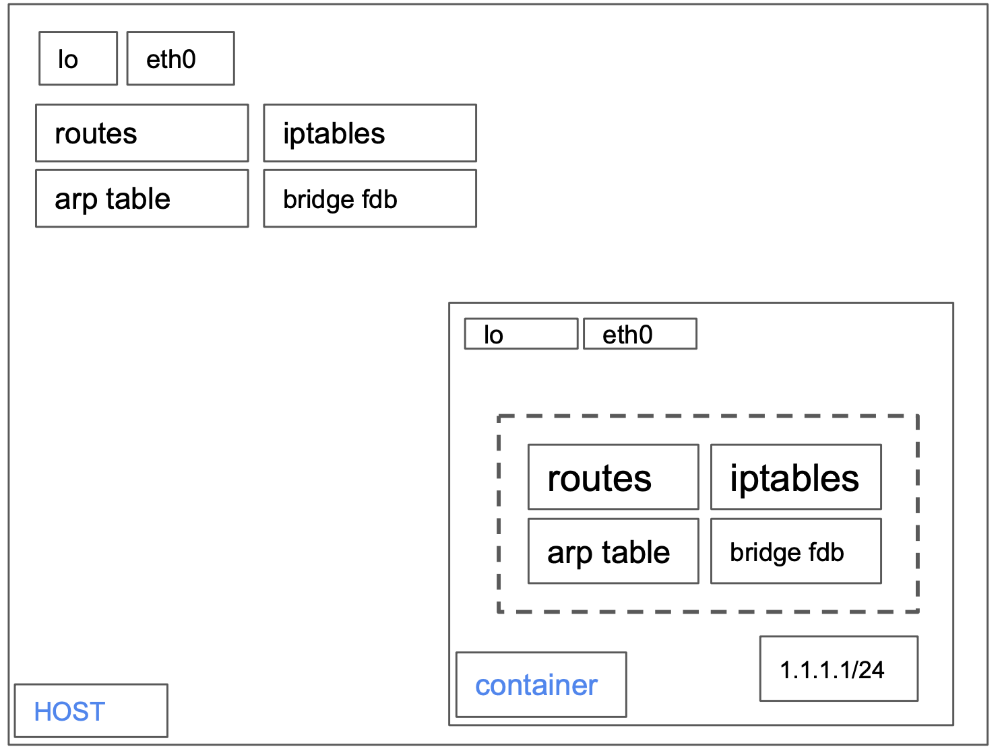
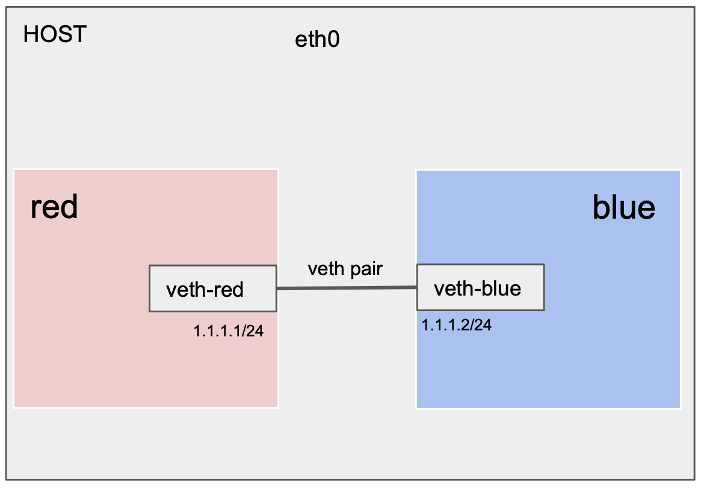

# network namespace

- network namespace 개념에 대해 알아보고
- namespace와 veth를 생성해서 1:1 통신 및 가상장치에 대한 테스트를 해보자

## 이더넷

- 컴퓨터 네트워킹의 한 방식이다,.

- Layer 1(물리계층) - 신호/배선 담당

- Layer 2(데이터링크) - MAC 프로토콜 담당

  

## MAC address

- Media Access Control adress
- Physical Address
- 16진수 옥텟 6개로 구분되어 있음

## ARP (Address Resolution Protocol)

- ARP 프로토콜은 같은 같은 네트워크 대역에서 통신을 하기 위해 필요한 MAC주소를 IP주소를 이용해서 알아오는 프로토콜이다.
- 같은 네트워크 대역에서 통신을 한다고 하더라도 데이터를 보내기 위해서는 7계층부터 캡슐화를 통해 데이터를 보내기 때문에 IP주소와 MAC주소가 모두 필요하다.
- 이 때 IP주소는 알고 MAC주소는 모르더라도 ARP를 통해 통신이 가능하다.
- 브로드 캐스트 (FF:FF:FF:FF:FF:FF)
- 라우터는 자신의 MAC을 알려준다.

## Network namespace

- 호스트  안에 가상 네트워크를 생성할 수 있다.

- 네트워크를 isolation 하고 네트워크 stack (OSL 7Layer)을 가상화한다.
  - Isolates network and virtualize network stack
- ip주소, 라우트 테이블, 소켓, 방화벽 등이 별도 가상화 네트워크에 준비된다.

### Network interface (랜카드 라고 생각하면 편하다)

- 가상의 디바이스를 생성하고 마치 랜카드 끼우는 것 처럼 옮겨다니며 장착할 수 있다.
  - Network interface is present in exactly 1 namespace
  - Network interface can ve moved between namespaces

### Delete Network interface

- 네트워크 네임스페이스를 삭제하면 포함된 모든 가상장치가 삭제된다.

## namespace 1:1 통신

#### veth(virtual etcernet) 두 개가 서로 통신을 할 수 있다.

- 랜카드 두 개를 랜선으로 연결 했다고 생각하면 된다.

### 통신 준비작업

- 네트워크 네임스페이스 2개 생성 (red, blue)
- veth 두개를 pair 로 생성해준다
- 네임스페이스에 각각의 veth를 링크해준다.
- 링크 후 veth의 전원을 켜준다.
- 해당 네임스페이스의 veth에 ip를 할당해준다.
  - dev: "name" # 주소를 정할 장치 명
- [테스트 내용](./namespace-test.md)

## 리눅스 참고 프로그램

### nsenter

- 네임스페이스에 attach하여 지정한 프로그램을 실행한다.

- COMMAND: 지정하지 않으면 $shell 실행

- Option: --net: "net namespace"

- man nsenter

- ~~~
  $ nsenter --net=/var/run/netns/red
  ~~~

### ip addr show (ip addr)

- 네트워크 장치를 확인

### ip neigh show(default show)

- arp tables management
- Man ip-neighbour

