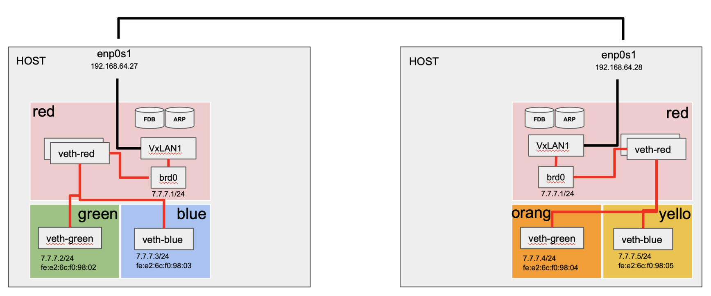
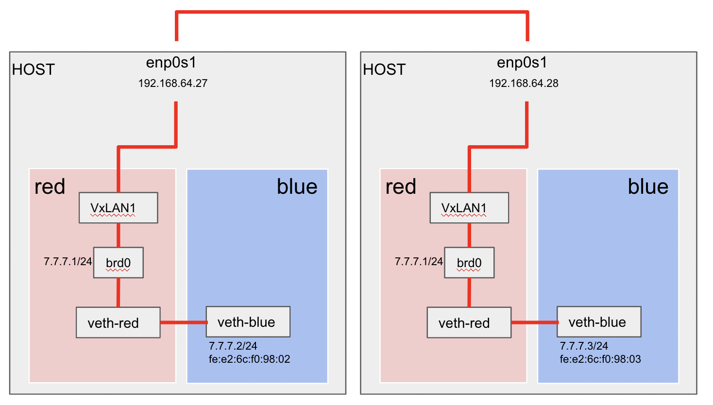

# overlay network

- 가상화 또는 클라우드 기반의 네트워크는 유연하게 확장이 되어야 한다. 
- 관리하는 Subnet들이 많아지고 연결되어 있는 host의 수가 증가하면 포워딩, 스위칭, 라우팅 과 같은 네트워크 구성이 복잡해진다.
- 따라서 물리적인 네트워크망은 고려하지 않고 가상으로 host와 host의 연결만을 고려해서 구현한 기술이 바로 Network Overlay이다.

### 오버레이 네트워크 종류

- **Virtual Extensible Local Area Network (VxLAN)**
- Generic Routing Encapsulation (GRE)
- IP Security (IPsec)
- Multiprotocol Label Switching (MPLS)
- Ethernet Virtual Private Network(EVPN)
- Software-Defined WAN (SD-WAN)
- Software-Defined Access (SD-Access)
- Application Centric Infrastructure (ACI)
- Cisco Virtual Topology System (VTS)

## practice

- hostA 내부 veth와 hostB 내부 veth간 ICMP 통신을 실습
- hostA : 192.168.64.27, hostB: 192.168.64.28

### hostA 설정

- namsepace, bridge, VxLAN을 설정한다.

~~~sh
# red: VxLAN을 설정한 namespace
ip netns add red
# blue: 실제 통신을 위한 가상 단말기
ip netns add blue

# red와 blue의 veth peer를 구성
# mtu 1450으로 설정
ip link add dev red-veth mtu 1450 netns red type veth peer name blue-veth mtu 1450 netns blue

# 실제통신 단말기의 ip와 mac을 설정
ip netns exec blue ip link set dev blue-veth address 02:42:c0:a8:00:02
ip netns exec blue ip addr add dev blue-veth 7.7.7.2/24

# red에 bridge device설정 및 ip 세팅
ip netns exec red ip link add dev br0 type bridge
ip netns exec red ip addr add dev br0 7.7.7.1/24

# endpoint 식별을 위해 id 설정 (VNI)
# proxy옵션: arp 쿼리에 응답
# learning: bridge fdb entry 자동갱신 (수정설정할 필요 없음)
# dstport 4789: UDP port 터널링
ip link add dev vxlan1 netns red type vxlan id 42 proxy learning dstport 4789

# red 내부에 VxLAN, peer veth 장비를 bridge와 연결한다.
ip netns exec red ip link set red-veth master br0
ip netns exec red ip link set vxlan1 master br0

# 모든 가상장치를 실행한다.
ip netns exec red ip link set br0 up
ip netns exec red ip link set vxlan1 up
ip netns exec red ip link set red-veth up
ip netns exec blue ip link set blue-veth up
~~~

### hostB 설정

~~~sh
ip netns add red
ip netns add blue

ip link add dev red-veth mtu 1450 netns red type veth peer name blue-veth mtu 1450 netns blue

ip netns exec blue ip link set dev blue-veth address 02:42:c0:a8:00:03
ip netns exec blue ip addr add dev blue-veth 7.7.7.3/24

ip netns exec red ip link add dev br0 type bridge
ip netns exec red ip addr add dev br0 7.7.7.1/24

ip link add dev vxlan1 netns red type vxlan id 42 proxy learning dstport 4789

ip netns exec red ip link set red-veth master br0
ip netns exec red ip link set vxlan1 master br0

ip netns exec red ip link set br0 up
ip netns exec red ip link set vxlan1 up
ip netns exec red ip link set red-veth up
ip netns exec blue ip link set blue-veth up
~~~

### hostA > blue

~~~sh
\# nsenter --net=/var/run/netns/blue
ping 7.7.7.3 # 실패

\# ip neigh # arp에 등록이 안되어있음.
7.7.7.3 dev blue-veth  FAILED
~~~

~~~sh
\# nsenter --net=/var/run/netns/red
tcpdump -i br0 # 로그 확인
05:28:15.024947 ARP, Request who-has 7.7.7.3 tell 7.7.7.2, length 28 # arp 요청만 한다.
~~~

### mac 추가

- VxLAN이 통신을 해야하는데, 해당 ip는 host 내부에 없다.
- hostA의 VxLAN에 통신할 arp 정보를 수동으로 등록해준다.

~~~sh
\# nsenter --net=/var/run/netns/red
\# ip neigh add 7.7.7.3 lladdr 02:42:c0:a8:00:03 dev vxlan1 # in red namespace

\# ip neigh show
7.7.7.3 dev vxlan1 lladdr 02:42:c0:a8:00:03 PERMANENT
~~~

- arp table state

- 다시 테스트하면 ARP 통신이 된다.

~~~sh
\# ping 7.7.7.3
PING 7.7.7.3 (7.7.7.3) 56(84) bytes of data.
--- 7.7.7.3 ping statistics ---
5 packets transmitted, 0 received, 100% packet loss, time 4087ms
~~~

~~~sh
\# ip neigh # arp테이블에 업데이트됨을 확인
7.7.7.3 dev blue-veth lladdr 02:42:c0:a8:00:03 REACHABLE
~~~

- **hostA > red**
- ARP 통신 이후 ICMP 통신이 실패함을 알 수 있다.
- ICMP (Internet Control Message Protocol) - L3 (Network Layer) 프로토콜

~~~sh
root@seongtki:~# tcpdump -i br0
tcpdump: verbose output suppressed, use -v or -vv for full protocol decode
listening on br0, link-type EN10MB (Ethernet), capture size 262144 bytes
05:32:09.944756 ARP, Request who-has 7.7.7.3 tell 7.7.7.2, length 28
05:32:09.944784 ARP, Reply 7.7.7.3 is-at 02:42:c0:a8:00:03 (oui Unknown), length 28
05:32:09.944861 IP 7.7.7.2 > 7.7.7.3: ICMP echo request, id 1821, seq 1, length 64
05:32:10.964330 IP 7.7.7.2 > 7.7.7.3: ICMP echo request, id 1821, seq 2, length 64
05:32:11.987056 IP 7.7.7.2 > 7.7.7.3: ICMP echo request, id 1821, seq 3, length 64
05:32:13.011901 IP 7.7.7.2 > 7.7.7.3: ICMP echo request, id 1821, seq 4, length 64
~~~

### hostA > blue

- br0 존재하는 blue 에서 netfilter 룰을 조회.
- FORWARD 가 ACCEPT 임을 확인.

~~~sh
root@seongtki:~# iptables -t filter -L | grep policy
Chain INPUT (policy ACCEPT)
Chain FORWARD (policy ACCEPT)
Chain OUTPUT (policy ACCEPT)
~~~

- route 조회

~~~sh
root@seongtki:~# ip route
7.7.7.0/24 dev br0 proto kernel scope link src 7.7.7.1
~~~

- bridge fdb 조회
  - vxlan1의 정보를 확인할 수 있다.

~~~sh
root@seongtki:~# bridge fdb | grep 02:42:c0:a8:00:03
02:42:c0:a8:00:03 dev vxlan1 master br0
~~~

- 정확한 목적지 ip, VxLAN ip 등을 명시해 fdb entry에 추가한다.

~~~sh
root@seongtki:~# bridge fdb add 02:42:c0:a8:00:03 dev vxlan1 self dst 192.168.64.28 vni 42 port 4789

root@seongtki:~# bridge fdb | grep 02:42:c0:a8:00:03
02:42:c0:a8:00:03 dev vxlan1 master br0
02:42:c0:a8:00:03 dev vxlan1 dst 192.168.64.28 link-netnsid 1 self permanent
~~~

### hostB > red

- hostB에도 필요한 정보가 전부 존재하는지 조회를 해보자.
- arp는 수동으로 추가해주어야 한다.
- fdb는 이미 추가되어 있다. -> vxlan1 추가 시 learning 키워드를 추가해주면, fdb는 필요한 정보를 자동으로 업데이트 한다.
  (hostA에서 이미 추가되어있어 요청했을 때 자동으로 추가됨)

~~~sh
\# nsenter --net=/var/run/netns/red
root@seongtki:~# ip neigh
root@seongtki:~# ip route
7.7.7.0/24 dev br0 proto kernel scope link src 7.7.7.1
root@seongtki:~# bridge fdb | grep 02:42:c0:a8:00:02
02:42:c0:a8:00:02 dev vxlan1 master br0
02:42:c0:a8:00:02 dev vxlan1 dst 192.168.64.27 link-netnsid 1 self
~~~

- arp 정보 추가

~~~sh
\# ip neigh add 7.7.7.2 lladdr 02:42:c0:a8:00:02 dev vxlan1

root@seongtki:~# ip neigh show
7.7.7.2 dev vxlan1 lladdr 02:42:c0:a8:00:02 PERMANENT
~~~

### 최종 테스트

hostA > blue

- 정상적으로 응답

~~~
root@seongtki:~# ping 7.7.7.3
PING 7.7.7.3 (7.7.7.3) 56(84) bytes of data.
64 bytes from 7.7.7.3: icmp_seq=153 ttl=64 time=1008 ms
64 bytes from 7.7.7.3: icmp_seq=154 ttl=64 time=4.79 ms
64 bytes from 7.7.7.3: icmp_seq=155 ttl=64 time=3.85 ms
64 bytes from 7.7.7.3: icmp_seq=156 ttl=64 time=3.37 ms
~~~

hostB > red

- 정상적인 통신로그 조회

~~~
root@seongtki:~# tcpdump -i br0
tcpdump: verbose output suppressed, use -v or -vv for full protocol decode
listening on br0, link-type EN10MB (Ethernet), capture size 262144 bytes
03:12:11.488557 IP 7.7.7.2 > 7.7.7.3: ICMP echo request, id 1958, seq 174, length 64
03:12:11.488648 IP 7.7.7.3 > 7.7.7.2: ICMP echo reply, id 1958, seq 174, length 64
03:12:12.490214 IP 7.7.7.2 > 7.7.7.3: ICMP echo request, id 1958, seq 175, length 64
03:12:12.490423 IP 7.7.7.3 > 7.7.7.2: ICMP echo reply, id 1958, seq 175, length 64
03:12:13.495586 IP 7.7.7.2 > 7.7.7.3: ICMP echo request, id 1958, seq 176, length 64
03:12:13.495828 IP 7.7.7.3 > 7.7.7.2: ICMP echo reply, id 1958, seq 176, length 64
~~~

- 지금까지 구성한 overlay network 구성도.

### reference

https://ebt-forti.tistory.com/m/145?category=849281

https://netpple.github.io/docs/make-container-without-docker/
