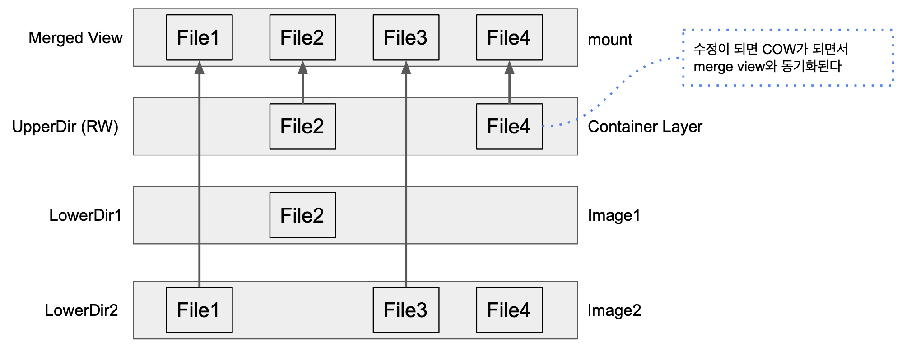

# Overlay Filesystem

- 여러 filesystem을 하나로 mount하는 기능.

- 두 파일시스템에 동일한 파일이 있는경우
  - 나중에 마운트 되는 파일시스템의 파일을 오버레이한다.
- 하위 파일시스템에 대한 쓰기 작업 시
  - 그 시점에 Copy-on-write 실시 () 복사본을 생성하여 수행 (원본유지))
- 이령, 상속 파일시스템으로 불린다.

### OverlayFS2

- Merged Dir: 통합 뷰 (**mount point**)
- Upper Dir: Writable. 컨테이너에서의 변경된 내용이 쓰이는 레이어
- Lower Dir: Read only, 기존 이미지 영역
- Work Dir: "atomic action"을 보장하기 위해 merge에 반영되기 전에 파일을 준비하는 데 사용된다.

## overlay test

~~~sh
mkdir overlay-test
cd overlay-test
mkdir image1 image2 container work merge
touch image1/a image1/b image2/c

# merge: mount point
mount -t overlay overlay -o lowerdir=image2:image1,upperdir=container,workdir=work merge
~~~

~~~sh
root@seongtki:/# mount | grep overlay-test/
overlay on /overlay-test/merge type overlay (rw,relatime,lowerdir=image2:image1,upperdir=container,workdir=work)
~~~

- 파일구조

~~~sh
root@seongtki:/overlay-test# tree -I .
├── container
├── image1
│   ├── a
│   └── b
├── image2
│   └── c
├── merge
│   ├── a
│   ├── b
│   └── c
└── work
    └── work
~~~

- merge/a 삭제 후 디렉토리

~~~sh
root@seongtki:/overlay-test# rm merge/a
root@seongtki:/overlay-test# tree -I .
├── container
│   └── a # 삭제파일이 upperdir 에 적용되어 보인다 (RW)
├── image1
│   ├── a # lowerdir는 변경이 단됨 (RO)
│   └── b
├── image2
│   └── c
├── merge
│   ├── b
│   └── c
└── work
    └── work
~~~

- lowerdir 에 파일 수정 시 merge에도 적용되어 보인다.

~~~sh
root@seongtki:/overlay-test# echo 'hello bb' > image1/b

root@seongtki:/overlay-test# cat image1/b
hello bbb
root@seongtki:/overlay-test# cat merge/b
hello bbb
~~~

- merge파일을 수정하면, lowerdir은 더이상 변경되지 않는다.
- Copy-On-Write 가 발생하기 때문이다. (실제 파일이 사용될 때 카피를 하고 수정하기 때문.)

~~~sh
root@seongtki:/overlay-test# echo 'hello m' > merge/b
root@seongtki:/overlay-test# cat merge/b
hello m
root@seongtki:/overlay-test# cat image1/b
hello bbb
~~~

- 이후 lowerdir파일을 변경해도 merge파일을 변경되지 않는다.

~~~sh
root@seongtki:/overlay-test#  echo 'hello bbbb' > image1/b

root@seongtki:/overlay-test# cat image1/b
hello bbbb
root@seongtki:/overlay-test# cat merge/b
hello m
~~~

~~~sh
root@seongtki:/overlay-test# tree -I .
.
├── container
│   ├── a
│   └── b
├── image1
│   ├── a
│   └── b
├── image2
│   └── c
├── merge
│   ├── b
│   └── c
└── work
    └── work
~~~

