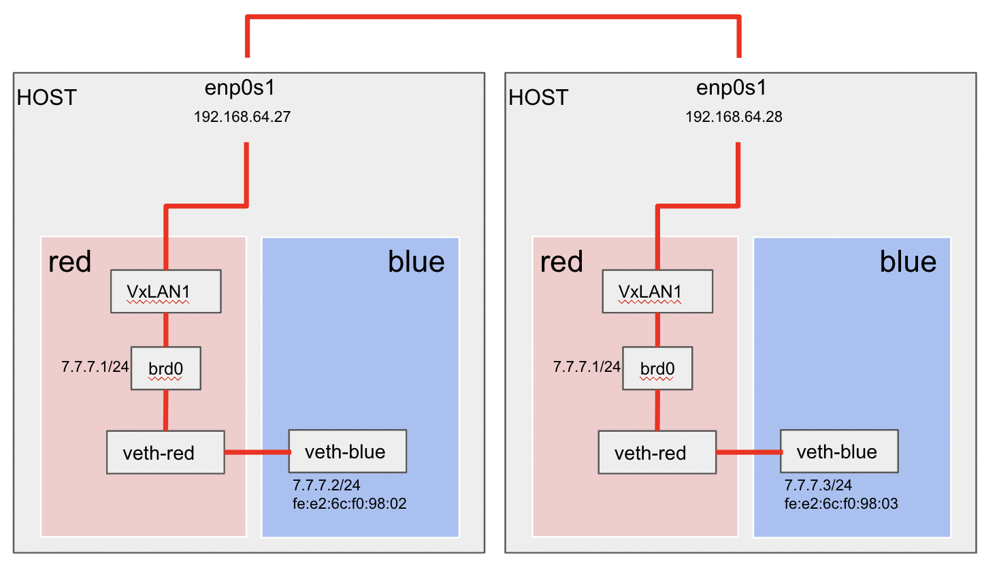
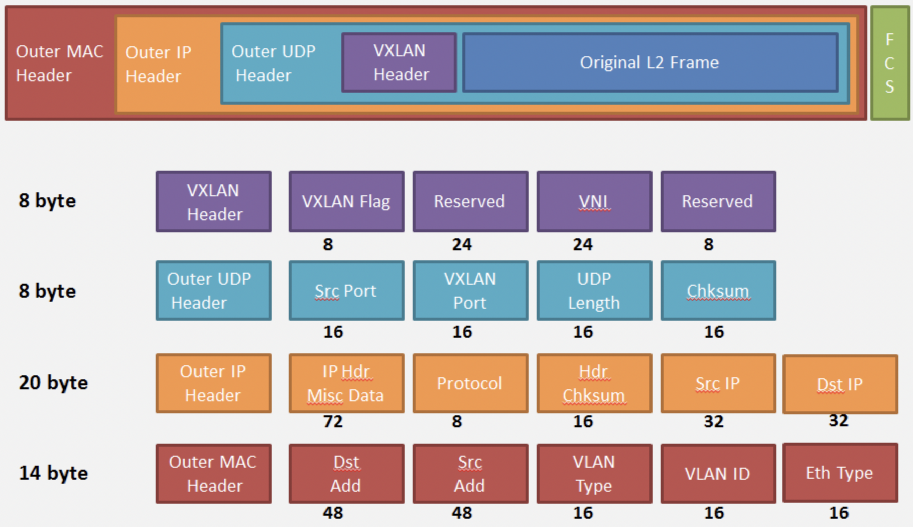

# overlay network

- linux overlay network structure
- 


 


## Network Overlay



- Network Overlay 기술은 물리 네트워크 위에 성립되는 가상의 네트워크이다.
- 예를 들어 실제 데이터센터 네트워크 망들이 어떻게 구성되어 있는지  network 를 넘어 구성하겠다는 기술이다.
- Overlay Network 의 정의란 물리 네트워크 위에 성립 되는 가상의 컴퓨터 네트워크이다.
- 오버레이 네트워크 안에 노드는 가상, 논리 링크로 연결될 수 있으며, 각 링크는 네트워크 안에서 많은 물리적 링크를 통하지만 물리적 링크를 고려 하지는 않는다.
- P2P 네트워크는 오버레이 네트워크라고 할 수 있다. 왜냐하면 P2P는 물리적으로 전달망을 고려하지 않고 peer 와 peer 간의 연결만을 고집하기 때문이다.
- 전화 접속 인터넷은 전화망 위에 오버레이 네트워크라고 볼 수 있다.

## vxlan

- XLAN은 대개 4789 포트로 보내지는 UDP 패킷 내부에 L2 프레임을 캡슐화(encapsulate)하는 터널링 기술이다.
- VXLAN의 주 목적은 L2 레이어에서 Multitenancy가 보장되어야 하는 클라우드 환경 구성을 단순화하는 것입니다.
  - 클러스터 내 호스트들 사이의 L2 연결성 없이도, L2 터널링을 L3에서 하는 것
    - 멀티캐스트를 기반으로 가능하다.
    - *L2 Over L3 : L2정보를 L3에 넣어서 통신하는것을 의미.*
  - 4096개 이상의 격리된 네트워크를 구성하는 것(VLAN ID는 4096개로 제한)

### 패킷구조



- Original L2 frame 만 원본 프레임이고 나머지는 VXLAN 을 위한 헤더 이다.
- 진한 보라색에 VXLAN 에 대한 모든 정보가 담겨 있다.
- 출발지에서 VXLAN Header 를 생성하여 출발시킨다.
- VXLAN 헤더 에는 VNI 라는 24비트 VLAN 을 생성할 수 있다. 일반적인 VLAN ID 가 12비트의 기반이라면, VXLAN의 VNI 에서 표현되는 VLAN 은 24비트의 기반으로, 16,000,000 (2^24) 개의 VLAN 을 생성 할 수 있다.
- VXLAN 헤더 이외에는 전통적인 방식의 UDP 헤더, IP 헤더, MAC 헤더 등이 생성된다.

### MTU (Maximum Transmission Unit)

- **네트워크에 연결된 장치가 받아들일 수 있는 최대 데이터 패킷 크기**
- `netstat -i`

### 오버레이 구조 생성

```bash
# overns 역할: 컨테이너를 연결하는 veth, bridge, vxlan 을 관리하는 network namespace.
ip netns add overns

# pinkns 역할: 컨테이너
ip netns add pinkns

ip link add dev veth1 mtu 1450 netns overns type veth peer name eth0 mtu 1450 netns pinkns

# 컨테이너의 mac, ip를 설정
ip netns exec pinkns ip link set dev eth0 address 02:42:c0:a8:00:03
ip netns exec pinkns ip addr add dev eth0 12.12.12.3/24

# bridge 를 생성하고 ip 설정
ip netns exec overns ip link add dev br0 type bridge
ip netns exec overns ip addr add dev br0 12.12.12.1/24

# vxlan을 생성한다
# id: VNI를 의미한다. (vxlan endpoint를 식별하는 용도이다)
# proxy : vxlan이 arp query에 응답하도록 허용하는 옵션
# learning: bridge fdb entry의 자동갱신을 허용
# dstport 4789 : UDP 기본 허용포트
ip link add dev vxlan1 netns overns type vxlan id 42 proxy learning dstport 4789

# 브릿지에 veth, vxlan을 연결한다.
ip netns exec overns ip link set veth1 master br0
ip netns exec overns ip link set vxlan1 master br0

# switch on
ip netns exec overns ip link set vxlan1 up
ip netns exec overns ip link set br0 up
ip netns exec overns ip link set veth1 up
ip netns exec pinkns ip link set eth0 up
```

### 옵션추가

- host1 의 컨테이너A 에서 host2의 컨테이너B로 ping 호출
  - host1의 오버레이네트워크는 host2의 ARP 정보를 모르므로 추가해준다.
  - host1의 오버레이네트워크는 host2의 FDB 정보를 모르므로 추가해준다.
  - host2의 오버레이네트워크는 host1의 ARP 정보를 모르므로 추가해준다.

## ARP

```bash
# 목적지의 컨테이너ip와 mac 주소, 전송장치 vxlan를 입력
# lladdr : L2 주소
$ ip neigh add 12.12.12.3 lladdr 02:42:c0:a8:00:03 dev vxlan1
$ ip neigh

12.12.12.3 dev vxlan1 lladdr 02:42:c0:a8:00:03 PERMANENT
```


## ICMP (Internet Control Message Protocol)

- IP 동작 진단/제어에 사용되고 오류에 대한 응답을 source IP에 제공한다.
- L3 프로토콜
- 인터넷 통신상황, 오류, 경보 보고
- ping : destination host 작동여부, 응답시간 측정

```bash
# vni 42 : VTEP ID : 패킷을 수신할 앤드포인트 지정
# 도착지의 host ip와 mac address 를지정
bridge fdb add 02:42:c0:a8:00:03 dev vxlan1 self dst 192.168.104.3 vni 42 port 4789
```

### FDB (Forwarding Database)

- OSI Layer 2 Device인 Switch/Bridge를 이용
- FDB에서 MAC 정보(장비), 포트정보를 저장하여 패킷을 주고받을 때 사용
- ARP & FDB

[What are the ARP and FDB tables?](https://blog.michaelfmcnamara.com/2008/02/what-are-the-arp-and-fdb-tables/)


### **NETLINK**

[Netlink](https://en.wikipedia.org/wiki/Netlink)

- NETLINK는 커널과 User Side 프로세스 간의 정보를 전달받을 때 사용된다.
- 커널에 설정 정보를 전달하고 수신하기 위해서 NETLINK를 활용하는 iproute2나 pyroute2와 같은 패키지를 파이썬에서 사용할 수가 있으며, 이러한 패키지는 보통 네트워크 인터페이스를 설정할 때 사용한다.
- NETLINK는 커널의 여러 컴포넌트들이 각각 통신할 수 있도록 여러 개의 프로토콜 (families)로 구성되어 있다.
- 자주 쓰이는 프로토콜은 NETLINK_ROUTE인데, 라우팅과 링크 계층의 설정을 위한 프로토콜이다.

**NETLINK_ROUTE 그룹의 메세지**

- RTMGRP_LINK

   : 링크에 관련된 메시지

  - RTM_NEWLINK : 새로운 링크가 생성되었음을 알려준다.
  - RTM_DELLINK : 링크가 삭제되었음을 알려준다.

- RTMGRP_NEIGH

   : neighbor 에 관한 메시지

  - RTM_NEWNEIGH : 새로운 neighbor가 추가되었음을 알려준다.
  - RTM_DELNEIGH : neighbor가 삭제되었음을 알려준다

커널 단계 (네트워크 패킷 전송 단계) 에서 neighbor에 대한 정보가 없기 때문에 발생되는 RTM_GETNEIGH 이벤트를 수신한 뒤, FDB와 ARP 엔트리를 오버레이 네트워크 네임스페이스 내부에 등록해야 한다.

기본적으로, 이 이벤트는 User Side로 전송되지 않지만, `ip monitor neigh` 를 입력해 이벤트가 User Side로 전송되도록 활성화한 뒤 neighbor에 관련된 알림을 모니터링할 수 있다.

### Monitor

- iproute2는 ip monitor의 하위 명령어를 이용해 NETLINK 이벤트를 감지할 수 있다.

```bash
# link 메세지 조회
# link 추가/삭제 시 메세지 발동
# ip link add veth1 type veth peer name veth2
# ip link del veth1
ip monitor link

# route 메세지 조회
ip monitor route

# neigh 메세지 조회
# 우리는 l2miss, l3miss 를 캐치하기 위해 사용한다.
# vxlan 을 생성할 때 l2miss, l3miss 옵션을 사용하면 그에대한 메세지를 출력하기 때문에
# 아래옵션은 필요 없긴하다.

# 테스트를 원하는 net namespace의 network interface에 설정한 후 사용한다.
echo 1 | tee -a /proc/sys/net/ipv4/neigh/eth0/app_solicit

ip monitor neigh
```

- tcpdump
  - container간 통신에서 호스트간 트래픽에 vxlan이 사용된다는 걸 알 수 있다.
  - 

```bash
tcpdump -ni eth1 "port 4789"

listening on eth1, link-type EN10MB (Ethernet), capture size 262144 bytes
00:16:46.956287 IP 192.168.104.2.34935 > 192.168.104.3.4789: VXLAN, flags [I] (0x08), vni 42
IP 11.11.11.2 > 11.11.11.3: ICMP echo request, id 2392, seq 52, length 64
00:16:46.956418 IP 192.168.104.3.55638 > 192.168.104.2.4789: VXLAN, flags [I] (0x08), vni 42
IP 11.11.11.3 > 11.11.11.2: ICMP echo reply, id 2392, seq 52, length 64
```

- Overlay Namespace 내부에 ARP / FDB 테이블을 사용한다.
  - ARP : Mac+ContainerIP
  - FDB : Mac+HostIP.
  - 오버레이 네임스페이스가 ARP 프록시 역할로서 동작하고, ARP, FDB 테이블을 참조해 패킷 Encapsulation을 담당한다.

### 오버레이 네트워크를 이용한 도커

```bash
docker run -d --name test --net=none ubuntu:14.04 sleep 36000
ctn_ns_path=$(docker inspect --format="{{ .NetworkSettings.SandboxKey}}" test)
ctn_ns=${ctn_ns_path##*/}

ip link add dev veth1 mtu 1450 type veth peer name veth2 mtu 1450
ip link set dev veth1 netns overns
ip netns exec overns ip link set veth1 master br0
ip netns exec overns ip link set veth1 up

ln -sf $ctn_ns_path /var/run/netns/$ctn_ns
ip link set dev veth2 netns $ctn_ns
ip netns exec $ctn_ns ip addr add dev veth2 11.11.11.2/24
ip netns exec $ctn_ns ip link set dev veth2 address 02:42:c0:a8:00:02
ip netns exec $ctn_ns ip link set dev veth2 up
rm /var/run/netns/$ctn_ns

iputils-ping
docker exec -it test ping 11.11.11.3
```


### Ref

[GitHub - lbernail/dockeroverlays](https://github.com/lbernail/dockeroverlays)

[Deep dive 3 into Docker Overlay networks - Part 3](https://blog.revolve.team/2017/08/20/deep-dive-3-into-docker-overlay-networks-part-3/)


https://i5i5.tistory.com/408

https://limjunho.github.io/2021/04/25/Netlink-Sockets-Overview.html

https://stackoverflow.com/questions/70894776/how-to-enter-network-namespace-by-name

https://gist.github.com/sitano/6b3e407d704ef819ccfd7cd03949e110

https://atthis.tistory.com/7?category=750237


