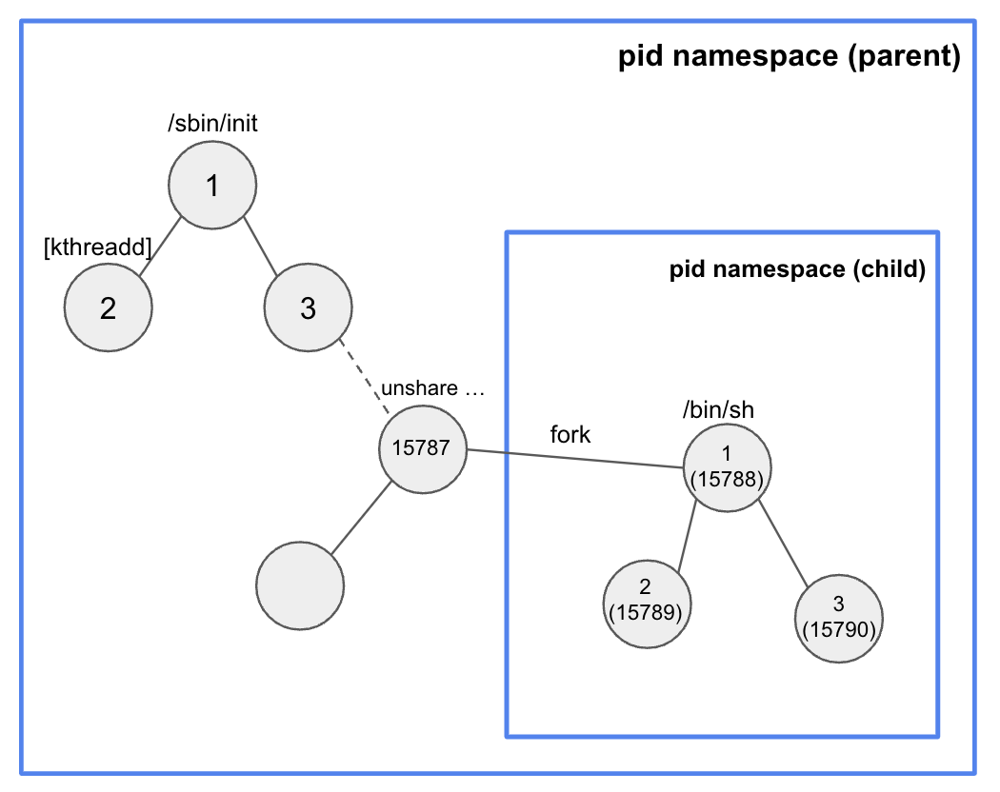

# pid namespace

- Process ID 넘버스페이스를 isolate 한다.
- 부모,자식 네임스페이스 중첩구조
- 부모 네임스페이스 (see) -> 자식 네임스페이스

### host pid 1

- init 프로세스 (커널이 생성해준다)
- 시그널 처리
- 좀비, 고아프로세스 처리
- kill 1 되면, 시스템 패닉되어 reboot해야함

### 컨테이너 pid 1

- unshare 할 때 fork 하여 자식 pid namespace의 pid 1 로 실행
- 시그널 처리
- 좀비, 고아프로세스 처리
- 죽으면 컨테이너가 종료됨

### unshare

- -p : pid namespace
- -f : fork
- --mount-proc : proc 파일시스템 마운트

### /proc

- 메모리 기반의 가상파일 시스템
  - pseudo filesystem (memory based virtual filesystem)
- 커널이 관리하는 시스템 정보를 제공
- 시스템 모니터링과 분석에 활용
- 커널 데이터 구조의 접근을 쉽게 할 수 있음
- ps, mount ,umount 할 때 /proc 파일시스템을 통해서 명령어가 실행됨.
- 컨테이너 (pid namespace) 안에서 프로세스 정보를 조회하고 제어하기 위해 사용한다.

### 예제

- fork하면서 pid namespace 로 격리함
-  proc 파일시스템을 마운트 하지 않으면 proc 정보가 보임 

~~~sh
root@seongtki:/tmp# unshare -fp --mount-proc /bin/sh
\#
~~~

- 컨테이너
  - pid 1은 /bin/sh이다.
  - namespace inode 조회.

~~~sh
# 컨테이너
# ps -ef
UID          PID    PPID  C STIME TTY          TIME CMD
root           1       0  0 04:41 pts/0    00:00:00 /bin/sh
root           2       1  0 04:42 pts/0    00:00:00 ps -ef

# lsns -t pid -p 1
        NS TYPE NPROCS PID USER COMMAND
4026532398 pid       2   1 root /bin/sh

~~~

### host

- pid 1은 /sbin/init 이다. (컨테이너와 다름)

~~~sh
root@seongtki:~# ps -ef
UID          PID    PPID  C STIME TTY          TIME CMD
root           1       0  0 03:21 ?        00:00:01 /sbin/init
root           2       0  0 03:21 ?        00:00:00 [kthreadd]
~~~

- unshare명령에 대한 프로세스의 자식에 /bin/sh 가 있다. 
- /bin/sh의 inode 를 조회해 보면, 컨테이너의 pid 1의 inode와 같음을 알 수 있다.

~~~sh
root@seongtki:~# ps -ef | grep /bin/sh
root       15787   15768  0 04:41 pts/0    00:00:00 unshare -fp --mount-proc /bin/sh
root       15788   15787  0 04:41 pts/0    00:00:00 /bin/sh
root       15952   15938  0 04:43 pts/2    00:00:00 grep --color=auto /bin/sh

root@seongtki:~# lsns -t pid -p 15788
        NS TYPE NPROCS   PID USER COMMAND
4026532398 pid       1 15788 root /bin/sh

~~~

- 위 예제의 pid namespace 구조도는 아래와 같다.

## signal handler

### pid namespace

컨테이너의 pid 1을 SIGKILL 하면 컨테이너가 종료되는 것을 알 수 있다.

- 컨테이너로 시그널을 보낼 때, 핸들링하는 프로그램 데몬이 존재해야 하지만, 없기 때문에 SIGKILL을 제외한 시그널을 무시된다.

~~~sh
root@seongtki:~# kill -SIGHUP 15788 # ignore 
root@seongtki:~# kill -SIGINT 15788 # ignore 
root@seongtki:~# kill -SIGTERM 15788 # ignore 
root@seongtki:~# kill -SIGKILL 15788 # ignore 
root@seongtki:~# kill -SIGKILL 15788 # pid namespace 종료
~~~

### docker pid

- busybox 를 실행하고 sleep 3600 cmd 실행하도록 컨테이너를 생성하였다.

~~~sh
root@seongtki:~# docker run --rm --name busybox busybox sleep 3600
~~~

- host에서 sleep 3600 가 실행중인걸 알 수 있다.

~~~sh
root@seongtki:~# ps aux | grep sleep
root       16005  0.3  0.5 1326556 22572 pts/0   Sl+  05:20   0:00 docker run --rm --name busybox busybox sleep 3600
root       16067  0.0  0.0   3852   400 ?        Ss   05:20   0:00 sleep 3600
root       16100  0.0  0.0   5968   668 pts/2    S+   05:20   0:00 grep --color=auto sleep
~~~

- 컨테이너 내부에서 pid1 은 cmd임을 알 수 있다.
- 이는 시그널을 컨트롤하는 사용자 프로그램이 없다는 뜻이어서, kill을 제외한 다른 시그널에대한 핸들링이 없다.

~~~sh
root@seongtki:~# docker exec busybox ps -ef
PID   USER     TIME  COMMAND
    1 root      0:00 sleep 3600
    7 root      0:00 ps -ef
    
root@seongtki:~# kill -SIGHUP 16067 # ignore 
root@seongtki:~# kill -SIGINT 16067 # ignore
root@seongtki:~# kill -SIGTERM 16067 # ignore
root@seongtki:~# kill -SIGKILL 16067 # ignore
root@seongtki:~# kill -SIGTERM 16067 # 컨테이너 종료
~~~

### docker init process

- --init : docker 에서 제공하는 컨테이너 init process

~~~sh
root@seongtki:~#  docker run --rm --name busybox --init busybox sleep 3600
~~~

- cmd 인 sleep 3600 부모로 /sbin/docker-init이 존재하는걸 알수 있다.

~~~sh
root@seongtki:~# ps aux | grep sleep
root       16182  0.2  0.5 1326812 22972 pts/0   Sl+  05:22   0:00 docker run --rm --name busybox --init busybox sleep 3600
root       16230  0.0  0.0    812     4 ?        Ss   05:22   0:00 /sbin/docker-init -- sleep 3600
root       16265  0.0  0.0   3852   412 ?        S    05:22   0:00 sleep 3600
root       16267  0.0  0.0   5968   672 pts/2    S+   05:22   0:00 grep --color=auto sleep
~~~

- 컨테이너 내부의 ps역시 initprocess 자식으로 cmd가 존재한다.
- SIGHUP을 날렸을 때, docker-init 프로그램에서 시그널을 핸들링하여 컨테이너가 종료되는 걸 알 수 있다.

~~~sh
root@seongtki:~# docker exec busybox ps -ef
PID   USER     TIME  COMMAND
    1 root      0:00 /sbin/docker-init -- sleep 3600
    6 root      0:00 sleep 3600
    7 root      0:00 ps -ef

root@seongtki:~# kill -SIGHUP 16230
~~~

