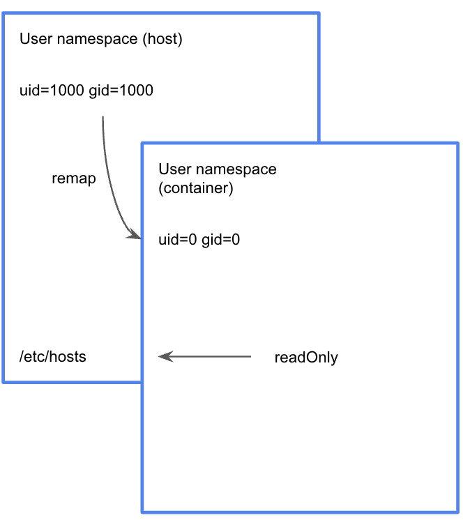

# user namespace

- 프로세스의 UID/GID Isolation
- 중첩(nested) 구조 (최대 32레벨)

- 보안 상 중요 
- 컨테이너의 “root 권한" 문제를 해결
- 네임스페이스 안과 밖의 UID/GID를 다르게 설정할 수 있음

### Linux USER

- User name? 커널이 취급하는 값이 아닙니다
  (managed by external tools, /etc/passwd, LDAP, Kerberos, ...)
- 커널이 아는 것은 UID, GID
- UID, GID space ~ 커널이 관리
- 프로세스와 호스트 사이의 UID/GID 매핑 ~ Secure 측면에서 중요
- 권한(permission) 체크 ~ UID, GID를 검사

- 컨테이너? isolated processes로 호스트의 “커널”을 공유
- Same UID, Same User 

## Linux USER namespace isolation

- -U : user namespace 격리
- --map-root-user : user id를 remap 해서 usernamespace 를 생성

~~~sh
unshare -U --map-root-user /bin/sh
~~~

- namespace 가 격리되어 inode가 다름을 알 수 있다.

~~~sh
# id
uid=0(root) gid=0(root) groups=0(root),65534(nogroup)
# readlink /proc/$$/ns/user
user:[4026532670]
~~~

~~~sh
seongtki@seongtki:~$  id
uid=1000(seongtki) gid=1000(seongtki) groups=1000(seongtki),4(adm),24(cdrom),27(sudo),30(dip),46(plugdev),116(lxd),118(docker)
seongtki@seongtki:~$
seongtki@seongtki:~$ ps -ef | grep /bin/sh
seongtki    1898    1415  0 00:35 pts/0    00:00:00 /bin/sh
seongtki    1902    1662  0 00:35 pts/1    00:00:00 grep --color=auto /bin/sh

seongtki@seongtki:~$ readlink /proc/$$/ns/user
user:[4026531837]
~~~

- 컨테이너 안에서는 root이지만 실제로 host에서 보면 seongtki로 실행이 되었고, inode도 다르다.
- USER 네임스페이스 간 UID/GID Remap 되어잇음.

## Docker Container와 User namespace

### docker run (일반 계정)

~~~sh
docker run --name test --rm -d ubuntu sleep 3600
~~~

- 컨테이너가 root로 실행됨

~~~sh
seongtki@seongtki:~$ docker exec test ps aux |grep sleep
root           1  0.0  0.0   2200   768 ?        Ss   05:14   0:00 sleep 3600
seongtki@seongtki:~$ ps aux | grep sleep
root        4629  0.0  0.0   2200   768 ?        Ss   05:14   0:00 sleep 3600
~~~

- Dockerfile에서 실행 시 USER를 정해본다.

~~~dockerfile
# Dockerfile
FROM ubuntu:latest
RUN useradd -r -u 2000 testuser
USER testuser
ENTRYPOINT ["sleep", "3600"]
~~~

~~~sh
$ docker build -t testuser -f Dockerfile .
$ docker run --name test2 --rm -d testuser
~~~

- 도커를 그냥 실행했을 때와 USER를 지정하고 실행했을 때 차이.

~~~sh
seongtki@seongtki:~$ docker exec test id
uid=0(root) gid=0(root) groups=0(root)
seongtki@seongtki:~$ docker exec test2 id
uid=1000(testuser) gid=999(testuser) groups=999(testuser)
~~~

- test 컨테이너 - root (uid 0) 으로 실행됨
- test2 -> seongtki (uid 1000) 으로 실행됨
  - test2 는 testuser로 보이고 host에서는 seongtki 로보임
  - 커널에서는 둘 다  uid = 1000 으로 취급된다. (/etc/passwd)

~~~sh
seongtki@seongtki:~$ ps aux | grep sleep
root        4629  0.0  0.0   2200   768 ?        Ss   05:14   0:00 sleep 3600
seongtki    4884  0.0  0.0   2200   784 ?        Ss   05:16   0:00 sleep 3600
~~~

- user namespace inode 가 같으므로 같은 호스트임을 알 수 있다.

~~~sh
root@seongtki:~# lsns -t user -p 4629
        NS TYPE  NPROCS PID USER COMMAND
4026531837 user     154   1 root /sbin/init
root@seongtki:~# lsns -t user -p 4884
        NS TYPE  NPROCS PID USER COMMAND
4026531837 user     154   1 root /sbin/init
~~~

- 도커 명령어로 user 접근해보기
  - 그런데, --user 0 으로 하면 root 로 실행된다.

~~~sh
docker run --name test3 -d --user 1000 --rm ubuntu sleep 3600

seongtki@seongtki:~$ ps aux | grep sleep
root        4629  0.0  0.0   2200   768 ?        Ss   05:14   0:00 sleep 3600
seongtki    4884  0.0  0.0   2200   784 ?        Ss   05:16   0:00 sleep 3600
seongtki    5034  0.0  0.0   2200   780 ?        Ss   05:21   0:00 sleep 3600

seongtki@seongtki:~$ docker exec test3 id
uid=1000 gid=0(root) groups=0(root)

seongtki@seongtki:~$ sudo lsns -t user -p 5034
        NS TYPE  NPROCS PID USER COMMAND
4026531837 user     155   1 root /sbin/init
~~~

### 도커의 root 사용

- 패키지인스톨이 쉬움
- 시스템리소스 사용에 제약이 없음
- 도커 v1.10+ 에서 user namespace 제공
- 호스트의 uid/gid를 다른 uid/gid로 매핑하는 방식
- 보안관점에서 큰 진보

### 도커 root 보안취약점

- 실제 root 권한으로 host 파일시스템을 조작할 수 있다.

~~~sh
seongtki@seongtki:~$ docker run --rm -v /etc:/root/etc -it ubuntu
root@1608149fa966:/# echo "127.0.0.1  hello" >> /root/etc/hosts # root 권한이 있어 가능함.
~~~

- host에서 실제 값이 입력됨을 확인.

~~~sh
root@seongtki:~# cat /etc/hosts
127.0.0.1 localhost
127.0.1.1 seongtki

# The following lines are desirable for IPv6 capable hosts
::1     ip6-localhost ip6-loopback
fe00::0 ip6-localnet
ff00::0 ip6-mcastprefix
ff02::1 ip6-allnodes
ff02::2 ip6-allrouters
127.0.0.1  hello # 컨테이너에서 입력한 값이 실제로 입력됨.
~~~

### docker remap

- docker에서 user namespace를 적용해보자.
- uid, gid를 remap할 대역을 정의한다.

~~~sh
sudo sh -c 'echo dockremap:500000:65536 > /etc/subuid' # {username}:{start}:{count} 
sudo sh -c 'echo dockremap:500000:65536 > /etc/subgid' # {groupname}:{start}:{count}
~~~

~~~sh
seongtki@seongtki:~$ sudo cat /etc/subuid
dockremap:500000:65536
seongtki@seongtki:~$ sudo cat /etc/subgid
dockremap:500000:65536
~~~

- 실행 옵션에 remap 설정

~~~sh
seongtki@seongtki:~$  sudo vi /etc/systemd/system/docker.service

[Service] # add line
ExecStart=/usr/bin/dockerd -H fd:// -H tcp://127.0.0.1:2375 --userns-remap=default # add line

seongtki@seongtki:~$ sudo systemctl daemon-reload
seongtki@seongtki:~$ sudo systemctl restart docker

# 설정을 다시 없애려면
/etc/systemd/system/docker.service # 내부에 내용을 모두 지우고
sudo systemctl unmask docker # 실행하고 docker 재실행 하면 된다.
~~~

[subuid, subgid](https://www.funtoo.org/LXD/What_are_subuids_and_subgids%3F)

- 컨테이너 실행

~~~sh
docker run --rm -v /etc:/root/etc -it ubuntu
~~~

- 컨테이너에

~~~sh
# 권한제한 확인
root@cb4263e1b582:/# echo "127.0.0.1    hello2" >> /root/etc/hosts
bash: /root/etc/hosts: Permission denied

root@cb4263e1b582:/# id
uid=0(root) gid=0(root) groups=0(root) # 컨테이너 내부에서는 root 이다.

root@cb4263e1b582:/# ls -al /root
total 20
drwx------   1 root   root    4096 Oct 12 02:57 .
drwxr-xr-x   1 root   root    4096 Oct 12 02:57 ..
-rw-r--r--   1 root   root    3106 Oct 15  2021 .bashrc
-rw-r--r--   1 root   root     161 Jul  9  2019 .profile
drwxr-xr-x 110 nobody nogroup 4096 Oct 12 02:54 etc # root 권한이 아니다.

root@cb4263e1b582:/# ps aux
USER         PID %CPU %MEM    VSZ   RSS TTY      STAT START   TIME COMMAND
root           1  0.0  0.0   4132  3404 pts/0    Ss   02:57   0:00 /bin/bash # pid 1 확인
root          10  0.0  0.0   6408  1632 pts/0    R+   02:57   0:00 ps aux

root@cb4263e1b582:/# lsns -t user -p $$
        NS TYPE  NPROCS PID USER COMMAND
4026532389 user       2   1 root /bin/bash # user namespace inode 확인
~~~

- host의 user namespace inode 확인 (**격리되어 있으므로 다르다**)

~~~sh
root@seongtki:~# ps aux | grep /bin/bash
500000      3343  0.0  0.0   4132  3404 pts/0    Ss+  02:57   0:00 /bin/bash
root        3385  0.0  0.0   5968   660 pts/1    S+   02:58   0:00 grep --color=auto /bin/bash

root@seongtki:~# lsns -t user -p $$
        NS TYPE  NPROCS PID USER COMMAND
4026531837 user     168   1 root /sbin/init # 컨테이너의 user namespace inode 값과 다르다.

root@seongtki:~# readlink /proc/$$/ns/user
user:[4026531837]
~~~

