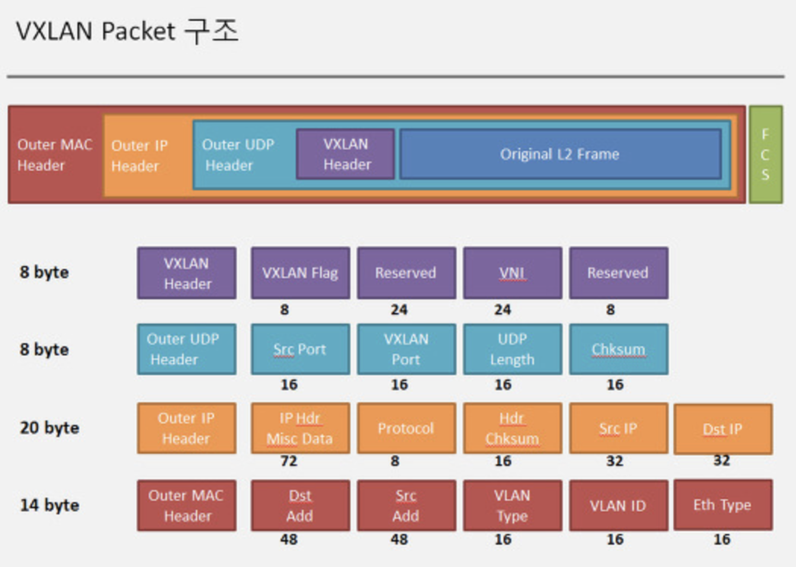

# vxlan

- VxLAN은&nbsp;VLAN을&nbsp;확장한&nbsp;개념으로&nbsp;기존의&nbsp;VLAN에서&nbsp;만들&nbsp;수&nbsp;있는&nbsp;네트워크보다&nbsp;훨씬&nbsp;더&nbsp;많은&nbsp;네트워크를&nbsp;생성할&nbsp;수&nbsp;있다.
- VxLAN에서 x는 eXtensible으로 이름에서도 확장을 나타내고 있다.
- VLAN은 이더넷 프레임에 16bit(vlan, option, id)를 추가로 구성하여 Tag를 기반으로 동작하는데 이때 id로 사용할 수 있는 비트가 12bit이기 때문에 만들 수 있는 네트워크가 최대 4096개만 생성할 수 있었다.
- VxLAN은 VLAN의 문제를 해결하기 위해 50byte 헤더(Mac over IP, UDP Header, 24bit VLAN ID)를 추가로 구성하여 16,000,000개 이상의 VLAN을 제공할 수 있다.

### VNI (virtual Network Identifier)

- VLAN과 VxLAN segment간 mapping 구분자
- 같은 VLAN에 대해 여러 개의 VNI mapping이 가능하다.

### VTEP ( VXLAN Tunnel End Point )

- VXLAN Tunnel 종단 역할을 수행한다
- 인캡슐레이션과 터미네이션 의 end point 역활을 수행한다.

- Original L2 frame 이외의 모든 헤더가 VXLAN 관련 헤더이다.

- VXLAN 헤더 에는 VNI 라는 24비트 VLAN 을 생성할 수 있다.

  일반적인 VLAN ID 가 16비트의 기반이라면, VXLAN의 VNI 에서 표현되는 VLAN 은 24비트의 기반으로, 16,000,000 개의 VLAN 을 생성 할 수 있다.

- L2 over L3 : UDP 패킷 내부에 L2 프레임을  캡슐화 하는 *터널링*  기술

- Mac in UDP 

  - VXLAN 패킷 사이즈 : 50byte
  - VXLAN L2 정보 (MAC address)를 L3에 넣어서 통신

### MTU

- 원래는 1500byte 를 사용하는데 VXLAN 패킷에 50byte를 썼으므로
-  1450byte 를 세팅해서 사용하도록 MTU를 세팅한다.

### reference 

https://skstp35.tistory.com/227

https://atthis.tistory.com/7?category=750237

