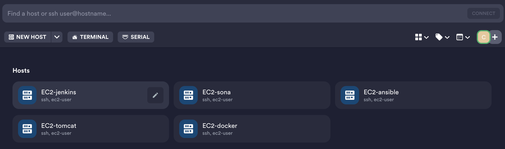

## EC2 설치

### key-pair 생성

- .pem 파일을 다운로드.

### termus (ssh client)

- termius 에서 host 연결 시 .pem 파일 import 후 연결한다.

~~~sh
brew install --cask termius
~~~

### jdk 설치

~~~sh
sudo yum install java-17-amazon-corretto
java -version
~~~

### 이미지 생성

- 인스턴스 중지 후 이미지 생성 
- AMI 에서 확인 가능

### ssh 접속

### private network 통신 inbound 설정

- EC2의 보안그룹 선택 후, inbound를 추가한다.
- All ICMP - ipv4에서 현재 사용중인 보안그룹을 선택하면 private network 통신을 할 수 있게된다.

