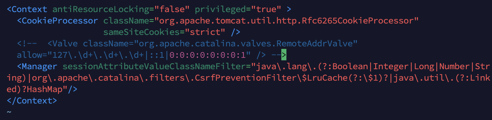
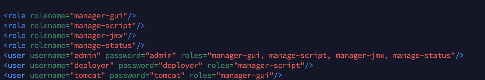
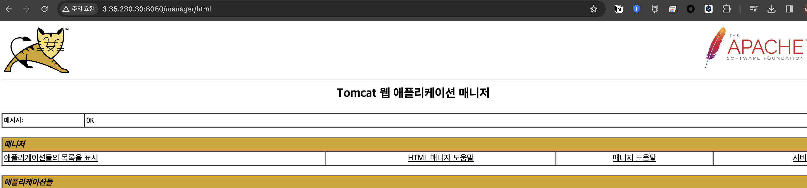

## AWS EC2에 Tomcat 서버 설치하기

### tomcat 설치

~~~sh
cd /opt
sudo wget https://mirror.navercorp.com/apache/tomcat/tomcat-9/v9.0.85/bin/apache-tomcat-9.0.85.tar.gz
sudo tar -xvf apache-tomcat-9.0.85.tar.gz 

sudo chmod +x ./bin/startup.sh
sudo chmod +x ./bin/shutdown.sh
~~~

### 외부에서 localhost 외 ip접근 허용설정

~~~sh
sudo vi ./webapps/manager/META-INF/context.xml
sudo vi ./webapps/host-manager/META-INF/context.xml
~~~

- 127.0.0.1 만 허용하는 태그를 주석처리한다.

### user 설정

- admin, deployer, tomcat 계정 설정

~~~
sudo vi conf/tomcat-users.xml
~~~

- user manager 확인

