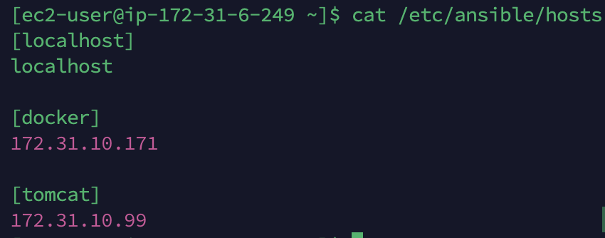
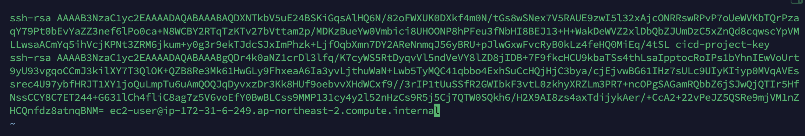
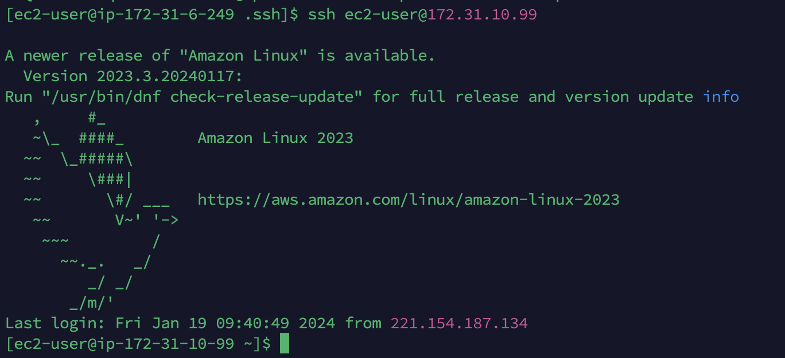
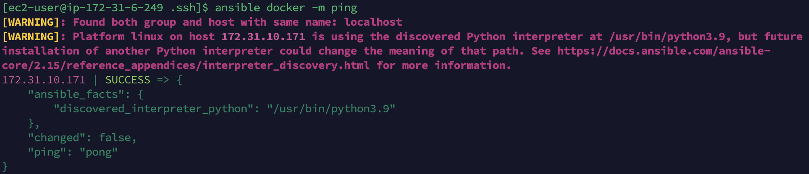

## AWS EC2에 Ansible 서버 설치하기

### ansible 설정

~~~sh
sudo yum install ansible
~~~

### hosts 설정

- private host를 모듈이름과 함께 설정해준다.

### ssh 접속 설정

- ssh-keygen 생성
- ~/.ssh/id_rsa.pub 파일 내용을 복사 한 후
- localhost, docker, tomcat 서버의 ~/.ssh/authorized_keys 파일에 붙여넣기를 한다.

- 그 후 ssh 접속을 하면 접속이 된다.

- ansible module 명령어가 잘 되는 지 테스트 해보자.

