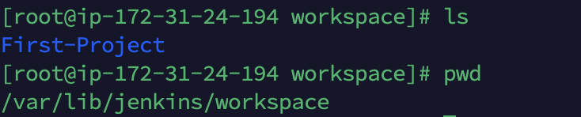
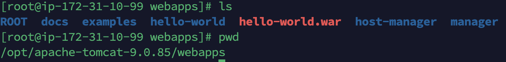
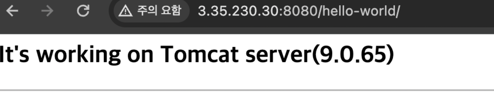

## Jenkins를 이용하여 Tomcat 서버에 배포하기

### 1. 플러그인 설치

~~~sh
Maven Integration
Deploy to container
~~~

### 2. jenkins maven 설정

- tools 에 maven installations 추가
- Name: Maven3.9.6
- MAVEN_HOME: /opt/maven

### 3. item 생성 

- git 추가
- build
  - pom.xml
  - clean compile package
- 빌드 후 조치
  - Deploy war/ear to a container
    - `**/*.war`
    - containers
      - tomcat user/password 
      - tomcat public url

### 빌드 결과 확인

- jenkins server

- tomcat server

