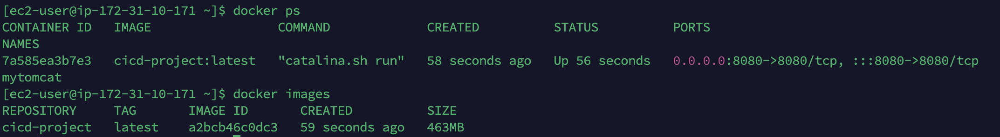
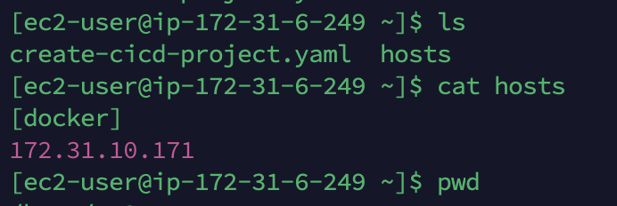
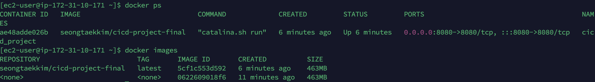

## Jenkins빌드 후 docker에서 배포

### 1. 플러그인 설치

~~~
publish over ssh 플러그인 설치
~~~

### 2. ssh 접속 설정

- jenkins server
  - ssh-keygen 생성
  - docker server에 .ssh > authorized_keys 에 jenkins server의 id_rsa.pub 내용을 복붙한다.
  - jenkins에서 ssh ec2-user@"internal ip" 으로 확인
- jenkins 웹에서 시스템설정에서 Publish over SSH 를 추가
  - 패스워드가 아닌 key 로 인증해야하는데, jenkins의 id_rsa (개인키) 를 넣어서 한다.

### 3. item 생성

- git pull 이전 예제와 같음
- build 이전 예제와 같음
- SSH Publishers 설정
  - docker server - 전달받은 war파일을 image로 만든다.
    - source: target/*.war
    - remove prefix: target
    - remote directory: .
    - command: 
      - docker build --tag=cicd-project .
      - docker run -d -p 8080:8080 --name mytomcat cicd-project:latest

### 4. 도커서버에서 도커파일 생성

~~~dockerfile
FROM tomcat:9.0

COPY ./hello-world.war /usr/local/tomcat/webapps
~~~

### 5. 빌드 결과

## Jenkins 빌드 후 Ansible 에서 Docker로 배포

### 1. jenkins에서 ansible-server Publish over SSH 추가

- hostname: internal ip
- key: jenkins의 private key 삽입
- jenkins의 public key를 ansible 의 authorized_keys에 삽입

~~~
docker build --tag=seongtaekkim/cicd-project-final .
~~~

### 2. ansible server 설정

- target host를 정한다.

- 아래 명령어들은 target host (docker server)에서 수행할 내용이다.

~~~yaml
$ cat create-cicd-project.yaml 
- hosts: all
  tasks:
  - name: stop current running container
    command: docker stop cicd_project
    ignore_errors: yes

  - name: remove stopped cotainer
    command: docker rm cicd_project
    ignore_errors: yes

  - name: create a container using cicd-project-ansible image
    command: docker run -d --name cicd_project -p 8080:8080 seongtaekkim/cicd-project-final
~~~

### 3. item 생성

- git pull 이전 예제와 같음
- build 이전 예제와 같음
- SSH Publishers 설정
  - docker server - 전달받은 war파일을 image로 만든다.
    - source: target/*.war
    - remove prefix: target
    - remote directory: .
    - command: docker build --tag=seongtaekkim/cicd-project-final .
  - ansible server - ansible-playbook으로 docker-server에 컨테이너를 띄운다
    - ansible-playbook -i hosts create-cicd-project.yaml

### 4.빌드 결과

