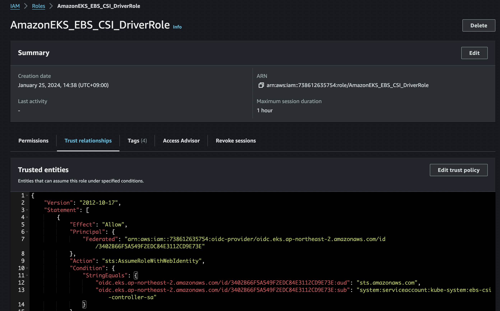
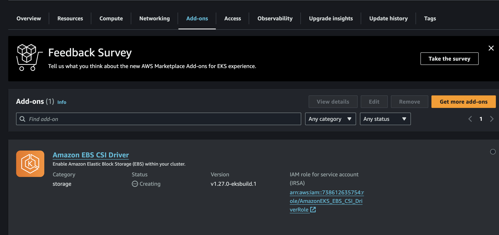

# eks csi

### 개요

- 이 예제는 jenkins를 helm 패키지관리자를 이용해서 pod으로 실행할 예정이다.
- jenkins의 데이터를 영구 저장하기 위해 동적 프로비저닝 해주는 EBS CSI 드라이버를 설치하고, 
  jenkins 실행 시 PVC에 작성된 storageClass의 프로비저너(EBS CSI)에 PV 생성을 요청하고
  요구한 만큼의 EBS 볼륨을 실행하도록 설정할 것이다.

### CSI

- CSI ( Container Storage Interface) 란 컨테이너 오케스트레이션 시스템과 Storage Controller ( Plugin ) 사이의 Interface이며, gRPC 기반으로 구성되어 있다
- CSI는 Storage를 제어하는 Plugin, Volume Life Cycle, 컨테이너 오케스트레이션 시스템과 CSI Plugin 사이의 인터페이스를 정의한다

### EBS CSI

- #### EBS CSI 드라이버는 EKS 클러스터가 EBS를 사용하여 볼륨을 프로비저닝 및 관리해주는 CSI 드라이버이다

- 이미 기본 프로비저닝 도구가 있으나, 신규 프로비저닝 기능을 사용하기 위해서는 설치를 해야 한다고 한다..

~~~sh
$ k get sc
NAME            PROVISIONER             RECLAIMPOLICY   VOLUMEBINDINGMODE      ALLOWVOLUMEEXPANSION   AGE
gp2 (default)   kubernetes.io/aws-ebs   Delete          WaitForFirstConsumer   false                  28m
~~~

### EBS CSI 드라이버 구성

- 아래 설치가이드에 자세히 나와 있으니 참고해서 구성하자.

[aws 설치가이드](https://docs.aws.amazon.com/ko_kr/eks/latest/userguide/ebs-csi.html)

- AmazonEBSCSIDriverPolicy role을 사용하는 role추가한다.
- cluster 이름과 role-name을 지정하고 실행한다.

~~~sh
eksctl create iamserviceaccount \
    --name ebs-csi-controller-sa \
    --namespace kube-system \
    --cluster eks-demo \
    --role-name AmazonEKS_EBS_CSI_DriverRole \
    --role-only \
    --attach-policy-arn arn:aws:iam::aws:policy/service-role/AmazonEBSCSIDriverPolicy \
    --approve
~~~

- aws console에서 생성 결과 확인.

- aws-ebs-csi-driver addon 추가.
- cluster 이름, iam 정보,  좀전에 생성한 role name을 입력하고 실행한다.

~~~sh
eksctl create addon --name aws-ebs-csi-driver --cluster eks-demo --service-account-role-arn arn:aws:iam::738612635754:role/AmazonEKS_EBS_CSI_DriverRole --force
~~~

- aws console EKS 탭에서 생성결과 확인.

- eks 에 관련 리소스가 실행됨을 확인.

~~~sh
$ k get sa -n kube-system
ebs-csi-controller-sa                0         3m3s
ebs-csi-node-sa                      0         3m3s

$ k get pod -n kube-system
ebs-csi-controller-6f547dbd7b-d8tmq   6/6     Running   0          3m31s
ebs-csi-controller-6f547dbd7b-tbqr4   6/6     Running   0          3m31s
ebs-csi-node-kpq6v                    3/3     Running   0          3m31s
ebs-csi-node-qx2gs                    3/3     Running   0          3m31s
~~~

## ref

[blog1](https://velog.io/@lijahong/0%EB%B6%80%ED%84%B0-%EC%8B%9C%EC%9E%91%ED%95%98%EB%8A%94-AWS-%EA%B3%B5%EB%B6%80-EKS-%ED%99%9C%EC%9A%A9%ED%95%98%EA%B8%B0-EBS-CSI-%EB%93%9C%EB%9D%BC%EC%9D%B4%EB%B2%84%EB%A5%BC-%EC%9D%B4%EC%9A%A9%ED%95%9C-%EB%8F%99%EC%A0%81-%ED%94%84%EB%A1%9C%EB%B9%84%EC%A0%80%EB%8B%9D)

[blog2](https://velog.io/@aylee5/EKS-Helm%EC%9C%BC%EB%A1%9C-Jenkins-%EB%B0%B0%ED%8F%AC-MasterSlave-%EA%B5%AC%EC%A1%B0-with-Persistent-VolumeEBS)

