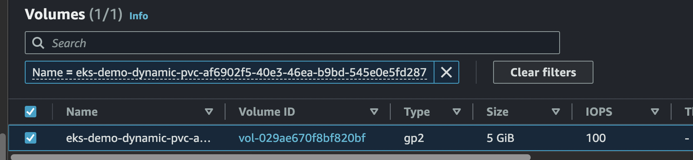

# jenkins volume

EBS CSI 드라이버 구성 이후 jenkins 생성 전에 필요한 리소스를 구성한다.

### StorageClass

- pvc로 요청이 있을 때 작성한 provisioner로 저장타입, 가용영역 등을 요청하여 pv를 생성할 수 있는 리소스를 생성한다.

- provisioner : 사용할 프로비저너인 EBS CSI를 지정
- volumeBindingMode - Immediate : pvc 생성 시, 프로비저닝과 바인딩이 바로 발생하도록 설정
  - WaitForFirstConsumer라면, pvc를 사용하는 Pod가 배포될 때까지 Provisioning과 Mount를 지연시킨다

- reclaimPolicy - Delete : 볼륨 사용이 끝나면, 삭제하도록 설정
- parameters : EBS 볼륨 타입과 볼륨 파일 시스템 지정
- allowedTopologies : 프로비저닝을 제한하기 위한 설정. Key와 Value를 통해 설정한다
  - Key - topology.ebs.csi.aws.com/zone : EBS 볼륨이 생성되는 가용 영역을 제한하기 위해 사용
    - values - 가용 영역 : EKS 클러스터 워커 노드가 위치한 가용 영역에 EBS 볼륨이 생성되게 설정

~~~yaml
apiVersion: storage.k8s.io/v1
kind: StorageClass
metadata:
  name: jenkins-ebc-csi-sc
provisioner: ebs.csi.aws.com
volumeBindingMode: Immediate
reclaimPolicy: Delete
parameters:
  csi.storage.k8s.io/fstype: ext4
  type: gp2
allowedTopologies:
  - matchLabelExpressions:
    - key: topology.ebs.csi.aws.com/zone
      values:
      - ap-northeast-2a
      - ap-northeast-2c
~~~

~~~sh
$ k get sc
NAME                 PROVISIONER             RECLAIMPOLICY   VOLUMEBINDINGMODE      ALLOWVOLUMEEXPANSION   AGE
gp2 (default)        kubernetes.io/aws-ebs   Delete          WaitForFirstConsumer   false                  44m
jenkins-ebc-csi-sc   ebs.csi.aws.com         Delete          Immediate              false                  21s
~~~

### PersistentVolumeClaim 

- jenkins pod 생성시 해당 pvc에 필요한 리소스를 요청하게 된다.
- 우리는 EBS를 사용하므로 ReadWriteOnce 를 사용한다.
  - EBS는 단일 노드에서 사용가능.

~~~yaml
apiVersion: v1
kind: 
metadata:
  namespace: jenkins
  name: jenkins-pvc
spec:
  accessModes:
    - ReadWriteOnce
  resources:
    requests:
      storage: 5Gi
  storageClassName: jenkins-ebc-csi-sc
~~~

~~~sh
$ k get pvc -n jenkins
NAME          STATUS   VOLUME                                     CAPACITY   ACCESS MODES   STORAGECLASS         AGE
jenkins-pvc   Bound    pvc-af6902f5-40e3-46ea-b9bd-545e0e5fd287   5Gi        RWO            jenkins-ebc-csi-sc   29s
~~~

~~~sh
$ k get pv -n jeknins
NAME                                       CAPACITY   ACCESS MODES   RECLAIM POLICY   STATUS   CLAIM                 STORAGECLASS         REASON   AGE
pvc-af6902f5-40e3-46ea-b9bd-545e0e5fd287   5Gi        RWO            Delete           Bound    jenkins/jenkins-pvc   jenkins-ebc-csi-sc            41s
~~~

- aws console: EBS volume 생성 확인.

