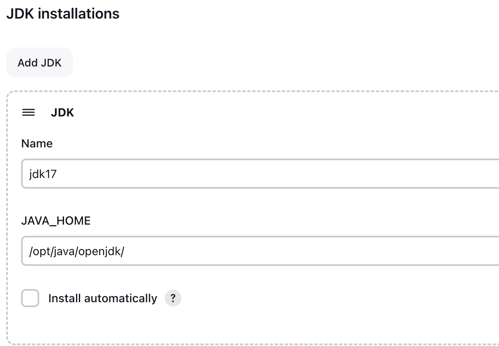
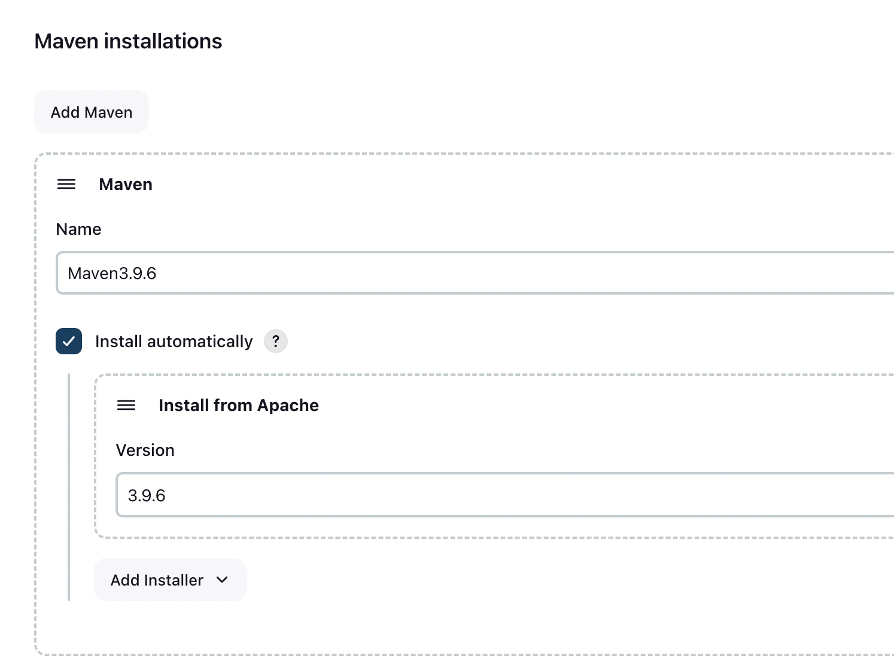
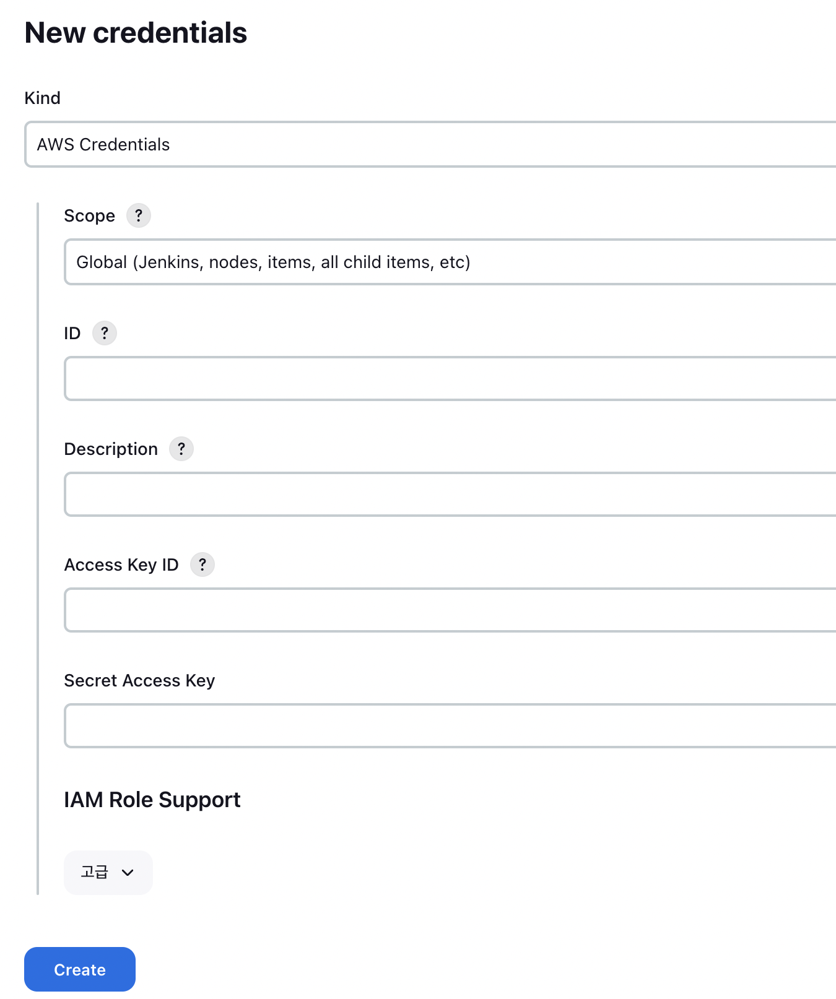

# helm jenkins manage

- helm을 이용해서 jenkins를 제어한다.

## AWS CLI

- cli 환경에서 작성되었다. (m1)

### helm 설치

~~~sh
brew install helm
~~~

### repository 추가/업데이트

~~~sh
helm repo add jenkinsci https://charts.jenkins.io
helm repo update
helm repo list
~~~

### jenins 실행

~~~sh
helm install jenkins -n jenkins -f jenkins-value.yaml jenkinsci/jenkins
~~~

### k8s 리소스 확인

~~~sh
$ k get pod,statefulset,svc -n jenkins
NAME            READY   STATUS    RESTARTS   AGE
pod/jenkins-0   2/2     Running   0          6m26s

NAME                       READY   AGE
statefulset.apps/jenkins   1/1     6m26s

NAME                    TYPE           CLUSTER-IP      EXTERNAL-IP                                                                          PORT(S)        AGE
service/jenkins         LoadBalancer   10.100.66.176   aae1c43291ebf4f7d85e60b2f3db20bf-61ed8dbfbb616bf0.elb.ap-northeast-2.amazonaws.com   80:32338/TCP   6m26s
service/jenkins-agent   ClusterIP      10.100.189.34   <none>                                                                               50000/TCP      6m26s
~~~

- aws console: LoadBalancer 생성 확인

- 로그인 확인

### 기본 로그인정보

- id: admin
- password : 아래명령어
  - 설정에서 변경가능.

~~~
kubectl exec --namespace jenkins -it svc/jenkins -c jenkins -- /bin/cat /run/secrets/additional/chart-admin-password && echo
~~~

### 설정변경 적용

~~~sh
helm upgrade jenkins jenkinsci/jenkins -n jenkins -f jenkins-value.yaml
~~~

### 플러그인 설치

~~~
GitHub Integration
Maven Integration
Pipeline Maven Integration
Docker Pipeline
AWS Credentials
Amazon ECR
Delivery Pipeline
Pipeline Utility Steps
~~~

### tools 설정

- jdk17 이 이미 설치되어 있으므로 java_home 위치를 작성해서 설정해주자.
  - name은 piepeline에서 선택해서 사용할 수 있음을 주의

~~~sh
$ k get pod -n jenkins
NAME        READY   STATUS    RESTARTS   AGE
jenkins-0   2/2     Running   0          32m

$ k exec -it jenkins-0 -n jenkins -c jenkins -- bash
jenkins@jenkins-0:/$ which java
/opt/java/openjdk/bin/java
~~~

- Maven Integration  설치 후 열리는 설정.
- jenkins에서 자동 설치하여 사용하도록 한다.
  - name은 piepeline에서 선택해서 사용할 수 있음을 주의

### credentials 작성

- Jenkins 관리 > Security > Credentials

### aws credentials

- aws ECR push를 위해 해당 iam access 정보를 등록한다.

~~~sh
$ cat ~/.aws/credentials
[default]
aws_access_key_id = xxxxxxxx
aws_secret_access_key = xxxxxxxx
~~~

### release 삭제

~~~
 helm ls --all-namespaces
 helm uninstall release_name -n release_namespace # delete release
~~~

### repository 삭제

~~~
helm repo remove "id"
~~~

