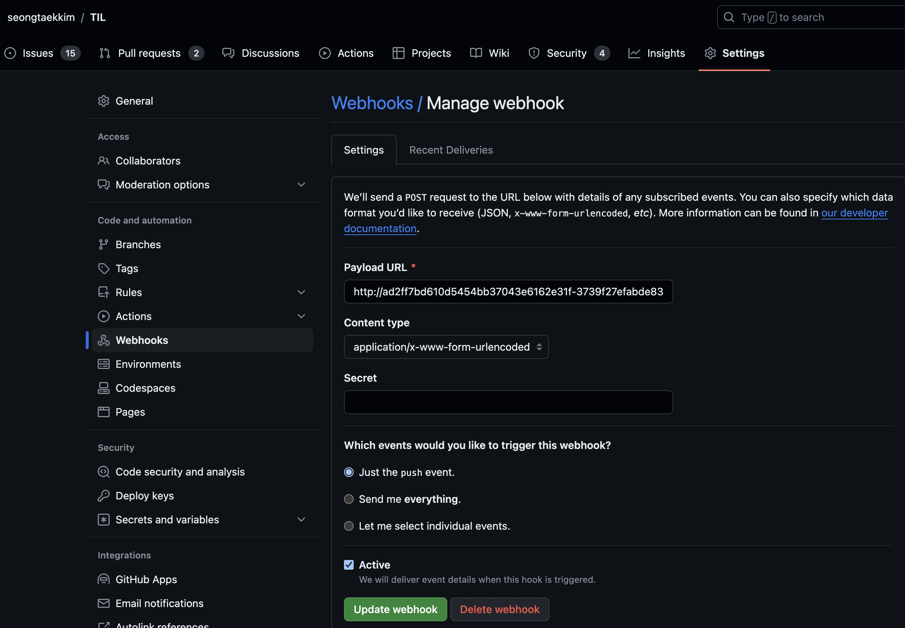
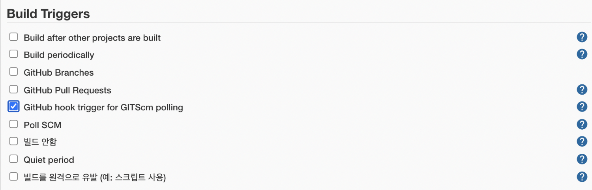

# github webhook

github repository push할 때 jenkins ci 가 자동 실행되도록 webhook을 설정한다.

## github public repository

### github 설정

- repository 변경 시 Payload URL에 webhook 할 수 있다.
  - jenkins git clone 정보에 작성된 branch 가 변동시 적용 되는듯함
- Payload URL: jenkins 접속 url 작성

### jenkins 설정

- plugin install
  - 설치 전에 github update도 진행해야 한다. (jenkins restart 해야함.)

~~~
GitHub Integration
~~~

- pipeline 설정 시 Build Triggers에 아래와 같이 체크해준다.

### ref

https://velog.io/@suhongkim98/jenkins-webhook-CI-CD-pipeline-%EA%B5%AC%EC%B6%95%ED%95%98%EA%B8%B0

