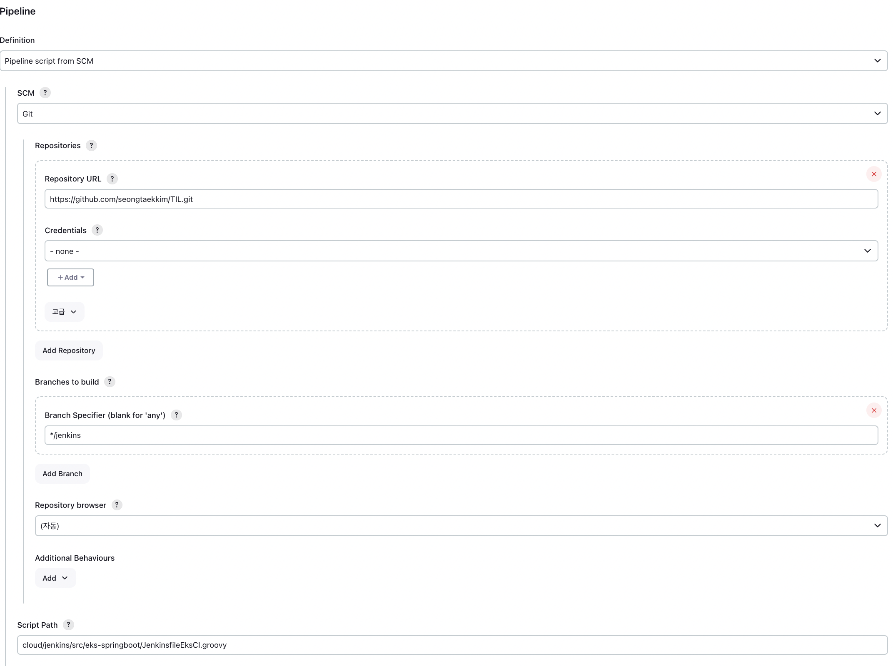
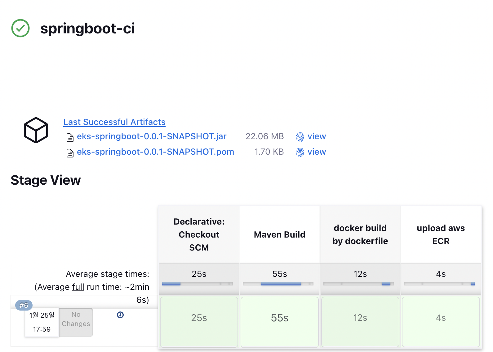
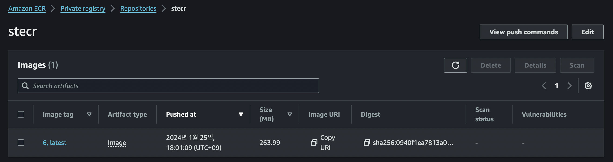
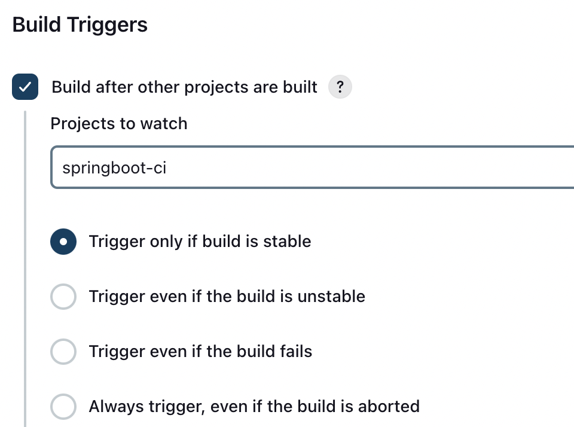
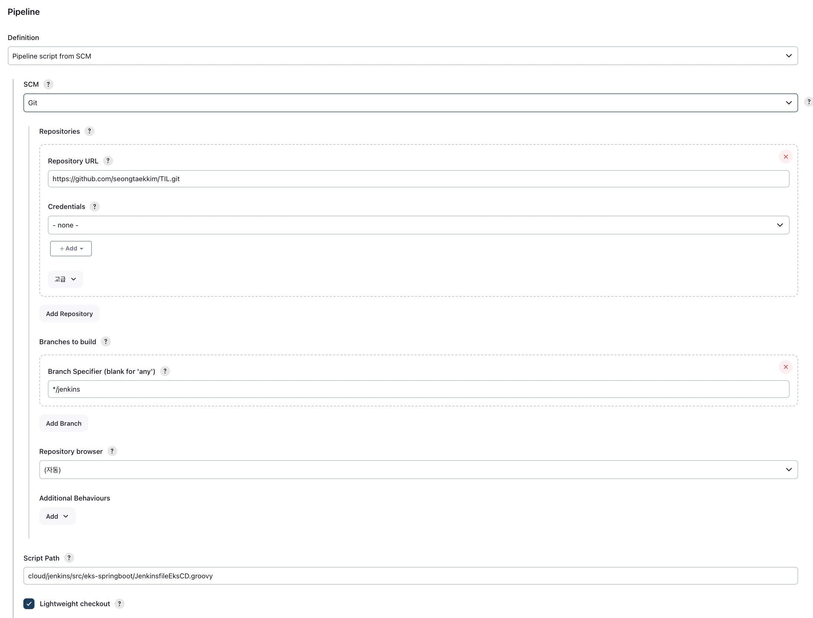
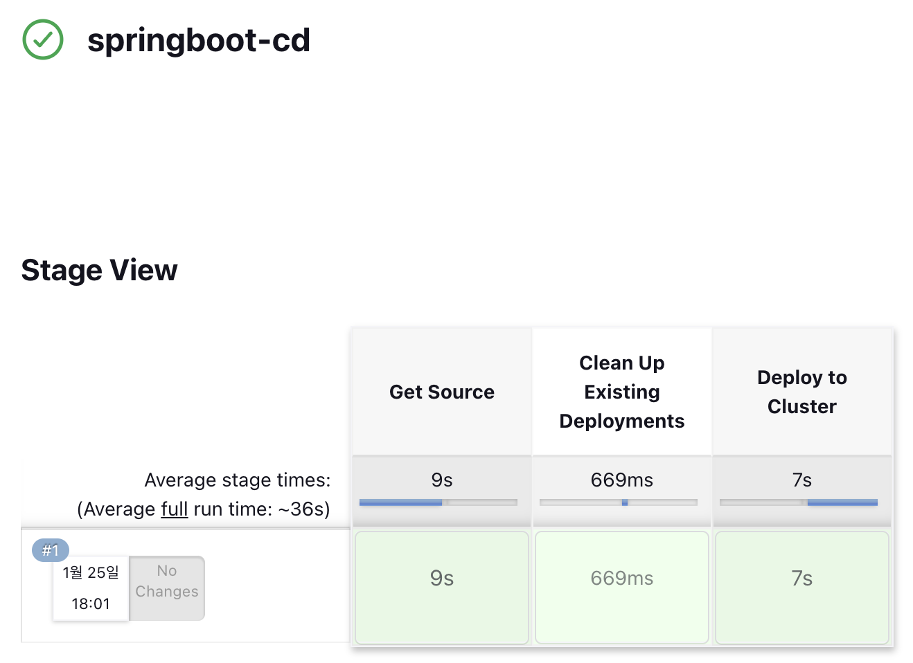
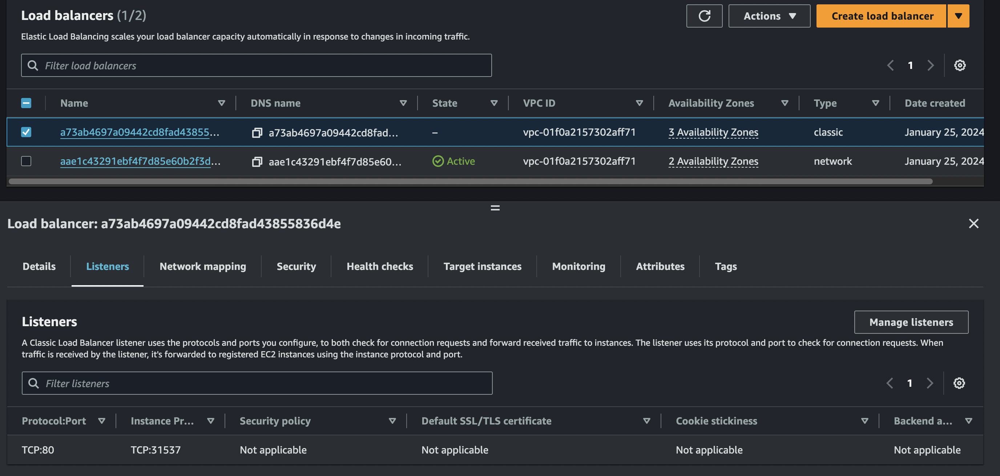
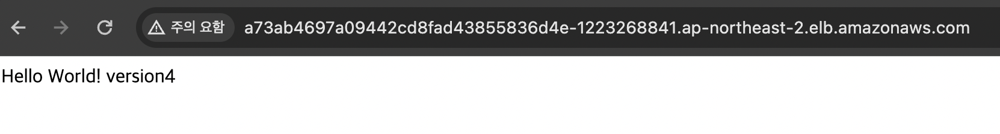

# jenkins pipeline

## CI

- docker사용: 하므로 dind-agent 선택
- ecr push: ecr path, repo url 작성
- 순서: gir pull => maven build => docker build => ecr push

~~~groovy
pipeline {
    agent  {
        label 'dind-agent'
    }
    options {
        timeout(time: 1, unit: 'HOURS') // set timeout 1 hour
    }
    environment {
        TIME_ZONE = 'Asia/Seoul'
        PROFILE = 'local'

        REPOSITORY_CREDENTIAL_ID = 'gitlab-jenkins-key'
        REPOSITORY_URL = 'https://github.com/seongtaekkim/TIL.git'
        TARGET_BRANCH = 'jenkins'

        CONTAINER_NAME = 'belloga-labeling-service'

        AWS_CREDENTIAL_NAME = 'aws'
        ECR_PATH = '738612635754.dkr.ecr.ap-northeast-2.amazonaws.com'
        IMAGE_NAME = '738612635754.dkr.ecr.ap-northeast-2.amazonaws.com/stecr'
        REGION = 'ap-northeast-2'
    }
    stages{
        stage('Maven Build') {
            steps {
                withMaven(globalMavenSettingsConfig: '', jdk: 'jdk17', maven: 'Maven3.9.6', mavenSettingsConfig: '', traceability: true) {
                    sh 'mvn -f cloud/jenkins/src/eks-springboot clean package -Dmaven.test.skip=true'
                }
            }
        }
        stage('docker build by dockerfile') {
            steps {
                sh '''
                 cd cloud/jenkins/src/eks-springboot
        		 docker build -t $IMAGE_NAME:$BUILD_NUMBER .
        		 docker tag $IMAGE_NAME:$BUILD_NUMBER $IMAGE_NAME:latest
        		 '''
            }
            post {
                success {
                    echo 'success dockerizing project'
                }
                failure {
                    error 'fail dockerizing project' // exit pipeline
                }
            }
        }
        stage('upload aws ECR') {
            steps {
                script{
                    // cleanup current user docker credentials
                    sh 'rm -f ~/.dockercfg ~/.docker/config.json || true'

                    docker.withRegistry("https://${ECR_PATH}", "ecr:${REGION}:${AWS_CREDENTIAL_NAME}") {
                        docker.image("${IMAGE_NAME}:${BUILD_NUMBER}").push()
                        docker.image("${IMAGE_NAME}:latest").push()
                    }

                }
            }
        }
    }
}

~~~

- pipeline 작성

- 결과

- aws console: ECR push 결과 확인

## CD

- kubectl pod을 실행시켜 작업을 위임한다.
- git pull 후 pipeline.properties 설정파일을 참고하여 k8s resource 를 실행시킨다.

~~~groovy
def label = "hellonode-${UUID.randomUUID().toString()}"

podTemplate(
        label: label,
        containers: [
                containerTemplate(name: "kubectl", image: "lachlanevenson/k8s-kubectl", command: "cat", ttyEnabled: true)
        ],
)
        {
            node(label) {
                stage("Get Source") {
                    git branch: 'jenkins', url: 'https://github.com/seongtaekkim/TIL.git'
                }

                //-- 환경변수 파일 읽어서 변수값 셋팅
                def props = readProperties  file:"cloud/jenkins/src/eks-springboot/pipeline.properties"
                def deployment = props["deployment"]
                def service = props["service"]
                def label_key = props["label_key"]
                def label_value = props["label_value"]
                def namespace = props["namespace"]

                try {
                    stage( "Clean Up Existing Deployments" ) {
                        container("kubectl") {
                            sh "kubectl delete deployments -n ${namespace} -l ${label_key}=${label_value}"
                        }
                    }

                    stage( "Deploy to Cluster" ) {
                        container("kubectl") {
                            sh "kubectl apply -n ${namespace} -f ${deployment}"
                            sh "sleep 5"
                            sh "kubectl apply -n ${namespace} -f ${service}"
                        }
                    }

                } catch(e) {
                    currentBuild.result = "FAILED"
                }
            }
        }
~~~

###  pipeline.properties

~~~properties
version=v1
namespace=jenkins
dockerRegistry=https://registry.hub.docker.com/
credential_registry=seongtaekkim
image=seongtaekkim/demo-springboot
deployment=cloud/jenkins/src/eks-springboot/k8s/k8s-deployment.yaml
service=cloud/jenkins/src/eks-springboot/k8s/k8s-service.yaml
label_key=app
label_value=springboot-helloworld
~~~

- CD 작업은, CI작업 성공 후 자동으로 실행되도록 설정할 수 있다.

- pipeline 작성

- 결과

- aws console: classic type의 Loadbalancer가 생성됨.

- 접속 확인.

