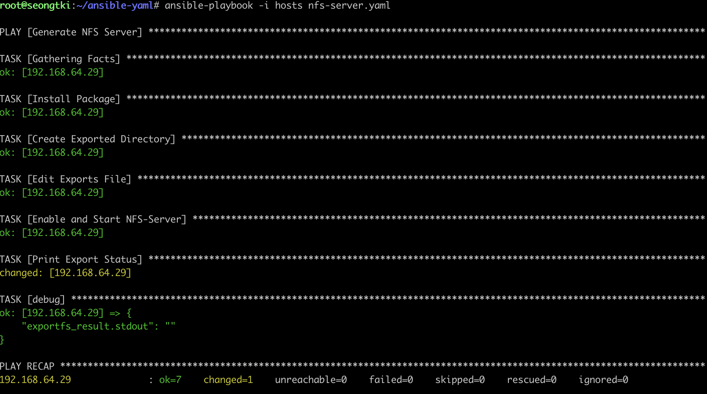

## NFS server 구성

~~~sh
apt install ansible 
~~~

~~~
cd
cd ansible-yaml
~~~

- hosts 파일생성

~~~
[master01]
192.168.64.29
~~~

- ssh-keygen, id_rsa.pub 을 복붙해서 ssh 인증하기.

- playbook yaml 생성

~~~sh
---
- name: Generate NFS Server
  hosts: all
  tasks:
  - name: Install Package
    yum:
      name: nfs-kernel-server
      state: latest

  - name: Create Exported Directory
    file:
      path: /data
      state: directory
      mode: '0777'

  - name: Edit Exports File
    lineinfile:
      path: /etc/exports
      line: '/data 192.168.0.0/16(rw,sync,no_subtree_check)'

  - name: Enable and Start NFS-Server
    systemd:
      name: nfs-server
      enabled: yes
      state: started
      
  - name: Print Export Status
    shell:
      cmd: exportfs -v
    register: exportfs_result

  - debug:
      var: exportfs_result.stdout
~~~

- 명령어 실행

~~~sh'
ansible-playbook -i hosts nfs-server.yml
~~~

### 위의 ansible 해도 되고, 아래 명령어로 해도 된다.

~~~sh
$ sudo apt-get update
$ sudo apt-get install -y nfs-common nfs-kernel-server

$ mkdir /data
$ sudo chmod 777 shared

$ sudo echo '/data 192.168.0.0/16(rw,sync,no_subtree_check)' >> /etc/exports
$ sudo exportfs -a
$ sudo systemctl restart nfs-kernel-server
~~~

- NFS에 접속할 노드에 설치 (이 코드도 ansible-playbook 으로 해도됨,,)

~~~sh
apt install nfs-common
~~~

