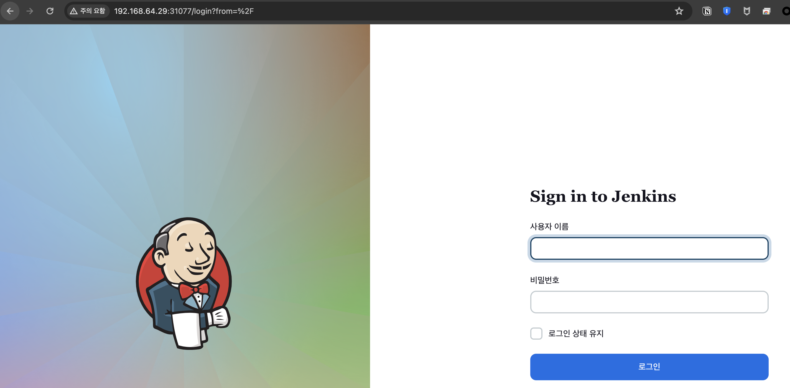

## k8s jenkins pod 추가

### 1. namespace

~~~yaml
apiVersion: v1
kind: Namespace
metadata:
  name: jenkins
~~~

### 2. pv

~~~yaml
---
apiVersion: v1
kind: PersistentVolume
metadata:
  name: jenkins-pv
  namespace: jenkins
  labels:
    type: nfs
spec:
  capacity:
    storage: 10Gi
  accessModes: ["ReadWriteMany"]
  nfs:
    server: 192.168.64.29
    path: /data # NFS server's shared path
~~~

### 3. pvc

~~~yaml
apiVersion: v1
kind: PersistentVolumeClaim
metadata:
  name: jenkins-pvc
  namespace: jenkins
spec:
  storageClassName: ""
  accessModes:
    - ReadWriteMany
  resources:
    requests:
      storage: 10Gi
~~~

### 4. deploy

~~~yaml
---
    apiVersion: apps/v1
    kind: Deployment
    metadata:
      name: jenkins
      namespace: jenkins
    spec:
      replicas: 1
      selector:
        matchLabels:
          app: jenkins
      template:
        metadata:
          labels:
            app: jenkins
        spec:
          containers:
          - name: jenkins
            image: jenkins/jenkins:lts
            ports:
            - containerPort: 8080
            volumeMounts:
            - name: jenkins
              mountPath: /var/jenkins_home
          volumes:
            - name: jenkins
              persistentVolumeClaim:
                claimName: jenkins-pvc
~~~

### 5. svc

~~~yaml
apiVersion: v1
kind: Service
metadata:
  name: jenkins
  namespace: jenkins
spec:
  type: NodePort
  ports:
    - port: 8080
      targetPort: 8080
  selector:
    app: jenkins
~~~

### 6. 1~5 yaml 리소스를 실행한다.

