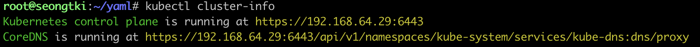
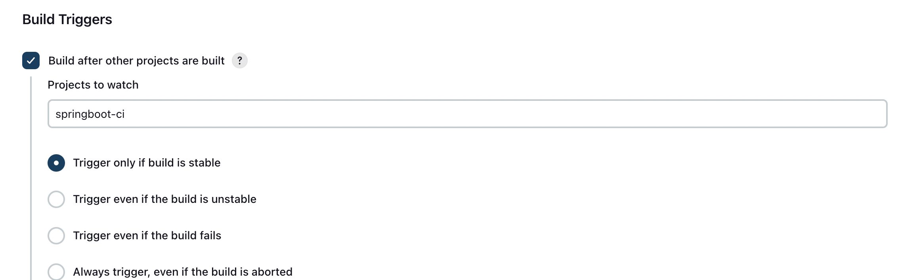

### 플러그인 설치

~~~
Kubernetes Credentials
Kubernetes
Pipeline Utility Steps: groovy의 readProperties 라이브러리를 포함한다. (properties 파일을 읽어올 수 있음)
delivery pipeline: 내가만든 작업을 ui 하나에서 보여줄 수 있도록 설정을 도와준다.
~~~

- kubernetes api server info

## jenkins 관리 > cloud

- 클라우드 생성
  - 아래 설정으로 connection test 후 저장한다.

~~~
Kubernetes URL: https://kubernetes.default.svc.cluster.local 혹은 https://192.168.64.29:6443
Disable https certificate check 체크
Kubernetes Namespace: jenkins
Credentials -> 없으면 생성 누른 후 Service Account를 생성한다. 내가 정한 namespace의 service account가 존재해야 한다.
Jenkins URL: http://jenkins.jenkins.svc.cluster.local 혹은 http://192.168.64.29:30000/
Jenkins tunnel: jenkins.jenkins.svc.cluster.local:50000 ({service}.{namespace}.svc.cluster.local:50000)

~~~

### CI pipeliine 생성

- pipeline을 이용해서 maven build, docker build push까지 진행.

~~~groovy
def NAMESPACE = "ns-project"

pipeline {
    agent any
    stages {
        stage('Maven Build') {
            steps {
                withMaven(globalMavenSettingsConfig: '', jdk: 'jdk17', maven: 'Maven3.9.6', mavenSettingsConfig: '', traceability: true) {
                    sh 'mvn -f cloud/jenkins/src/demo clean package -Dmaven.test.skip=true'
                }
            }
        }
        stage('Docker Build And Push') {
            steps {
                script {
                    docker.withRegistry('https://registry.hub.docker.com/', 'seongtaekkim') {
                        image = docker.build("seongtaekkim/demo-springboot:v1", "./cloud/jenkins/src/demo");
                        image.push();
                    }
                }
            }
        }
    }
}
~~~

### CD pipeline 생성

- podTemplate을 이용하여 kubectl 전용 컨테이너를 실행한다.
- git pull 후 포함된 설정정보를 이용해서 기존의 deployment를 delete 하고
- 새로운 deploy, service를 순서대로 실행한다.
- 작업 완료 후에는 생성되었던 임시컨테이너는 delete된다.

~~~groovy
def label = "hellonode-${UUID.randomUUID().toString()}"

podTemplate(
    label: label,
    containers: [
            containerTemplate(name: "kubectl", image: "lachlanevenson/k8s-kubectl", command: "cat", ttyEnabled: true)
    ]
)
    {
        node(label) {
            stage("Get Source") {
                git branch: 'jenkins', url: 'https://github.com/seongtaekkim/TIL.git'
            }

            //-- 환경변수 파일 읽어서 변수값 셋팅
            def props = readProperties  file:"cloud/jenkins/src/demo/pipeline.properties"
            def tag = props["version"]
            def dockerRegistry = props["dockerRegistry"]
            def credential_registry=props["credential_registry"]
            def image = props["image"]
            def deployment = props["deployment"]
            def service = props["service"]
            def label_key = props["label_key"]
            def label_value = props["label_value"]
            def namespace = props["namespace"]

            try {

                stage( "Clean Up Existing Deployments" ) {
                    container("kubectl") {
                        sh "kubectl delete deployments -n ${namespace} -l ${label_key}=${label_value}"
                    }
                }

                stage( "Deploy to Cluster" ) {
                    container("kubectl") {
                        sh "kubectl apply -n ${namespace} -f ${deployment}"
                        sh "sleep 5"
                        sh "kubectl apply -n ${namespace} -f ${service}"
                    }
                }

            } catch(e) {
                currentBuild.result = "FAILED"
            }
        }
    }
~~~

### cd 작업에 ci 작업 후 실행한다는 trigger를 설정한다

### kubernetes resource - deploy, service

~~~yaml
apiVersion: apps/v1
kind: Deployment
metadata:
  name: springboot-helloworld
  labels:
    app: springboot-helloworld
spec:
  replicas: 1
  selector:
    matchLabels:
      app: springboot-helloworld
  template:
    metadata:
      labels:
        app: springboot-helloworld
    spec:
      containers:
        - name: springboot-helloworld
          image: seongtaekkim/demo-springboot:v1
          ports:
            - containerPort: 8080
          imagePullPolicy: Always
          env:
            - name: DATE
              value: 'DATE_STRING'

~~~

~~~yaml
apiVersion: v1
kind: Service
metadata:
  name: springboot-helloworld
spec:
  ports:
    - name: "8080"
      port: 8082
      targetPort: 8080
  selector:
    app: springboot-helloworld
  type: NodePort

~~~

### kubernetes resource - sa

~~~yaml
apiVersion: v1
kind: ServiceAccount
metadata:
  namespace: jenkins
  name: jenkins
---
kind: ClusterRoleBinding
apiVersion: rbac.authorization.k8s.io/v1
metadata:
  name: cluster-admin-clusterrolebinding
subjects:
- kind: ServiceAccount
  name: jenkins
  namespace: jenkins
roleRef:
  apiGroup: rbac.authorization.k8s.io
  kind: ClusterRole
  name: cluster-admin
~~~

### properties file

- podtemplate 작업 시 읽을 설정파일이다.
- slave jenkins에서 git pull한 프로젝트에서 읽어서 사용한다.

~~~properties
version=v1
namespace=jenkins
dockerRegistry=https://registry.hub.docker.com/
credential_registry=seongtaekkim
image=seongtaekkim/demo-springboot
deployment=cloud/jenkins/src/demo/k8s/k8s-deployment.yaml
service=cloud/jenkins/src/demo/k8s/k8s-service.yaml
#ingress=deployment/ing.yaml
label_key=app
label_value=springboot-helloworld
~~~

