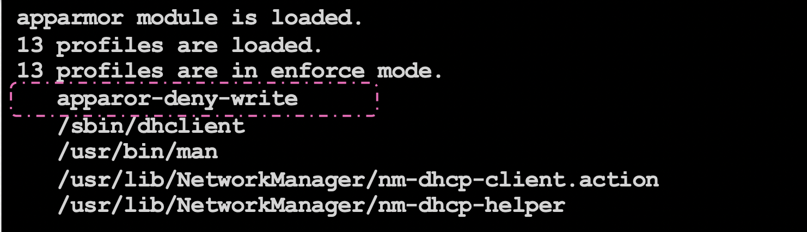

# apparmor

[doc](https://kubernetes.io/docs/tutorials/security/apparmor/)

- apparmor 에 profile 을 추가하고, pod에 profile을 적용하여 실행 시킨다.
- 적용이 완료되었는지 테스트 해본다.

### apparmor-deny-write

~~~sh
profile apparmor-deny-write flags=(attach_disconnected) {
  file,
  # Deny all file writes.
	deny /** w, 
}
~~~

~~~sh
$ apparmor_parser -q /etc/apparmor.d/apparmor-deny-write # profile 추가.
$ aa-status
~~~

### ubuntu-sleeper.yaml

- container.apparmor.security.beta.kubernetes.io/<container_name>: localhost/<profile-name> 을 작성해야 적용됨.

~~~yaml
apiVersion: v1
kind: Pod
metadata:
  name: ubuntu-sleeper
  annotations:
    container.apparmor.security.beta.kubernetes.io/ubuntu-sleeper: localhost/apparmor-deny-write
spec:
  containers:
  - name: ubuntu-sleeper
image: ubuntu
command: [ "sh", "-c", "echo 'Sleeping for an hour!' && sleep 1h" ]
~~~

- 실행

~~~sh
$ kubectl create –f ubuntu-sleeper.yaml
pod/ubuntu-sleeper created
~~~

- 로그 확인

~~~sh
$ kubectl logs ubuntu-sleeper
Sleeping for an hour!
~~~

- profile 에 적용된 deny write 에 의해 파일생성이 거부됨을 확인.

~~~sh
$ kubectl exec -ti ubuntu-sleeper -- touch /tmp/test
touch: cannot touch '/tmp/test': Permission denied
command terminated with exit code 1
~~~

