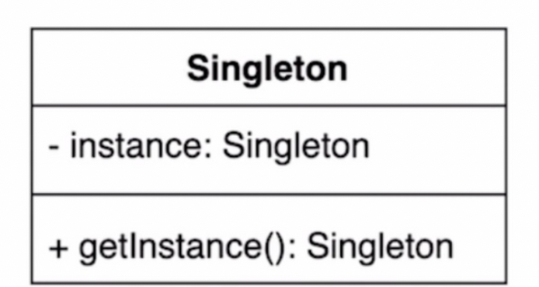
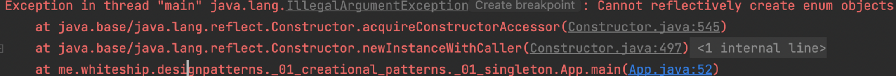

## 1. simple implement




- 인스턴스를 오직 한개만 제공하는 클래스 

- 시스템 런타임, 환경세팅에 대한 정보 등, 인스턴스가 여러개 일 때 문제가 생길 수 있는 경우가 있다.
  인스턴스를 오직 한개만 만들어 제공하는 클래스가 필요하다.


### private 생성자와 public static 메소드

- client 에서 인스턴스를 직접 생성할 수 없고, method를 통해서만 가능한데, 인스턴스 null 체크를 하므로, 오직 하나의 인스턴스만 생성한다.
- 문제점 : 멀티스레드 환경에서 안전하지 않은 방법이다.
  - 인스턴스 Null체크 하는 구문에 2개의 스레드가 접근하게 되면, 두개의 인스턴스가 생성된다.

```java
/**
 * private 생성자와 public static 메소드를 사용하는 방법
 */
public class Settings1 {

    private static Settings1 instance;

    private Settings1() { }

    public static Settings1 getInstance() {
        if (instance == null) {
            instance = new Settings1();
        }
        return instance;
    }
}
```


## 2. implement in multi-threaded environment

### synchronized

- 멀티스레드 환경에서 안전하다.
- 문제점 : 로직 접근 할 때마다 동기화 에대한 비용이 사용된다.

```java
/**
 * synchronized 사용해서 동기화 처리
 */
public class Settings2 {

    private static Settings2 instance;

    private Settings2() { }

    public static synchronized Settings2 getInstance() {
        if (instance == null) {
            instance = new Settings2();
        }
        return instance;
    }
}
```

### eager initialization

- 멀티스레드 환경에서 안전하다.
- 단점 : 미리 만든다는 자체가 문제가 될 수 있다.
  - 비용이 많이 들고 잘 사용하지 않을 경우.

```java
/**
 *  이른초기화 eager initialization 사용해서 동기화 처리
 */
public class Settings2 {

    private static final Settings2 INSTANCE = new Settings();

    private Settings2() { }

    public static Settings2 getInstance() {
        return INSTANCE;
    }

}
```

### double checked locking

- 첫번 째 체크로직에 두개의 스레드가 들어온 후, 두번째 체크로직에서는 반드시 걸린다.
  - 인스턴스가 생성되는 순간에만 동기화 로직이 사용되기 때문에 비용적인 측면에서 좋다.
- volatile 키워드를 반드시 사용해야 된다.
  - 왜 사용해야 하는가 ?
- 단점  : volatile 은 1.5 버전 이상에서 사용가능.

```java
/**
 * double checked locking
 */
public class Settings3 {

    private static volatile Settings3 instance;

    private Settings3() { }

    public static Settings3 getInstance() {
        if (instance == null) {
            synchronized (Settings3.class) {
                if (instance == null) {
                    instance = new Settings3();
                }
            }
        }
        return instance;
    }

}
```

### static inner

- 멀티스레드 환경에서 안전함.
- getInstance() 가 호출 될 때, Settings4Holder를 생성하기 때문에, lazy loading 이 가능함.

```java
/**
 * static inner 클래스 홀더
 */
public class Settings4 {

    private Settings4() { }

    private static class Settings4Holder {
        private static final Settings4 INSTANCE = new Settings4();
    }

    public static Settings4 getInstance() {
        return Settings4Holder.INSTANCE;
    }

}
```


## 3. break the Singleton pattern implementation


### 리플렉션

- private 함수에 직접 접근해서 인스턴스를 직접 생성한다.

```java
Settings4 settings4 = Settings4.getInstance();

Constructor<Settings4> constructor = Settings4.class.getDeclaredConstructor();
constructor.setAccessible(true);
Settings4 settings41 = constructor.newInstance();
System.out.println(settings4 == settings41);
```


### 직렬화 & 역직렬화

- 직렬화 사용을 위해 Serializable을 impliments 한다.
- 역직렬화를 할 때는 생성자를 사용해서 다시 인스턴스를 만들어주기 때문에, 싱글톤이 안된다.

```java
public class Settings4 implements Serializable {

    private Settings4() { }

    private static class Settings4Holder {
        private static final Settings4 INSTANCE = new Settings4();
    }

    public static Settings4 getInstance() {
        return Settings4Holder.INSTANCE;
    }
}
// Serializable
Settings4 settings42  = Settings4.getInstance();
Settings4 settings43 = null;
try (ObjectOutput out = new ObjectOutputStream(new FileOutputStream("settings.obj"))) {
    out.writeObject(settings42);
}

try (ObjectInput in = new ObjectInputStream(new FileInputStream("settings.obj"))) {
    settings43 = (Settings4) in.readObject();
}

System.out.println(settings42 == settings43); // false
```

- 역직렬화 시 호출되는 readResolve()를 오버라이딩 하면 싱글톤 유지가 가능하다.

```java
public class Settings4 implements Serializable {

    ...
		protected Object readResolve() {
        return getInstance();
    }
}
```


## 4. A safe and simple way to implement

- 리플랙션에 안전하다.
- 직렬화 & 역직렬화 에 안전하다.
  - enum 자체가 직렬화를 implements 하고 있음
- 해당 예제는 멀티스레드에서 안전하지는 않다. → 안전하도록 구현이 가능한가?
- 단점 : 클래스 로딩 시 생성된다.

```java
public enum Settings5 {
    INSTANCE;
}
```

- Settings5 class 모든 정보를 가져와서 newInstance를 시도 해도 실패한다.

```java
// enum 일때, 리플랙션 생성 시도
Settings5 settings5 = Settings5.INSTANCE;
Settings5 settings51 = null;
Constructor<?>[] declaredConstructors = Settings5.class.getDeclaredConstructors();
for (Constructor<?> c : declaredConstructors) {
    c.setAccessible(true);
    settings51 = (Settings5) c.newInstance("instance");
}
System.out.println(settings5 == settings51);
```



- ENUM 일 경우, 예외가 발생.

```java
private ConstructorAccessor acquireConstructorAccessor() {

   ...
  // Otherwise fabricate one and propagate it up to the root
  // Ensure the declaring class is not an Enum class.
  if ((clazz.getModifiers() & Modifier.ENUM) != 0)
      throw new IllegalArgumentException("Cannot reflectively create enum objects");
		...
}
```

- 직렬화 역직렬화 시 같은 인스턴스를 가져옴. (싱글톤 o)

```java
Settings5 settings = Settings5.INSTANCE;

  Settings5 settings1 = null;
  try (ObjectOutput out = new ObjectOutputStream(new FileOutputStream("settings.obj"))) {
      out.writeObject(settings);
  }

  try (ObjectInput in = new ObjectInputStream(new FileInputStream("settings.obj"))) {
      settings1 = (Settings5) in.readObject();
  }

  System.out.println(settings == settings1);
```


## 5. practice

~~~java
public class App {

    public static void main(String[] args) throws IOException, ClassNotFoundException, NoSuchMethodException, InvocationTargetException, InstantiationException, IllegalAccessException {
        Settings5 settings = Settings5.INSTANCE;

        Settings5 settings1 = null;
        try (ObjectOutput out = new ObjectOutputStream(new FileOutputStream("settings.obj"))) {
            out.writeObject(settings);
        }

        try (ObjectInput in = new ObjectInputStream(new FileInputStream("settings.obj"))) {
            settings1 = (Settings5) in.readObject();
        }

        System.out.println(settings == settings1);

        // Serializable
        Settings4 settings42  = Settings4.getInstance();
        Settings4 settings43 = null;
        try (ObjectOutput out = new ObjectOutputStream(new FileOutputStream("settings.obj"))) {
            out.writeObject(settings42);
        }

        try (ObjectInput in = new ObjectInputStream(new FileInputStream("settings.obj"))) {
            settings43 = (Settings4) in.readObject();
        }

        System.out.println(settings42 == settings43);


        // 리플렉션사용으로 싱글통 깨기
        Settings4 settings4 = Settings4.getInstance();

        Constructor<Settings4> constructor = Settings4.class.getDeclaredConstructor();
        constructor.setAccessible(true);
        Settings4 settings41 = constructor.newInstance();
        System.out.println(settings4 == settings41);


        // enum 일때, 리플랙션 생성 시도
        Settings5 settings5 = Settings5.INSTANCE;
        Settings5 settings51 = null;
        Constructor<?>[] declaredConstructors = Settings5.class.getDeclaredConstructors();
        for (Constructor<?> c : declaredConstructors) {
            c.setAccessible(true);
            settings51 = (Settings5) c.newInstance("instance");
        }
        System.out.println(settings5 == settings51);

    }

}

~~~


### 복습

1. 자바에서 enum을 사용하지 않고 싱글톤 패턴을 구현하는 방법은 ?

   - private 생성자와 public static 메소드

   - synchronize

   - double check sync

   - eager initialize

   - static inner


2. private 생성자와 static 메소드를 사용하는 방법의 단점은?
   - 멀티스레드에 취약


3. enum을 사용해 싱글톤 패턴을 구현하는 방법의 장점과 단점은?

   - 장점 : 리플랙션, 직렬화 에대해 싱글톤이 안전함.

   - 단점 : 1) 클래스 로딩시 생성 인스턴스가 생성됨. 2) 상속 불가 (enum 만 상속이 가능함)


4. static inner 클래스를 사용해 싱글톤 패턴을 구현하라.


질문1
예제에서 보여주신 enum 내의 INSTANCE 또한 클래스로딩 시점에 JVM의 static 영역에 변수가 등록되고, SettingsHolder와 마찬가지로 호출시점에 힙영역이 할당되면서 그때, static 영역내 변수에 해당 힙주소가 참조되는것으로 알고 있습니다, 그렇다면 이 부분도 lazy initialization이라고 볼 수 있는것 아닌가요?

답변
보통 "지연 초기화"는 클래스로딩 시점에 만드는게 아니라, 처음 해당 인스턴스를 요청할 때, 그 때 만들어 지는 걸 말하는데요. 말씀하신대로, enum은 클래스로딩 시점에 만들어지니까 지연 초기화가 아니라고 말씀드린겁니다. 하지만, 사실상 해당 enum을 클래스로딩만 하고 구체적인 타입을 쓰지 않는 경우(예, EnumSet.allOf(Difficulty.class);) 는 거의 없으니까, 크게 고민하지 않아도 되는 단점입니다.

질문2
 inner class 에서 eager loading 으로 생성된 인스턴스를 outer class의 getInstance() 메소드로 일관되게 반환함으로써 싱글톤 패턴을 실현시키는 건가요?

답변
inner 클래스가 로딩되는 시점도 해당 클래스가 처음으로 사용되는 시점인데, getInstanace()가 처음으로 호출됐을 때 로딩 될테니 엄밀히는 eager loading은 아니지만, 홀더가 로딩 되는 시점에 static 필드가 만들어 지면서 싱글톤 패턴이 요구하는 단일 인스턴스를 보장할 수 있게 됩니다.


## 6. API example

### Runtime

- 생성자로 생성하지 못하고, 클래스 로딩 시 인스턴스가 생성된다.

```java
public class RuntimeExample {

    public static void main(String[] args) {
        Runtime runtime = Runtime.getRuntime();
        System.out.println(runtime.maxMemory());
        System.out.println(runtime.freeMemory());
    }
}
```

- `private static final Runtime currentRuntime = new Runtime();`

```java
public class Runtime {
    private static final Runtime currentRuntime = new Runtime();

    private static Version version;

    /**
     * Returns the runtime object associated with the current Java application.
     * Most of the methods of class {@code Runtime} are instance
     * methods and must be invoked with respect to the current runtime object.
     *
     * @return  the {@code Runtime} object associated with the current
     *          Java application.
     */
    public static Runtime getRuntime() {
        return currentRuntime;
    }
```

### spring bean

- bean 을 싱글톤으로 관리하긴하지만, 싱글톤패턴으로 되어있지는 않다. (내부로직이 다른듯)

```java
@Configuration
public class SpringConfig {
    @Bean
    public String hello() {
        return "hello";
    }
}

public static void main(String[] args) {
        ApplicationContext applicationContext = new AnnotationConfigApplicationContext(SpringConfig.class);
        String hello = applicationContext.getBean("hello", String.class);
        String hello2 = applicationContext.getBean("hello", String.class);
        System.out.println(hello == hello2);
}
```