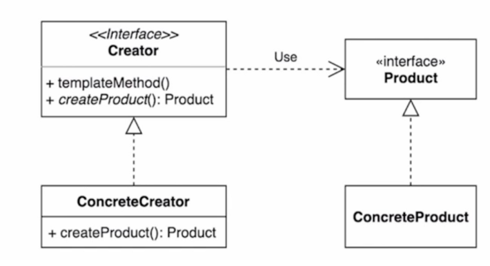
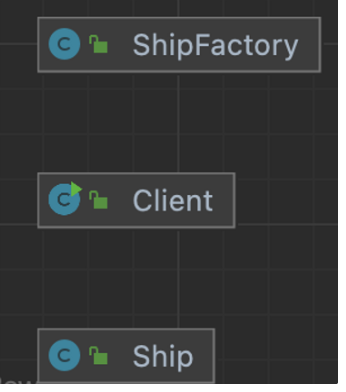
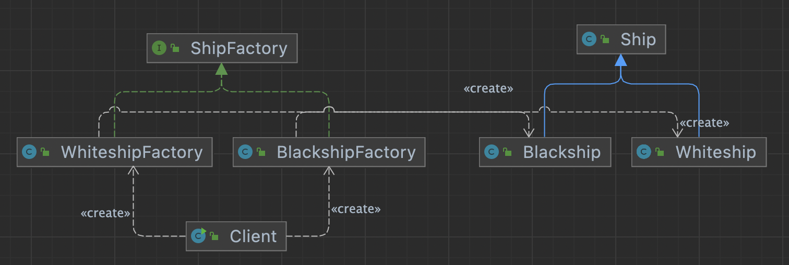
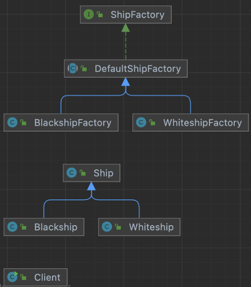
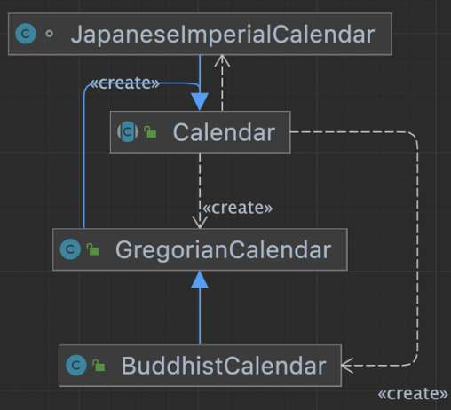

## 1. intro



- 구체적으로 어떤 인스턴스를 만들지는 서브 클래스가 정한다.

- 다양한 구현체(Product)가 있고, 그 중에서 특정한 구현체를 만들 수 있는 다향한 팩토리(Creator)를 제공할 수 있다.

- 변경에 닫혀있지 않다
  - 요구사항에 대해 기존코드가 계속 변경된다.


## 2. implement

### 변경 전 구조

### 

- 배의 인스턴스 생성 시, 인스턴스 특성 조건(이름)에 따라 내부 속성이 변경되는 경우,
- 이름이 다를때, 분기에 따라 속성을 변경한다.
- 이 때 배 이름이 다를 때마다 분기문이 추가되어야 한다. (개방폐쇄원칙 위배)

### 변경 후 구조



- 새로운 종류의 배구 추가될 때 분기문을 추가하지 않기 위해서 인터페이스를 상속받는
- 팩토리들을 만든다.
- 새로운 종류의 배가 추가된다면, 팩토리를 추가해서 기존 소스변경이 없이 추가만으로 로직을 변경할 수 있다.

## 3. interface with implement



client 코드는 구체적인 코드가 계속 변경되지 않느냐 ?

- 인터페이스를 인자로 받아서 di처럼 구동되게 할 수 있다.

interface

- private method() 는 java9 부터 구현이 가능하므로, 그 이전 버전이라면 abstractc class 를 만들어 사용하면 된다.


## 4. Strength and Weakness

구체적으로 어떤 것을 만들지는 서브클래스가 정한다.

1. 팩토리 메소드 패턴을 적용했을 때의 장점과 단점?

   - 장점 : 개방폐쇄원칙에 따라 기존소스변경을 하지 않아도 되어 소스복잡도가 낮다.

   - 단점 : 간단한 로직일 경우, 상대적으로 많은 파일이 생성된다.


2. “확장에 열려있고 변경에 닫혀있는 객체지향원칙” 을 설명하시오

   - 기능 확장이 가능하다.

   - 기능을 추가할 때, 기존소스를 변경하지 않고, 추가만 하게 되므로, 변경에 닫혀있다.

3. 자바8에 추가된 default메소드에 대해설명하세요

   - interface 에 메서드를 구현할 수 있다.

   - implement 한 class 는 기본적으로 default method를 사용할 수있고 , override 할 수 있다.


## 5. API example

### Calendar



- getInstance 인자에 따라 concrete class 를 생성한다.

```java
public class CalendarExample {

    public static void main(String[] args) {
        System.out.println(Calendar.getInstance().getClass());
        System.out.println(Calendar.getInstance(Locale.forLanguageTag("th-TH-x-lvariant-TH")).getClass());
        System.out.println(Calendar.getInstance(Locale.forLanguageTag("ja-JP-x-lvariant-JP")).getClass());
    }
}
private static Calendar createCalendar(TimeZone zone,
                                           Locale aLocale)
    {
       ...
        if (aLocale.hasExtensions()) {
            String caltype = aLocale.getUnicodeLocaleType("ca");
            if (caltype != null) {
                cal = switch (caltype) {
                    case "buddhist" -> new BuddhistCalendar(zone, aLocale);
                    case "japanese" -> new JapaneseImperialCalendar(zone, aLocale);
                    case "gregory"  -> new GregorianCalendar(zone, aLocale);
                    default         -> null;
                };
            }
        }
...
```

### spring BeanFactory

```java
public class SpringBeanFactoryExample {

    public static void main(String[] args) {
        BeanFactory xmlFactory = new ClassPathXmlApplicationContext("config.xml");
        String hello = xmlFactory.getBean("hello", String.class);
        System.out.println(hello);

        BeanFactory javaFactory = new AnnotationConfigApplicationContext(Config.class);
        String hi = javaFactory.getBean("hello", String.class);
        System.out.println(hi);
    }
}
```