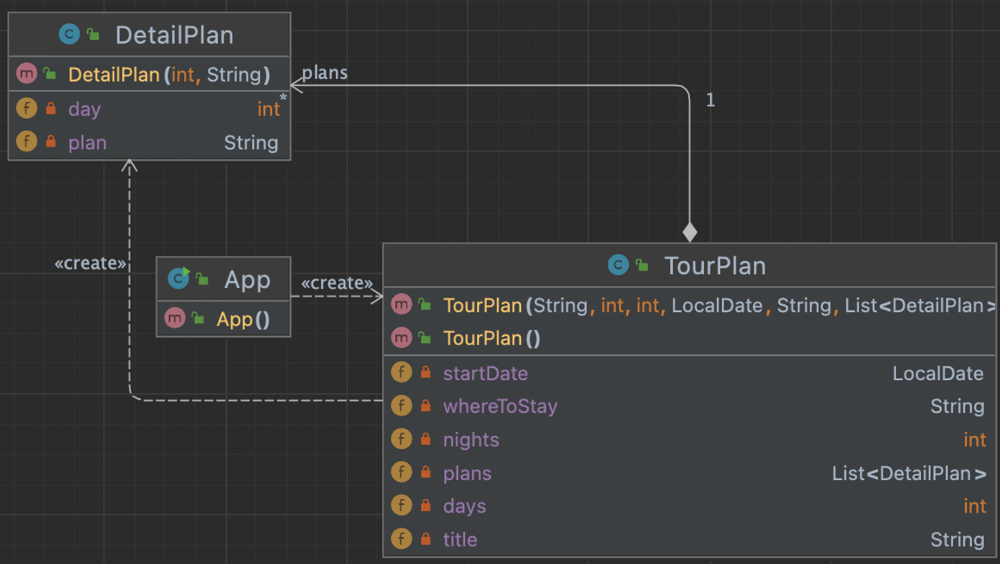
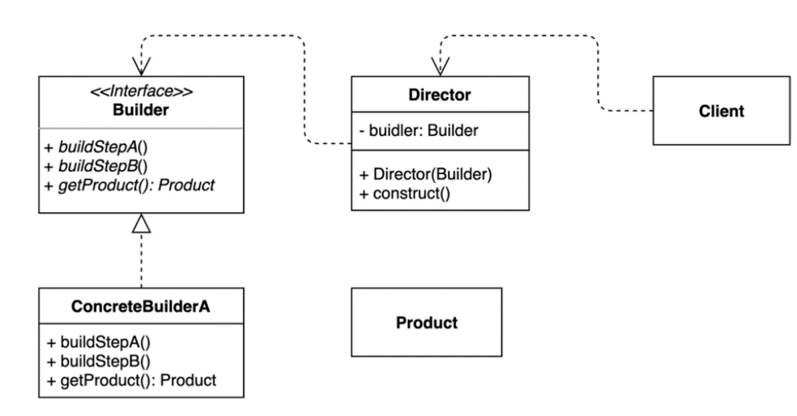
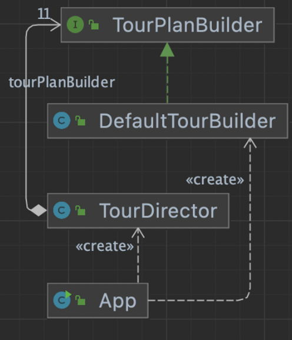

## 1. intro



- 구조 해석
  1. 장황하게 생성자를 생성하고 ,필드를 구성하게 된다.
  2. 생성자가 생성 될 때 여러개의 인자를 여러 조합으로 생성할 수 있다. → 장황하다.
  3. 생성자를 생성할 때 일정한 패턴이 없다.
  4. 어떤 인자의 조합은 동시에 생성되거나, 생성이 안되게 하는 등 제약을 걸고 싶은데, api 사용방법에 따라 사용법이 달라질 수 있다. → 인스턴스가 불안정하게 생성될수있다.




동일한 프로세스를 거쳐 다양한 구성의 인스턴스를 만드는 방법

- (복잡한) 객체를 만드는 프로세스를 독립적으로 분리 수 있다.


## 2. implement




기존코드 사용방법

```java
public class App {

    public static void main(String[] args) {
        TourPlan shortTrip = new TourPlan();
        shortTrip.setTitle("오레곤 롱비치 여행");
        shortTrip.setStartDate(LocalDate.of(2021, 7, 15));

        TourPlan tourPlan = new TourPlan();
        tourPlan.setTitle("칸쿤 여행");
        tourPlan.setNights(2);
        tourPlan.setDays(3);
        tourPlan.setStartDate(LocalDate.of(2020, 12, 9));
        tourPlan.setWhereToStay("리조트");
        tourPlan.addPlan(0, "체크인 이후 짐풀기");
        tourPlan.addPlan(0, "저녁 식사");
        tourPlan.addPlan(1, "조식 부페에서 식사");
        tourPlan.addPlan(1, "해변가 산책");
        tourPlan.addPlan(1, "점심은 수영장 근처 음식점에서 먹기");
        tourPlan.addPlan(1, "리조트 수영장에서 놀기");
        tourPlan.addPlan(1, "저녁은 BBQ 식당에서 스테이크");
        tourPlan.addPlan(2, "조식 부페에서 식사");
        tourPlan.addPlan(2, "체크아웃");
    }
}
```

빌더패턴 적용 후 사용 방법

```java
public class TourDirector {

   ...

    public TourPlan cancunTrip() {
        return tourPlanBuilder.title("칸쿤 여행")
                .nightsAndDays(2, 3)
                .startDate(LocalDate.of(2020, 12, 9))
                .whereToStay("리조트")
                .addPlan(0, "체크인하고 짐 풀기")
                .addPlan(0, "저녁 식사")
                .getPlan();
    }
		...
public static void main(String[] args) {
        TourDirector director = new TourDirector(new DefaultTourBuilder());
        TourPlan tourPlan = director.cancunTrip();
        TourPlan tourPlan1 = director.longBeachTrip();
    }
```

- chaining 을 이용해서 변수들을 연속해서 세팅할 수 있다.
- Director에 자주쓰이는 세팅을 함수로 만들어놓아서, client에서 사용할 때 보다 편리하게 만들 수 있다.
- getPlan() 을 호출해야 인스턴스가 생성이 된다. (validate 용이)


## 3. interface with implement

- 장점
  - getPlan() 함수를 사용해야 앞에서 세팅한 값들에대해 인스턴스가 생성되는 구조이므로,
  - getPlan() 사용을 강제 할 수 있고, 제한을 두고 싶다면, getPlan() 내부에서 validate 체크하는 로직을 만들어놓으면 좋다.
    - 생성자같은경우는 그럴 수 없거나 로직이 매우 복잡해진다.
  - 디렉터 class를 사용해서 client 쪽에서 깔끔해보이는 코드를 만들 수 있다.
  - 디렉터 등의 프로세스를 생성하면서, 입력한 데이터들에 대해 여러 서브 타입을 적용해줄 수 있는 확장성을 생각할 수 있다.
    - 예를 들어 tourPlan 의 일반고객, vip고객으로 세분화.
- 단점
  - 인스턴스를 여러 개 만들어야 하는 단점이 있다.
    - 용량부분에서 조금더 차지한다.
  - 구조가 복잡해진다.
    - 인스턴스생성 복잡 : `new TourDirector(new DefaultTourBuilder())`


## 5. API example

### StringBuilder

- append() 로 build 패턴을 만듬.
- StringBuilder 는 synchronize를 사용하지 않음.

```java
public class StringBuilderExample {

    public static void main(String[] args) {
        StringBuilder stringBuilder = new StringBuilder();
        String result = stringBuilder.append("whiteship").append("keesun").toString();
        System.out.println(result);
    }
}
```

- stream 도 stringbuilder 와 비슷하게 builder 패턴이 적용되어 있는데
- names2 코드를 names 코드로 축소시킬 수 있다. 이거를 이해 못했으면 제네릭을 다시 공부해야한다

```java
public class StreamExample {

    public static void main(String[] args) {
        Stream.Builder<String> stringBuilder = Stream.builder();
        Stream<String> names2 = stringBuilder.add("keesun").add("whiteship").build();
        names2.forEach(System.out::println);

        Stream<String> names = Stream.<String>builder().add("keesun").add("whiteship").build();
        names.forEach(System.out::println);
    }
}
```

### Lombok

- Lombok의 @Builder 애노테이션을 통해서 builder() 패턴을 사용할 수 있다.

```java
import lombok.Builder;

@Builder
public class LombokExample {

    private String title;

    private int nights;

    private int days;

    public static void main(String[] args) {
        LombokExample trip = LombokExample.builder()
                .title("여행")
                .nights(2)
                .days(3)
                .build();
    }
}
```

### spring

- springframework에서는 newInstance() 로 먼저 인스턴스를 생성후, 변수세팅을 하고, 그후에 build()로 마무리 하는패턴을 주로 사용함.
- 솔직히 잘 모르겟음 스프링공부할 때 파야할듯

```java
public class SpringExample {

    public static void main(String[] args) {
        UriComponents howToStudyJava = UriComponentsBuilder.newInstance()
                .scheme("http")
                .host("www.whiteship.me")
                .path("java playlist ep1")
                .build().encode();
        System.out.println(howToStudyJava);
    }
}
```

spring builder 패턴에서는 인스턴스를 먼저 생성하고 진행한걸 참고해서 소스를 변경해보면

아래처럼 변경해서 사용해도 좋다.

```java
public class DefaultTourBuilder implements TourPlanBuilder {

    public TourPlanBuilder newInstance() {
        this.tourPlan = new TourPlan();
        return this;
    }

@Override
    public TourPlanBuilder nightsAndDays(int nights, int days) {
        this.tourPlan.setNights(nights);
        this.tourPlan.setDays(days);
        return this;
    }

}
```