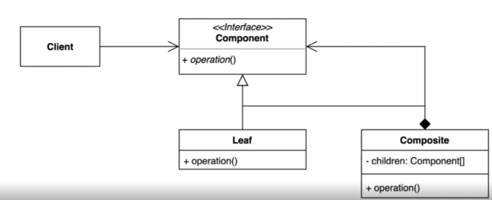

## 1. intro



그룹 전체와 개별 객체를 동일하게 처리할 수 있는 패턴.

- 클라이언트 입장에서는 전체나 부분이나 모두 동일한 컴포넌트로 인식할 수는 계층구조를 만든다 (Part-Whole Hierarchy)


## 2. implement


- Compisite 를 정의한다. (Client)
- 공통 operation 을 뽑아내서 Component 인 Component interface에 선언한다.
- Leaf 를 정의한다 (Bag, Item, Character)
- client 에서는 Leaf 들을 인자로 받아들어 필요한 operation() 을 호출해서 사용한다.
  - operation은 Component로 모두 추상화되어있고, 이 operation을 호출하기 위해 Leaf class 또한 Component 를 implements 받아 정의하였다.
  - client에서 호출한 이 operation이 Leaf class로 기능을 위임 한 것이다.

```java
public class Client {

    public static void main(String[] args) {
        Item doranBlade = new Item("도란검", 450);
        Item healPotion = new Item("체력 물약", 50);

        Bag bag = new Bag();
        bag.add(doranBlade);
        bag.add(healPotion);

        Client client = new Client();
        client.printPrice(doranBlade);
        client.printPrice(bag);
    }

    private void printPrice(Component component) {
        System.out.println(component.getPrice());
    }

}
```


## 3. Strength and Weakness

- Composit 과 Leaf 의 공통 오퍼레이션을 뽑는 과정이 너무 어렵거나,
- 막상 함수

```java
private void printPrice(Component component) {
        System.out.println(component.getPrice());
    }
```

를 만들었을 때, 내부에서 객체명으로 분기를 태우는 경우 등이 발생하면,

- 컴포짓 패턴이 아닌 다른 형식을 고민해 보아야 한다.


## 4. API example


- Component : Component
- Composite : JFrame
- Leaf : JButton, JTestField
- client 가 사용하는 JFrame 의 인자에 Leaf 객체들이 입력되는데, 이 객체들의 타입이 JFrame 의 타입인 Component 에 해당한다.
  - Composite 과 Leaf 간의 직접적인 관계는 없고 오직 타입만으로 구성이 가능하다.

```java
public static void main(String[] args) {
        JFrame frame = new JFrame();

        JTextField textField = new JTextField();
        textField.setBounds(200, 200, 200, 40);
        frame.add(textField);

        JButton button = new JButton("click");
        button.setBounds(200, 100, 60, 40);
        button.addActionListener(e -> textField.setText("Hello Swing"));
        frame.add(button);

        frame.setSize(600, 400);
        frame.setLayout(null);
        frame.setVisible(true);
    }
```