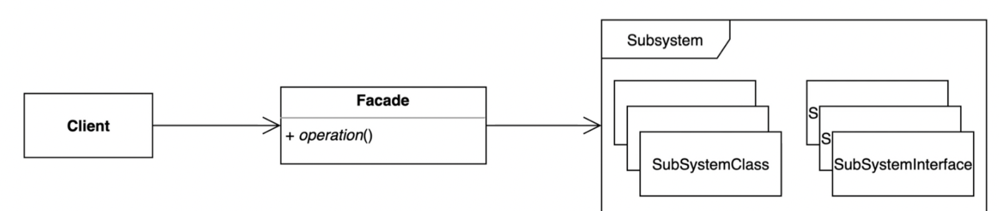
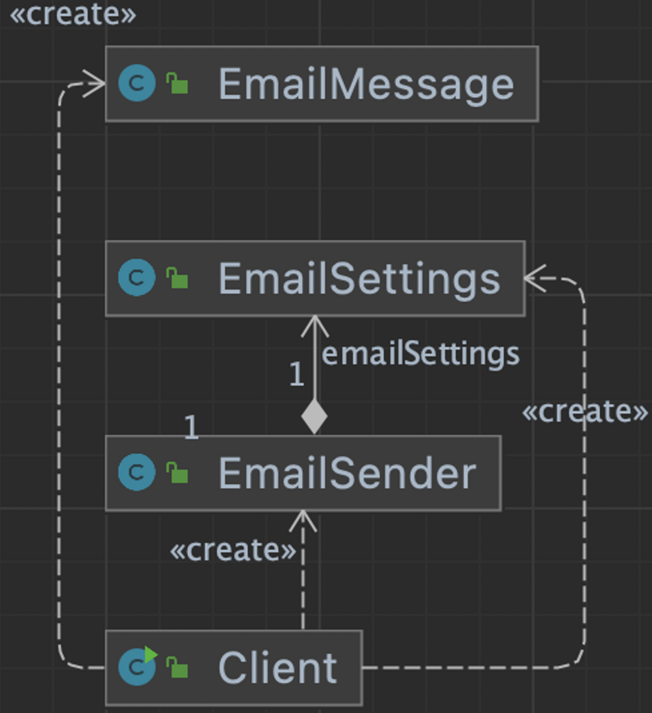

## 1. intro



복잡한 서브시스템 의존성을 최소화하는 방법

- 클라이언트가 사용해야 하는 복잡한 서브시스템 의존성을 간단한 인터페이스로 추상화할 수 있다.


## 2. implement

### 변경 전

- 메일 송신을 위해 핵심기능을 잘 알고 있어야 한다.
  - Properties, Session, MimeMessage, Transport 기능 및 각각의 상호관계를 잘 알고 있어야 사용이 가능하다.

```java
public class Client {
    public static void main(String[] args) {
        String to = "keesun@whiteship.me";
        String from = "whiteship@whiteship.me";
        String host = "127.0.0.1";

        Properties properties = System.getProperties();
        properties.setProperty("mail.smtp.host", host);

        Session session = Session.getDefaultInstance(properties);

        try {
            MimeMessage message = new MimeMessage(session);
            message.setFrom(new InternetAddress(from));
            message.addRecipient(Message.RecipientType.TO, new InternetAddress(to));
            message.setSubject("Test Mail from Java Program");
            message.setText("message");

            Transport.send(message);
        } catch (MessagingException e) {
            e.printStackTrace();
        }
    }
}
```

### 변경 후

- client 에서는 세팅할 데이터만 세팅하고, sendmail() 만 호출하면 된다.
- 메일을 보내기위한 상세 기능은 EmailSender 에 감춰져 있어 client 가 신경쓰지 않아도 된다.



```java
public static void main(String[] args) {
        EmailSettings emailSettings = new EmailSettings();
        emailSettings.setHost("127.0.0.1");

        EmailSender emailSender = new EmailSender(emailSettings);

        EmailMessage emailMessage = new EmailMessage();
        emailMessage.setFrom("keesun");
        emailMessage.setTo("whiteship");
        emailMessage.setCc("일남");
        emailMessage.setSubject("오징어게임");
        emailMessage.setText("밖은 더 지옥이더라고..");

        emailSender.sendEmail(emailMessage);
    }
}
```

- sendEmail() 에 Properties, Session, MimeMessage 등 메일을 보내기 위한 복잡한 기능을 숨겨서 client 가 간단하게 메일기능을 사용할 수 있도록 변경했다.

```java
public class EmailSender {

    private EmailSettings emailSettings;

    public EmailSender(EmailSettings emailSettings) {
        this.emailSettings = emailSettings;
    }

    /**
     * 이메일 보내는 메소드
     * @param emailMessage
     */
    public void sendEmail(EmailMessage emailMessage) {
        Properties properties = System.getProperties();
        properties.setProperty("mail.smtp.host", emailSettings.getHost());

        Session session = Session.getDefaultInstance(properties);

        try {
            MimeMessage message = new MimeMessage(session);
            message.setFrom(new InternetAddress(emailMessage.getFrom()));
            message.addRecipient(Message.RecipientType.TO, new InternetAddress(emailMessage.getTo()));
            message.addRecipient(Message.RecipientType.CC, new InternetAddress(emailMessage.getCc()));
            message.setSubject(emailMessage.getSubject());
            message.setText(emailMessage.getText());

            Transport.send(message);
        } catch (MessagingException e) {
            e.printStackTrace();
        }
    }
```


## 3. Strength and Weakness

장점

- 서브시스템에 대한 의존성을 한곳으로 모을 수 있다.

단점

- 퍼사드클래스가 서브시스템에 대한 모든 의존성을 가지게 된다.


- 복잡한 로직을 상세하게 알지 못해도,  client입장에서 원하는 기능에 대해서만 사용을 할 수 있다. (복잡 한 로직은 추상화되어 내부에 존재)
- client가 해당 기능을 한번만 사용한다면 필요 없을 수 있지만, 여러 클라이언트가 사용한다면 유용하다.


## 4. API example

- 브릿지 패턴에 등장했던 예제이다.
- 자바의 기존 기능을 추상화하여 스프링에 적용하는 과정이 퍼사드 패턴의 맥락과 맞다.